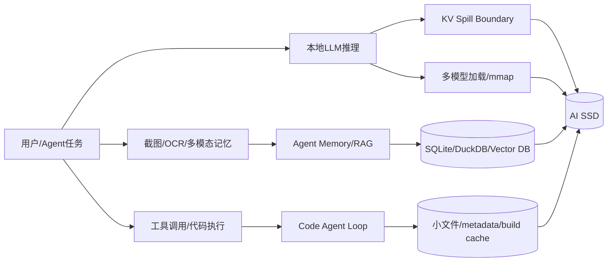
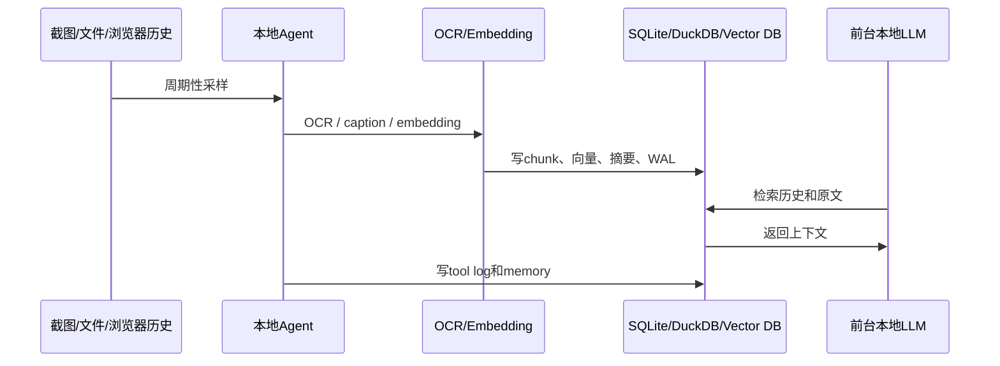

# AI PC / Agent PC 盘端压力测试计划：从 KV Cache 到本地记忆、RAG、代码 Agent 与多模型工作流

日期：2026-06-17

本文是 `docs/ai-ssd-boss-report-2026-06-15.md` 的下一阶段补充。核心判断是：现有 KV Cache 报告适合作为 AI SSD 的上限压力测试，但不能代表完整 AI PC / Agent PC 用户场景。

未来 128GB 级 unified memory 设备会减少一部分纯 KV spill 到 SSD 的概率，但会让多模型切换、长上下文、RAG、本地记忆库、截图/OCR、agent 日志、容器沙箱、checkpoint/快照成为新的主要 SSD 压力源。

## 1. 一页摘要

**下一阶段不要只围绕 KV Cache offload 做报告，而要把 AI PC / Agent PC 的盘端压力拆成“模型运行、上下文记忆、工具调用、索引构建、状态持久化、后台常驻”几类场景。**

当前报告体系应重新定位：

| 报告/测试 | 正确定位 | 不应外推为 |
|---|---|---|
| KV Cache forced-NVMe 测试 | KV Cache offload upper-bound stress test | 完整真实 LLM serving 用户体验验证 |
| BurstGPT speedup=1000 | 压力注入和差异放大 | 真实请求节奏 |
| 单盘四盘横评 | 候选盘筛选和风险识别 | 多盘节点最终选型 |
| 30min GC drift | 中短期稳态风险识别 | 24h 企业级稳定性 |

下一阶段主线应该从单一 KV Cache 扩展到五类 workload：



## 2. 背景：128GB unified memory 会改变 SSD 压力来源

很多新一代 AI PC / mini workstation 强调的不是传统独立显卡 128GB VRAM，而是 CPU/GPU/NPU 共享的 128GB unified memory。公开报道显示，AMD Ryzen AI Halo Developer Platform 使用 Ryzen AI Max+ 395、128GB LPDDR5X-8000 unified memory、2TB SSD、50 TOPS NPU；Copilot+ PC 基础要求包括 40 TOPS NPU、16GB RAM、256GB SSD；NVIDIA DGX Spark / RTX Spark 类平台也在向 128GB unified memory 和本地 agentic AI 方向推进。

这意味着：7B/14B/32B 模型和一部分 KV Cache 更容易留在内存里，SSD 未必持续承载全部 KV。但 SSD 压力并不会消失，而是转向更真实、更复杂的混合 I/O：

| 压力来源 | 典型行为 | SSD 风险 |
|---|---|---|
| 本地 agent memory | 写摘要、写状态、写 tool log、查历史 | 小写、WAL、fsync、P99 spike |
| RAG / 文件索引 | chunk、embedding、向量库插入和查询 | 随机读、小文件、index compaction |
| Code Agent | repo scan、搜索、patch、build/test | metadata、小文件、临时文件、日志 |
| 多模型切换 | GGUF/safetensors/ONNX 加载、mmap page fault | 冷启动、page cache 抖动 |
| 长上下文 LLM | prompt cache、KV spill、cache reload | object tail、eviction、TTFT |
| LoRA/checkpoint | 周期性大写、adapter 保存、数据预处理 | SLC cache 耗尽、GC cliff |

## 3. 场景优先级总表

| 优先级 | 场景 | 当前 storage 是否覆盖 | 盘端压力强度 | 用户价值 | 建议 |
|---|---|---:|---:|---:|---|
| P0 | AI PC 本地 Agent 常驻 + RAG + 文件索引 | 基本未覆盖 | 很高 | 很高 | 必须新增 |
| P0 | 长上下文本地 LLM：模型加载、prompt cache、KV spill 边界 | 部分覆盖 KV | 高 | 很高 | 从 forced-NVMe 改为边界测试 |
| P0 | Code Agent / Repo Agent：扫描代码库、构建、测试、日志 | 未覆盖 | 很高 | 很高 | 必须新增 |
| P0 | 多模态记忆：截图、OCR、embedding、检索 | 未覆盖 | 中高但持续 | 很高 | 必须新增 |
| P1 | 本地多模型切换：7B/14B/32B/70B 模型轮换 | 未覆盖 | 高 | 高 | 应该新增 |
| P1 | 本地微调 / LoRA / checkpoint / 数据预处理 | 未覆盖 | 很高 | 中高 | 应该新增 |
| P1 | 小型办公室/个人 AI Server：多用户并发推理 | 部分覆盖 | 高 | 中高 | 补 RAG、日志、session |
| P2 | 纯 forced-NVMe KV Cache worst-case | 已覆盖较多 | 极高 | 中 | 保留为压力上限 |
| P2 | 分布式 KV Cache / NVMe-oF / GDS | 未覆盖 | 极高 | 远期 | 技术预研 |
| P2 | OS 级 agentic AI 文件系统记忆层 | 未覆盖 | 未知但潜力大 | 远期高 | 先设计 trace schema |

## 4. Workload A：KV Spill Boundary

目标：不再只测 `gpu=0/cpu=0` 的 forced-NVMe worst-case，而是找出真实 memory tier 下 SSD 什么时候成为瓶颈。

测试矩阵：

| 变量 | 建议范围 |
|---|---|
| 模型 | 7B / 14B / 32B / 70B |
| 量化 | Q4 / Q5 / Q8 / FP16 |
| context | 32K / 128K / 256K / 1M |
| 并发 | 1 / 2 / 4 / 8 agents |
| memory cap | 25% / 50% / 75% / 90% |
| cache policy | no spill / CPU spill / NVMe spill |
| trace speed | 1x / 10x / 100x / 1000x |
| 运行时长 | 30min / 120min / 8h |

核心指标：

| 层级 | 指标 |
|---|---|
| 用户体验 | TTFT、TPOT/ITL、E2E P95/P99、tokens/s |
| KV 层 | cache hit rate、eviction rate、spill bytes/token、read/write amplification |
| SSD 层 | object read/write P99/P999、GC cliff time、device busy、temperature |

判定目标：回答“AI PC 上 SSD 到底在什么模型、上下文、并发和 memory cap 下成为用户可感知瓶颈？”

## 5. Workload B：AI PC Agent Memory Soak

目标：模拟未来 AI PC 最真实的后台常驻 agent 压力。

典型数据流：



建议运行 4h / 8h / 24h：

| 动作 | 频率 |
|---|---|
| 生成截图或模拟截图文件 | 每 3-5 秒 |
| OCR / caption / embedding | 每 3-5 秒 |
| 写入 SQLite/DuckDB/FAISS/Qdrant | 持续 |
| 自然语言检索 | 每 10 秒 |
| agent summary | 每 1 分钟 |
| 前台本地 LLM 对话 | 每 10 秒 |
| cleanup / compaction / vacuum | 每 10-30 分钟 |

核心指标：

| 指标 | 为什么重要 |
|---|---|
| SQLite WAL commit / fsync P99 | agent memory 卡顿最容易体现在提交延迟 |
| embedding insert/query latency | RAG 体验直接受影响 |
| 前台 TTFT/E2E jitter | 判断后台 AI 是否干扰前台交互 |
| SSD P99/P999、temperature、media busy | 识别 GC cliff 和热降速 |
| compaction/vacuum 对前台影响 | 验证长期后台维护任务的尾延迟风险 |

## 6. Workload C：Code Agent Loop

目标：模拟开发者 AI PC / 企业代码 agent 场景。这是最容易打出真实小文件、metadata、mixed R/W 压力的场景。

标准流程：

```text
大型 repo 准备
→ ripgrep 全仓搜索
→ tree-sitter / symbol index
→ embedding README、docs、source comments
→ agent 修改 20 个文件
→ 运行测试或构建 10-100 轮
→ 失败日志回读
→ 生成 summary 和 patch history
```

建议 repo 类型：

| 类型 | 目标压力 |
|---|---|
| Linux kernel / LLVM 子集 | 大量小文件和 metadata |
| 大型 Python monorepo | 依赖、pytest cache、日志 |
| Node/TypeScript monorepo | `node_modules`、构建缓存、小文件写 |
| CMake/C++ repo | object file、link、编译缓存 |

核心指标：

| 指标 | 解释 |
|---|---|
| small-file read IOPS / metadata latency | repo scan 和搜索体验 |
| mixed R/W P99/P999 | patch、日志、cache 与读取互扰 |
| dependency install / build / test E2E | 用户直接感知的 agent loop 时间 |
| log readback latency | 失败后定位问题速度 |
| 长时间运行后的性能衰减 | 代码 agent 常驻运行时是否触发 GC cliff |

## 7. Workload D：Model Switch + mmap Cold/Warm Load

目标：模拟一个 AI PC 同时服务小模型、中模型、大模型、视觉模型、embedding 模型和 reranker 的切换场景。

模型组合示例：

| 模型 | 用途 | 盘端行为 |
|---|---|---|
| 7B embedding / reranker | RAG 检索 | 中小模型频繁加载 |
| 14B chat | 日常问答 | warm load 和 page cache 命中 |
| 32B coder | 代码 agent | 大模型加载和切换 |
| 70B reasoning | 复杂推理 | 大文件读取和内存压力 |
| vision / OCR model | 截图理解 | 与前台 LLM 交替加载 |

核心指标：

| 指标 | 解释 |
|---|---|
| cold load time | 首次加载模型速度 |
| warm load time | OS page cache 命中后的体验 |
| mmap major/minor page fault | 判断是真读盘还是内存命中 |
| foreground jitter | 模型切换是否拖慢前台对话 |
| 温度和降速 | 多模型循环加载是否触发热降速 |

## 8. Workload E：Checkpoint + RAG + Inference Mixed

目标：模拟开发者/小团队 AI server 的混部压力，补齐当前报告中尚未直接验证的 checkpoint + inference 结论。

组合 workload：

| 前台/后台 | 行为 |
|---|---|
| 前台 | 本地 LLM 推理、RAG query、用户交互 |
| 后台 1 | RAG index build / embedding insert |
| 后台 2 | 周期性 checkpoint / LoRA adapter save |
| 后台 3 | 日志 append、SQLite/DuckDB compaction |
| 后台 4 | 模型文件加载或切换 |

核心问题：

| 问题 | 指标 |
|---|---|
| checkpoint 大写是否打爆前台 TTFT | TTFT P99/P999、E2E jitter |
| RAG index compaction 是否制造读 tail | query latency、read await |
| SLC cache 耗尽后是否进入 write cliff | write BW drift、write P99 |
| mixed R/W 下哪块盘更稳 | object P99、device await、GC cliff overlap |

## 9. 指标体系：从 SSD 跑分到用户体验

下一阶段每个 workload 都应同时报告三层指标：

| 层级 | 必报指标 | 目的 |
|---|---|---|
| 用户体验层 | TTFT、TPOT/ITL、E2E P95/P99/P999、agent loop latency | 判断用户是否感到卡顿 |
| 应用数据层 | KV object latency、SQLite fsync、vector query、model load、build/test time | 定位是哪类数据路径导致问题 |
| SSD 设备层 | BW、IOPS、await、util、P99/P999、temperature、SMART、media busy、throttle | 解释盘端根因 |

不要只报告顺序读写峰值。AI PC / Agent PC 更关心：

| 更重要的指标 | 原因 |
|---|---|
| P99/P999 latency | 前台交互怕卡顿，不怕平均值略低 |
| GC cliff time | 决定长时间常驻 agent 是否稳定 |
| fsync / WAL commit latency | 本地记忆和数据库高度依赖 |
| foreground/background interference | 后台 AI 不能拖慢前台 LLM |
| thermal consistency | mini workstation / AI PC 散热空间有限 |

## 10. Agent trace replay 标准

长期看，应把真实 agent runtime 的 I/O 行为录下来，再 replay 到 SSD 测试平台。建议先定义统一 trace schema：

```json
{
  "timestamp_ns": 0,
  "agent_id": "agent-001",
  "task_type": "coding|rag|office|browser|multimodal|llm",
  "qos": "interactive|responsive|background",
  "tool_call": "ripgrep|python|browser|ocr|embedding|sqlite",
  "read_files": [],
  "write_files": [],
  "db_ops": [],
  "model_load": "llama-3.1-8b-q4.gguf",
  "kv_cache_bytes": 0,
  "embedding_bytes": 0,
  "checkpoint_bytes": 0,
  "latency_slo_ms": 1000
}
```

这个 schema 的价值是把 AI SSD 测试从“手写 benchmark”推进到“真实 agent trace replay”。

## 11. 产品预研方向

结合当前 KV Cache 结果和 AI PC / Agent PC 场景，AI SSD 的产品方向应从单一带宽扩展为：

| 方向 | 产品含义 |
|---|---|
| Low tail latency | P99/P999 比平均吞吐更重要 |
| Predictable GC | 后台 GC 不能制造秒级卡顿 |
| Foreground QoS | 前台 LLM / agent 读优先，后台 checkpoint/RAG 写限速 |
| Small-write / WAL optimization | 本地记忆库、SQLite、DuckDB、向量库都依赖 |
| Large-object random read | KV block、模型 mmap、RAG 原文回读都需要 |
| Thermal consistency | AI PC 长时间常驻，不能依赖短时 burst |
| Telemetry | 暴露温度、throttle、media busy、GC、WA，用于系统调度 |
| Placement / stream hint | 区分 KV、checkpoint、RAG index、日志、模型文件冷热 |

## 12. 推荐执行顺序

| 阶段 | 测试 | 目标 |
|---|---|---|
| P0-1 | KV Spill Boundary | 把 forced-NVMe 上限测试改成真实 tiering 边界测试 |
| P0-2 | AI PC Agent Memory Soak | 验证本地记忆、RAG、后台常驻对前台 LLM 的干扰 |
| P0-3 | Code Agent Loop | 覆盖小文件、metadata、build/test、日志和工具调用 |
| P1-1 | Model Switch + mmap Load | 验证多模型 AI PC 的冷启动和切换体验 |
| P1-2 | Checkpoint + RAG + Inference Mixed | 直接验证 checkpoint 干扰，而不是从 KV 结果外推 |
| P1-3 | 3-run median + 60/120min + 8h/24h soak | 把 single-run 预研推进到产品验证 |
| P2 | 多盘、GDS、NVMe-oF、DPU/RDMA | 面向高端 workstation / 小型 AI server |

## 13. 对现有报告的定位调整

现有 KV Cache 报告应该保留，但建议在对外表述中明确降级为：

> AI SSD 的 KV Cache offload upper-bound stress test。

不要把它表述为：

> AI PC 用户场景完整代表，或真实 LLM serving 最终选型结论。

更准确的阶段性结论是：

| 当前可以说 | 当前不能说 |
|---|---|
| KV Cache offload 会形成 100KB 级随机大块 I/O | 所有 AI PC 压力都等同于 KV Cache |
| 长稳态会改变短测结论 | 30min 就代表长期生产稳定性 |
| GC cliff 和 write tail 是 AI SSD 风险 | checkpoint + inference 已经验证完成 |
| forced-NVMe 能筛出盘端差异 | 真实 tiering 下用户体验已经闭环 |

## 14. 参考资料

| 资料 | 用途 |
|---|---|
| Tom's Hardware: AMD Ryzen AI Halo Developer Platform with 128GB unified memory, <https://www.tomshardware.com/desktops/mini-pcs/amd-challenges-nvidias-dgx-spark-with-usd3-999-ryzen-ai-halo-with-windows-11-support-strix-halo-desktop-undercuts-nvidia-by-usd700-packs-128gb-of-unified-memory> | 128GB unified memory AI workstation 背景 |
| WIRED: What Is a Copilot+ PC?, <https://www.wired.com/story/what-is-copilot-plus-pc> | Copilot+ PC 40 TOPS NPU、16GB RAM、256GB SSD 基础要求背景 |
| Tom's Hardware: Microsoft testing Copilot AI features with discrete GPUs, <https://www.tomshardware.com/software/windows/microsoft-is-reportedly-testing-copilot-ai-features-with-discrete-gpus-instead-of-npus-a-feature-available-on-windows-app-sdk-with-a-windows-insider-experimental-channel-build-and-developer-mode-turned-on> | Windows 本地 AI 能力从 NPU 扩展到离散 GPU 的趋势 |
| NVIDIA DGX Spark, <https://www.nvidia.com/en-us/products/workstations/dgx-spark/> | 个人/桌面 AI supercomputer 与 unified memory 背景 |
| 现有报告：`docs/ai-ssd-boss-report-2026-06-15.md` | 管理层版本入口 |
| 现有报告：`docs/ai-ssd-kvcache-integrated-prestudy-report-2026-06-13.md` | KV Cache 技术主报告 |
| 现有报告：`docs/ai-ssd-kvcache-complete-archive-report-2026-06-13.md` | 实验归档 |
