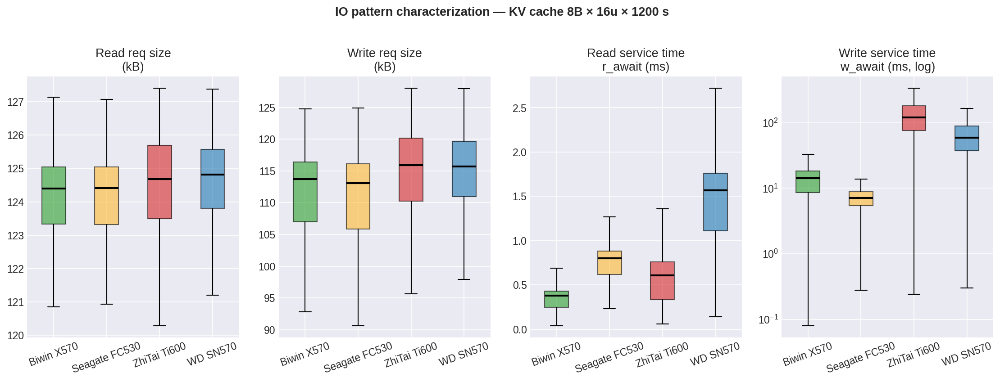
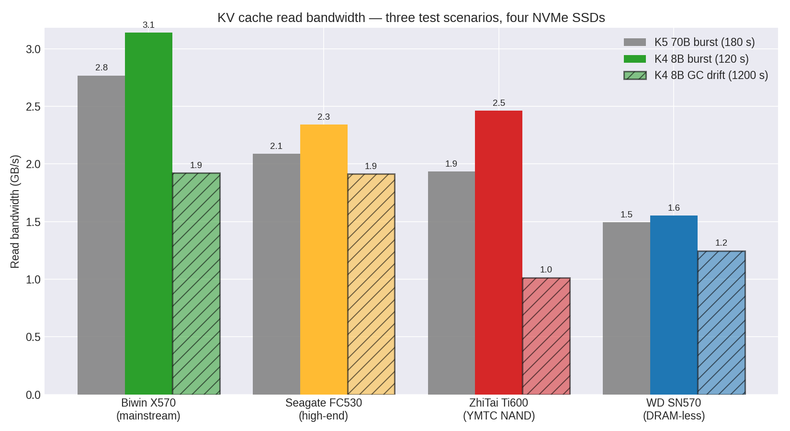
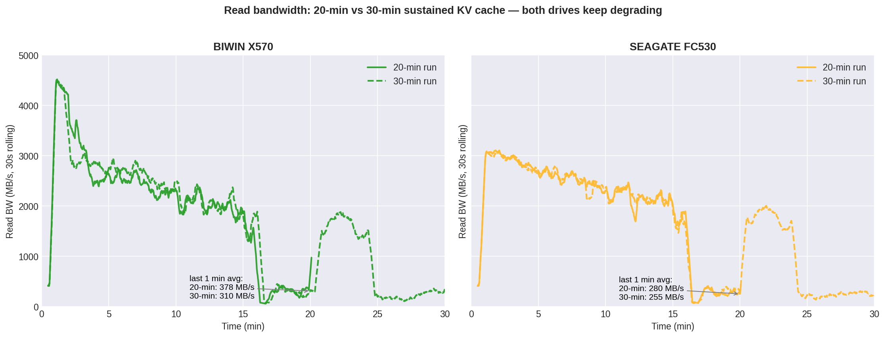
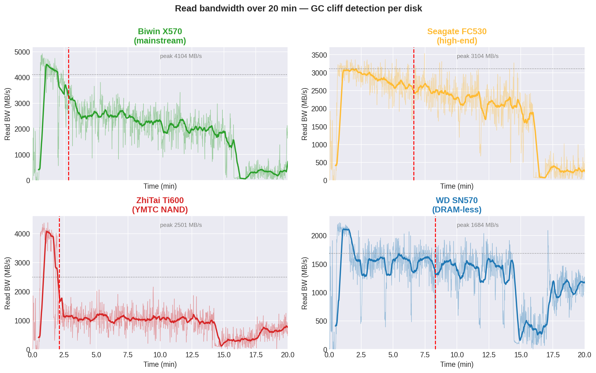
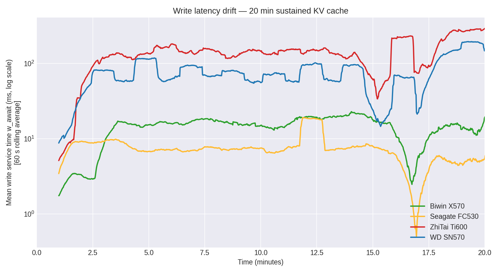

# AI SSD 产品预研报告：面向 LLM KV Cache 的机会、实验结论与下一阶段验证

日期：2026-06-15

本文面向管理层和产品决策讨论。目标不是复述全部实验细节，而是回答三个问题：

1. AI SSD 为什么值得做。
2. 我们现有实验已经证明了什么。
3. 下一阶段应该如何从 KV Cache 压测扩展到更真实的 AI PC / Agent PC 存储场景。

详细实验数据、命令、原始分析和完整归档见本文末尾“详细报告索引”。

## 1. 管理层摘要

**结论：AI SSD 的机会不是“更高顺序读写峰值”，而是在长时间混合 I/O 下提供低 tail latency、可预测 GC、前后台任务隔离和可观测的数据层。**

当前 KV Cache 实验是一个有价值的 **storage stress benchmark**：它放大了 LLM KV Cache offload 对 SSD 的压力，能帮助我们识别 I/O 画像、GC cliff 和 tail latency 风险。但它不是完整的真实用户场景验证，不能直接等同于最终采购选型或生产 SLO 结论。

当前实验最重要的发现：

| 发现 | 产品含义 |
|---|---|
| KV Cache I/O 是约 115-125kB 的离散大块随机读写 | 不能只用顺序读写峰值定义 AI SSD |
| 2 分钟短测和 20-30 分钟长测排名不同 | 产品验证必须加入长稳态和 GC cliff |
| BIWIN X570 短时最强，Seagate FC530 在当前单盘长稳态 KV 压测中写 tail 更稳 | AI SSD 要区分 burst 能力和 sustained serving 候选能力 |
| ZhiTai Ti600、WD SN570 不适合作为主力 KV Cache SSD | 普通消费级盘不一定适合 AI serving |
| P95/P99 tail latency 比平均吞吐更影响用户体验 | 产品指标应强调 tail、QoS、GC stall 和 E2E latency |

建议的阶段性产品方向：

| 方向 | 建议 |
|---|---|
| 短期产品验证 | 围绕 100-128kB random large-block、mixed R/W、30-120min 长稳态建立 benchmark |
| 中期系统验证 | 与 vLLM/LMCache/SGLang HiCache/Mooncake 类分层 KV Cache 场景结合 |
| 长期产品定义 | 做“KV Cache-aware SSD”：稳定 tail、read-priority GC、可观测 telemetry、多盘 QoS |

### 1.1 结论边界

这份报告当前能支持的结论：

| 能支持 | 说明 |
|---|---|
| KV Cache offload 会形成 100KB 级离散大块随机 I/O | iostat 与 benchmark 结果一致，读写 request size 接近 115-125kB |
| 短时跑分不能代表长稳态服务 | K4 120s、20min、30min 排名和尾延迟表现不同 |
| 消费级 SSD 的 GC cliff 和写 tail 是 AI SSD 风险 | 多盘长测都暴露出不同程度的掉速和 P99 漂移 |
| forced-NVMe 是有效的上限压力测试 | 适合放大 SSD 差异，筛出不适合的盘 |

这份报告当前不能单独证明的结论：

| 不能证明 | 原因 |
|---|---|
| 真实生产 LLM serving 一定优先选择某一块盘 | 当前主线是单盘、纯 KV Cache、forced-NVMe，不是完整生产 tiering |
| mixed inference + checkpoint 的最终选型 | checkpoint/RAG/日志/模型加载未作为主线 workload 组合验证 |
| 多盘节点级扩展效率 | 还未覆盖 root complex、RAID/分片、最慢盘 tail、GC stall overlap |
| 24h 在线稳定性和企业级 SLO | 当前最长主线仍不足以代表全天候 soak |
| AI PC / Agent PC 的完整用户体验 | 未来压力还包括 RAG、agent memory、代码仓库、小文件、SQLite/WAL、模型切换等 |

## 2. KV Cache 的通俗解释

大模型生成内容时，每生成一个 token 都要参考前面的上下文。为了避免每一步都重新计算历史上下文，系统会把中间状态保存下来，这就是 KV Cache。

可以把 KV Cache 理解成：

| 类比 | 说明 |
|---|---|
| 会议纪要 | 不需要重新听完整会议，只查前面整理好的要点 |
| 浏览器缓存 | 重复访问相同内容时，不需要重新下载 |
| 模型的短期记忆 | 上下文越长、并发越高，短期记忆越大 |

短上下文时，KV Cache 可以放在 GPU 显存中；长上下文、多轮对话、多用户并发时，显存不够，就会逐步下沉到 CPU 内存、SSD，甚至远端节点。AI SSD 的价值就在这一层出现：**让 SSD 承担一部分“模型短期记忆”，但不能明显拖慢用户体验。**

## 3. 实验结论一：KV Cache I/O 不是传统 SSD 跑分

我们通过 `iostat` 和 KV Cache benchmark 看到的 I/O 特征如下：

| 指标 | 实验结果 |
|---|---|
| 读请求大小 | 约 124-125kB |
| 写请求大小 | 约 113-116kB |
| 读请求合并率 | `%rrqm ≈ 0%` |
| I/O 类型 | sparse-large-block random I/O |
| 长稳态风险 | GC cliff、周期性掉速、写尾延迟上升 |

这类 I/O 不是连续读取模型权重，也不是传统数据库的 4K 小随机读。它更像是：系统从 SSD 的不同位置反复取出一块块较大的 KV Cache，再写入新的 cache 块。

图表解读：

| 图表信息 | 结论 |
|---|---|
| 四块盘的读写 request size 几乎一致 | workload 由 LLM KV object 决定，不是某块盘导致 |
| read request 集中在约 125kB | AI SSD 需要优化 100-128kB 级 random read |
| write request 集中在约 115kB | prefill/eviction 写入也不是顺序流 |
| Seagate 写服务时间在当前压测中更稳 | sustained serving 候选验证更看重 controller/firmware 的写路径 |

产品含义：

| 普通 SSD 指标 | AI SSD 更应该看 |
|---|---|
| 顺序读写峰值 | 100-128kB random read/write P99 |
| 4K random IOPS | KV object P95/P99 |
| fresh 空盘速度 | preconditioned / steady-state 性能 |
| 平均吞吐 | 长稳态 tail latency 和 GC stall |

## 4. 实验结论二：短测冠军不等于长期服务冠军

我们对四块 NVMe SSD 做了 K4/K5 短测和 K4 长稳态测试。结果显示：短时性能和长期服务能力不是同一个指标。

### 4.1 短测：BIWIN X570 是 burst 冠军

| 场景 | BIWIN X570 | Seagate FC530 | ZhiTai Ti600 | WD SN570 |
|---|---:|---:|---:|---:|
| K4 8B×16 users×120s read BW | 3.14GB/s | 2.34GB/s | 2.46GB/s | 1.55GB/s |
| K5 70B×4 users×180s read BW | 2.77GB/s | 2.09GB/s | 1.93GB/s | 1.49GB/s |

短时结论：BIWIN X570 在 burst、高并发短测和 70B 大 object 短测中最强。

### 4.2 长测：Seagate FC530 在当前长稳态压测中更稳

| 场景 | BIWIN X570 | Seagate FC530 | 结论 |
|---|---:|---:|---|
| K4 20min read BW | 1.92GB/s | 1.91GB/s | 基本持平 |
| K4 30min read BW | 1.57GB/s | 1.54GB/s | 基本持平 |
| 30min write P99 | 227.0ms | 213.6ms | Seagate 略好 |
| GC cliff time | 2.9min | 8.1min | Seagate 更晚进入 cliff |

图表解读：

| 观察 | 含义 |
|---|---|
| BIWIN 从 3.14GB/s 下滑到 1.57GB/s | 短时 SLC/burst 优势不能外推到长期服务 |
| Seagate 短时不如 BIWIN，但 20-30min 后接近 | 长稳态候选盘更看 firmware 和 GC 策略 |
| 两块盘在 30min 后差距很小 | 当前数据只能说功能等价，不能说 BIWIN 长稳态绝对更强 |

## 5. 实验结论三：GC cliff 是 AI SSD 的核心风险

SSD 内部会做垃圾回收和数据整理。普通跑分里这个过程可能不明显，但长时间 KV Cache mixed R/W 会把它暴露出来。

| 盘 | GC cliff 时间 | 跌幅 | 产品含义 |
|---|---:|---:|---|
| BIWIN X570 | 2.9min | -40.6% | 短时强，但很早进入稳态 |
| Seagate FC530 | 8.1min | -32.0% | cliff 最晚、跌幅最浅 |
| ZhiTai Ti600 | 5.6min | -77.8% | cliff 后吞吐崩塌 |
| WD SN570 | 7.8min | -40.6% | 本身就慢，不适合主力 |

图表解读：

| 观察 | 含义 |
|---|---|
| ZhiTai/WD 写延迟很快进入 100ms+ 甚至更高 | 写路径不适合高压力 KV Cache |
| Seagate 写服务时间最稳 | 在当前 KV 压测中更值得进入 mixed R/W 和 sustained serving 下一轮验证 |
| BIWIN 读路径强，但写 tail 随时间上升 | 适合 burst，长稳态需谨慎 |

对用户体验的影响：GC stall 会让请求落入“卡顿窗口”，表现为首 token 变慢、decode 卡顿、服务队列堆积。AI SSD 不能只报告平均吞吐，必须报告 GC cliff、P99/P999 和长稳态曲线。

## 6. 四盘阶段性产品判断

| SSD | 适合场景 | 风险 | 阶段性判断 |
|---|---|---|---|
| BIWIN X570 | 短会话、burst、冷启动、短时高并发 | GC cliff 较早，30min 后与 Seagate 收敛 | 短时性能最强 |
| Seagate FC530 | 当前单盘 KV 长稳态压测、mixed R/W 候选验证 | 短时读带宽低于 BIWIN；checkpoint 干扰尚未主线验证 | 长稳态写 tail 更稳，但不能直接外推到生产最终选型 |
| ZhiTai Ti600 | 低压力探索、国产替代候选 | 长稳态写 P99 可到 600-850ms | 当前不推荐作主力 |
| WD SN570 | 低成本 overflow | DRAM-less，吞吐和 tail 都弱 | 不推荐作主力 |

管理层需要关注的不是单盘胜负，而是指标体系：如果只看 2 分钟结果，会高估 burst 型 SSD；如果看 20-30 分钟稳定性，GC 和写 tail 的价值会上升。这说明 AI SSD 产品必须明确场景：短时 burst、长稳态 serving 候选、还是 mixed checkpoint + inference。最后一种目前仍需要直接实验验证。

## 7. 结合真实 LLM KV Cache 系统的行业趋势

外部系统和论文显示，KV Cache 正在从“显存中的临时状态”变成 LLM serving 的核心数据层。

| 系统/方向 | 主要思想 | 对 AI SSD 的启发 |
|---|---|---|
| vLLM / PagedAttention | 把 KV Cache 切成固定 block 管理，提升显存利用率 | SSD 要适应非连续 KV block 访问 |
| Mooncake | Kimi 使用的 KVCache-centric 解耦 serving，分离 prefill/decode，并利用 CPU/DRAM/SSD 做分布式 KV Cache | SSD 是 serving 数据面的重要 cache 层 |
| LMCache | 面向 vLLM/SGLang 的 KV Cache offload、共享、复用和 orchestration | AI SSD 要支持批量 KV movement 和 cache reuse |
| SGLang HiCache / Strata | 长上下文层级缓存和 cache-aware scheduling | 需要测试 cache reload 对 TTFT 的影响 |
| Tutti | 关注 SSD-backed KV Cache 的 CPU 瓶颈和碎片 I/O，提出 GPU-centric KV object store | 未来可能需要 GDS/GPU 直连存储路径 |
| TENT / Mooncake TE | 解耦 serving 中跨节点数据搬运 | 多盘、网络、SSD 会共同决定 KV Cache 性能 |

通俗地说：未来 LLM serving 不只是 GPU 算力问题，而是围绕 KV Cache 的存储、复用、淘汰、迁移和调度问题。AI SSD 如果要进入这个系统，必须从“硬盘跑分”变成“KV Cache 数据层能力”。

## 8. 最新研究与竞品格局：行业正在怎么做

外部研究和厂商动作已经开始收敛到一个方向：**SSD 正在从 AI 系统的“容量层”变成“上下文记忆层”。** 对我们来说，关键不是简单跟随某个竞品型号，而是识别行业正在验证哪些能力。

### 8.1 研究与系统方向

| 方向 | 代表 | 核心观点 | 对我们测试的启发 |
|---|---|---|---|
| KV cache offload 成为系统扩展手段 | Samsung KV cache offloading whitepaper | KV cache offload workload 以大块数据移动为主，读密集、并发下突发，存储正在成为可扩展 AI 系统的关键使能层 | 我们应把“读密集 burst + consistent latency”列为 P0 测试 |
| SSD 让上下文复用变得经济 | Solidigm KV cache/RAG 文章 | 从 SSD 恢复 KV cache 可避免重新计算长 prompt，示例中 TTFT 从约 39s 降到 1.43s | 需要增加“long-context reload TTFT”测试 |
| Context Memory / ICMS | NVIDIA ICMS + Solidigm 解读 | pod-local flash context tier，配合 DPU/RDMA，把 KV cache 作为 rack/pod 级共享资源 | 单盘测试之后必须进入多盘、DPU、网络、RDMA 维度 |
| 层级 KV cache | LMCache、SGLang HiCache、Strata | KV cache 在 HBM/DRAM/SSD/远端节点之间分层迁移和复用 | 需要测 pin/load/evict、prefix reuse、cache-aware scheduling |
| GPU-centric storage path | Tutti、Kioxia/NVIDIA GP SSD 方向 | 减少 CPU 参与，让 GPU 更直接访问 SSD-backed cache | 需要关注 GDS、GPU Direct、DPU offload、CPU overhead |

### 8.2 竞品与厂商方向

| 厂商/方向 | 公开动作 | 竞争含义 | 我们的应对 |
|---|---|---|---|
| Samsung | 发布 KV cache offloading 相关 whitepaper，并强调高吞吐、低延迟、并发一致性对 AI inference 的价值 | 大厂已经把 KV cache offload 从“概念”推进到系统评估 | 我们报告中应避免只讲 SSD 参数，要讲系统级 TTFT/吞吐/功耗/成本 |
| Solidigm | 明确宣传 RAG + KV cache data offload；同时用 D7-PS1010 做高性能、D5-P5336 做高容量 context tier 叙事 | 竞品把 SSD 定位为 inference context memory，而不只是数据盘 | 我们需要同时测试性能型盘和容量型盘，区分 hot context 与 cold context |
| NVIDIA ICMS / BlueField-4 | 推出 pod-local context memory storage 概念，强调 DPU、RDMA、Spectrum-X、flash tier | AI SSD 可能进入“DPU + 网络 + SSD”系统方案，而不是单盘销售 | 下一阶段要把多盘、网络、DPU/CPU overhead 纳入路线 |
| Kioxia | 强调 CM/CD/LC/PM 系列支持 AI，并推出 AiSAQ 做 SSD 上的大规模向量搜索；FMS 2025 展示 245.76TB LC9 和 AI 相关高容量/高性能方案 | Kioxia 路线覆盖高容量、低延迟、RAG/vector search，不只盯 KV cache | 我们可把 RAG vector + KV cache 合并成“AI memory hierarchy”测试 |
| Western Digital | 提出 AI Data Cycle framework，覆盖 AI 数据准备、训练、推理和归档；企业 SSD/HDD 都纳入 AI 存储组合 | WD 强调全生命周期存储，不一定只打 KV cache | 我们需要把 AI SSD 放在完整数据流里，说明它主要解决 inference context，不替代数据湖 |

### 8.3 由竞品格局推导出的产品假设

| 产品假设 | 为什么成立 | 下一步验证 |
|---|---|---|
| AI SSD 会分成“高性能上下文盘”和“高容量上下文盘” | Solidigm、Kioxia 都在同时强调性能和容量路线 | 用同一 KV benchmark 对比高性能 TLC/SLC-like 与高容量 QLC |
| 单盘能力不够，系统方案更重要 | ICMS/Mooncake/LMCache 都是系统级 KV cache 管理 | 测 RAID0、应用级分片、pod-local context tier |
| TTFT 会成为老板和客户最容易理解的指标 | 从 SSD 恢复上下文可以避免重算长 prompt | 增加 long-context reload：重算 vs SSD reload |
| RAG vector search 和 KV cache offload 会合流 | 都是在内存放不下时，把“可复用上下文”放到 SSD | 增加 vector DB / AiSAQ-like / FAISS-on-SSD 对照 |
| GPU Direct / DPU offload 会变成高端路线 | CPU 参与数据搬运会增加 latency 和 jitter | 测 CPU overhead、GDS、io_uring、DPU/RDMA 方案 |

### 8.4 对我们当前实验的补充判断

我们的实验已经证明 KV Cache 对 SSD 的 I/O 形态和长稳态风险；外部研究补充说明，这不是孤立现象，而是行业正在形成的新存储层。

| 我们已证明 | 外部趋势补充 | 产品化含义 |
|---|---|---|
| KV Cache 是 100KB 级随机大块读写 | Samsung 也强调 KV offload 是大块数据移动、读密集、并发突发 | 指标体系要围绕 large-block random + concurrency |
| 30min 长稳态改变选型结论 | Solidigm/NVIDIA 都强调 predictable behavior under sustained real-world load | 长稳态和 tail 是 AI SSD 可信度核心 |
| 单盘短测不足 | ICMS/Mooncake 指向 pod/rack 级 context tier | 必须从单盘走向多盘/网络/调度 |
| page cache/HBM 会改变压力 | LMCache/HiCache 都做层级缓存 | 必须补 production-like tiering 测试 |

## 9. AI SSD 建议指标体系

建议建立一套 KV Cache 专用指标，而不是沿用普通 SSD spec。

| 层级 | 建议指标 | 为什么重要 |
|---|---|---|
| 设备层 | 100-128kB random read/write P99 | 匹配实测 KV block I/O |
| 设备层 | 90/10、70/30 mixed R/W | 对应 decode 读 + prefill 写 |
| 设备层 | 30/60/120min GC drift | 判断长期在线能力 |
| KV 层 | KV object read/write P95/P99 | 直接对应 LLM cache 访问体验 |
| 系统层 | TTFT、E2E P95、QoS compliance | 直接对应用户体验 |
| 多盘层 | scaling efficiency、per-disk skew | 判断是否适合节点级扩展 |
| 可运维层 | GC、温度、throttle、WA telemetry | 支撑生产定位和 SLA |

## 10. 下一阶段测试建议

### 10.1 必做测试

| 测试 | 目的 | 业务价值 |
|---|---|---|
| BIWIN/Seagate 30min 3-run median | 确认两者是否真的等价 | 避免单次波动误导选型 |
| 60/120min 长稳态 | 判断 GC stall 是否继续恶化 | 判断是否可用于在线服务 |
| HBM/DRAM tier enabled | 模拟真实 GPU/CPU/SSD 分层 | 从 worst-case 转向生产近似 |
| bounded cache capacity | 限制 cache 池大小，触发真实 eviction | 更接近生产 |
| mixed checkpoint + KV Cache | 同时写 checkpoint 和服务请求 | 验证写放大与读写互扰 |

### 10.2 结合 Mooncake / HiCache / LMCache 的测试

| 场景 | 怎么测 | 重点指标 |
|---|---|---|
| Prefill-decode disaggregation | 分离 prefill 写和 decode 读，再加入 KV transfer | TTFT、decode latency、cache transfer BW |
| Prefix cache reuse | 多用户共享系统 prompt 或长文档前缀 | cache hit rate、SSD read P99、吞吐提升 |
| Long-context reload | 从 SSD 恢复 32K/64K/128K 上下文 | 首 token 延迟、GPU stall 时间 |
| KV cache migration | 跨 GPU/跨节点迁移 cache | 网络+SSD 共同瓶颈 |
| Cache eviction pressure | 限制 SSD cache 容量，强制淘汰 | miss rate、write P99、服务抖动 |
| Compression + SSD | KV cache 量化/压缩后再落盘 | 容量节省 vs 解压延迟 |
| Multi-tenant serving | 多租户/多模型同时访问 KV cache | tail latency 隔离、QoS |

### 10.3 多盘测试

| 测试 | 为什么要做 |
|---|---|
| 1/2/4 盘 scaling | 看 AI SSD 是否能按盘数扩展 |
| RAID0 vs 应用级分片 | 判断透明条带还是 KV-aware placement 更好 |
| 异构盘混合 | 验证最慢盘是否拖垮整体 |
| 读写分盘 | prefill 写和 decode 读隔离，降低互扰 |
| GC stall overlap | 多盘是否会同时掉速 |

## 11. 产品预研方向建议

### 11.0 从 KV Cache 扩展到 AI PC / Agent PC

下一阶段不要只围绕 KV Cache offload 做报告。128GB 级 unified memory 设备会减少部分纯 KV spill 到 SSD 的频率，但会放大多模型切换、长上下文、RAG、本地记忆库、截图/OCR、agent 日志、容器沙箱、checkpoint/快照等压力。

因此，现有 KV Cache 报告应定位为 **AI SSD 的 KV Cache offload upper-bound stress test**。AI PC / Agent PC 的完整验证应增加五类 workload：

| Workload | 目标 | 盘端压力 |
|---|---|---|
| KV Spill Boundary | 找到不同 memory cap 下 SSD 何时成为瓶颈 | KV block read/write、eviction、spill bytes/token |
| AI PC Agent Memory Soak | 模拟本地 agent 常驻、RAG、记忆、检索 | SQLite/WAL、向量库、小文件、持续后台写 |
| Code Agent Loop | 模拟 repo scan、索引、patch、build/test | metadata、小文件随机读、日志、依赖缓存 |
| Model Switch + mmap Load | 模拟 7B/14B/32B/70B 多模型切换 | 大文件顺序读、mmap page fault、OS page cache |
| Checkpoint + RAG + Inference Mixed | 模拟开发者/小团队 AI server | checkpoint 大写、RAG index、前台推理读 tail |

详细测试矩阵见 `docs/ai-pc-agent-storage-workload-plan-2026-06-17.md`。

### 11.1 做 KV Cache-aware SSD，而不是只做高带宽 SSD

产品侧应强调：

| 方向 | 说明 |
|---|---|
| read-priority GC | 后台 GC 不能阻塞 decode 读 |
| predictable tail | P99/P999 比平均吞吐更重要 |
| stable pSLC / reserved SLC | 长稳态比 fresh 空盘更重要 |
| KV object batch I/O | 面向 100-128kB KV block 批量读取优化 |
| telemetry | 暴露 GC、throttle、temperature、write amplification |
| QoS isolation | 多租户、多模型下隔离 tail |

### 11.2 优先面向长上下文服务

长上下文是 AI SSD 的天然入口。普通短聊天不一定压到 SSD，但 32K/64K/128K 上下文会放大 KV Cache 容量压力。

建议重点验证：

| 场景 | 价值 |
|---|---|
| 长文档问答 | prefix cache 复用明显 |
| 代码仓库问答 | 大上下文、多轮访问 |
| agent 工具调用 | 长对话、历史状态复用 |
| 企业知识库 | 多用户共享相同文档前缀 |

### 11.3 和推理框架协同

AI SSD 单独快不够，需要和推理框架协同：

| 框架能力 | SSD 侧关注 |
|---|---|
| vLLM PagedAttention | 非连续 KV block 的高效读取 |
| LMCache | KV movement、pin/load/evict 控制 |
| SGLang HiCache / Strata | 分层缓存和 cache-aware scheduling |
| Mooncake | prefill/decode 分离后的 KV cache 数据面 |
| GDS/Tutti 类路径 | 减少 CPU 参与，降低 GPU stall |

## 12. 建议老板关注的决策点

| 决策问题 | 建议 |
|---|---|
| 是否值得继续做 AI SSD 预研 | 值得，KV Cache 正在成为 LLM serving 的关键数据层 |
| 现在是否能直接定产品规格 | 不能，还需要 production-like tiering、多盘、长稳态和企业盘验证 |
| 当前最有价值的候选方向 | 长上下文 KV Cache offload、Agent memory/RAG、Code Agent、mixed R/W 稳定性 |
| 当前实验最强结论 | AI SSD 不能只看顺序峰值，必须看 KV object tail 和长稳态 GC |
| 下一阶段投入 | 先做 60/120min + HBM/DRAM tier + Agent/RAG/Code workload + 多盘分片，再考虑企业级样盘 |

## 13. 对外表述建议

> 我们已经完成第一轮 AI SSD / KV Cache 方法论预研。实验表明，KV Cache offload 对 SSD 的压力不是传统顺序读写，而是 100KB 级随机大块读写，并且 2 分钟短测和 20-30 分钟稳态结果会显著不同。因此 AI SSD 指标应从“峰值带宽”转向“object tail latency、长稳态 GC、mixed R/W 和多盘扩展”。但当前结果仍是 forced-NVMe 上限压力测试，不能直接代表完整生产用户场景。下一阶段应同时验证分层 KV Cache、Agent memory/RAG、Code Agent、多模型切换和 checkpoint 混部。

## 14. 详细报告索引

### 14.1 主报告

| 报告 | 用途 |
|---|---|
| `docs/ai-ssd-kvcache-integrated-prestudy-report-2026-06-13.md` | 技术决策主报告，完整解释实验结论 |
| `docs/ai-ssd-kvcache-complete-archive-report-2026-06-13.md` | 完整实验归档，覆盖主线和支线测试 |
| `docs/ai-pc-agent-storage-workload-plan-2026-06-17.md` | AI PC / Agent PC 盘端压力测试计划，补齐 KV Cache 之外的真实场景 |
| `docs/kv-cache-final-selection-2026-06-10.md` | 四盘最终选型结论 |
| `docs/ai-ssd-multidisk-validation-plan-2026-06-10.md` | 多盘验证和产品测试计划 |

### 14.2 I/O 分析与图表

| 报告/图表 | 内容 |
|---|---|
| `docs/kv-cache-io-pattern-analysis-2026-06-10.md` | KV Cache sparse-large-block random I/O 分析 |
| `docs/assets/charts/04_io_pattern_boxplots.png` | request size、await 分布 |
| `docs/assets/charts/03_cliff_detection.png` | 四盘 GC cliff 检测 |
| `docs/assets/charts/06_write_p99_drift.png` | 写延迟随时间漂移 |
| `docs/assets/charts/07_long_drift_compare.png` | 20min vs 30min 长稳态趋势 |
| `docs/assets/charts/01_k4_k5_bw_compare.png` | K4/K5 短测与长测读带宽对比 |

### 14.3 单项实验

| 报告 | 内容 |
|---|---|
| `docs/kv-cache-4disk-K4-headline-2026-06-10.md` | 8B×16 users×120s 短测 |
| `docs/kv-cache-4disk-K5-headline-2026-06-10.md` | 70B×4 users×180s 短测 |
| `docs/kv-cache-4disk-K4-gc-drift-2026-06-10.md` | K4 20min GC drift |
| `docs/kv-cache-4disk-K4-30min-drift-2026-06-10.md` | K4 30min 继续退化 |
| `docs/kvcache-saturation-points-2026-06-08.md` | 70B users12 / 8B users32 饱和边界 |
| `docs/kvcache-full-profiling-results-2026-06-08.md` | 4 层 profiling |
| `docs/kvcache-prefill-decode-split-2026-06-08.md` | prefill-only / decode-only 拆分 |
| `docs/kvcache-fio-iodepth-sweep-2026-06-08.md` | fio iodepth sweep |
| `docs/kvcache-ssd-preconditioning-2026-06-08.md` | SSD preconditioning |
| `docs/kvcache-pagecache-sensitivity-2026-06-09.md` | page cache sensitivity |
| `docs/biwin-x570-ssd-characterization-2026-06-08.md` | BIWIN X570 Gen5 / TLC-like / SLC cache 基础画像 |
| `docs/biwin-x570-slc-mixed-rw-2026-06-09.md` | SLC cache 在 mixed R/W 下的局限 |

## 15. 参考资料

| 资料 | 说明 |
|---|---|
| Samsung: Scaling AI Inference with KV Cache Offloading, <https://semiconductor.samsung.com/news-events/tech-blog/scaling-ai-inference-with-kv-cache-offloading-why-storage-is-becoming-a-key-enabler-for-next-generation-ai-systems/> | Samsung 对 KV cache offloading workload 和系统影响的公开分析 |
| Solidigm: SSDs Unlock AI Inference at Scale With RAG and KV Cache Data Offload, <https://www.solidigm.com/products/technology/ssds-unlock-ai-inference-with-rag-and-kv-cache.html> | Solidigm 将 SSD 定位为 RAG 与 KV cache offload 的性能层 |
| Solidigm: Inference Context Memory Storage, <https://www.solidigm.com/products/technology/icmsp-ai-inference-is-flash-storage-problem.html> | 对 NVIDIA ICMS/ICMSP、pod-local context tier、DPU/RDMA 的解读 |
| KIOXIA AI Applications, <https://americas.kioxia.com/en-us/business/application/ai.html> | Kioxia AI 存储产品线、AiSAQ、XL-FLASH 等方向 |
| KIOXIA FMS 2025 AI storage report, <https://apac.kioxia.com/en-apac/insights/fms25-202510.html> | Kioxia 245.76TB LC9、AI storage demo、GPU Direct SSD emulation 等公开方向 |
| Western Digital AI Data Cycle, <https://www.westerndigital.com/company/newsroom/press-releases/2024/2024-06-06-western-digital-introduces-new-ai-data-cycle-storage-framework> | WD 从 AI 数据生命周期角度定义存储组合 |
| Mooncake: A KVCache-centric Disaggregated Architecture for LLM Serving, arXiv 2407.00079, <https://arxiv.org/abs/2407.00079> | Mooncake/Kimi 的 KVCache-centric 解耦式 serving 架构 |
| LMCache: An Efficient KV Cache Layer for Enterprise-Scale LLM Inference, arXiv 2510.09665, <https://arxiv.org/abs/2510.09665> | vLLM/SGLang KV Cache offload、共享和 orchestration |
| PagedAttention / vLLM, <https://arxiv.org/abs/2309.06180> | KV Cache block 化管理，是当前主流 serving 机制之一 |
| Strata: Hierarchical Context Caching for Long Context Language Model Serving, arXiv 2508.18572, <https://arxiv.org/abs/2508.18572> | SGLang 上的长上下文层级缓存和 cache-aware scheduling |
| Tutti: Making SSD-Backed KV Cache Practical for Long-Context LLM Serving, arXiv 2605.03375, <https://arxiv.org/abs/2605.03375> | SSD-backed KV Cache 的 GPU-centric I/O 方向 |
| TENT: A Declarative Slice Spraying Engine for Disaggregated LLM Serving, arXiv 2604.00368, <https://arxiv.org/abs/2604.00368> | Mooncake/SGLang HiCache 相关的跨互联数据搬运方向 |
