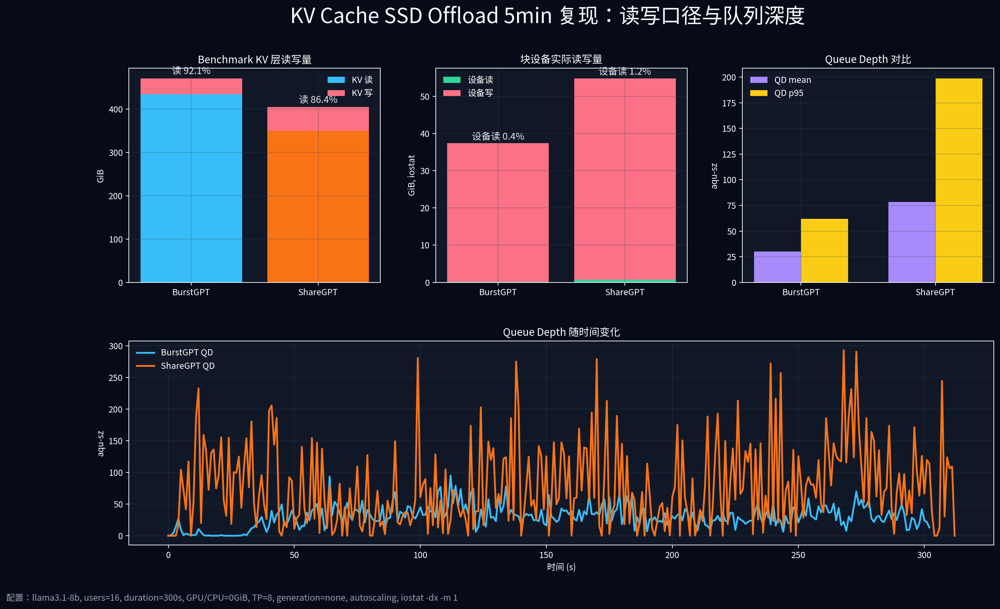
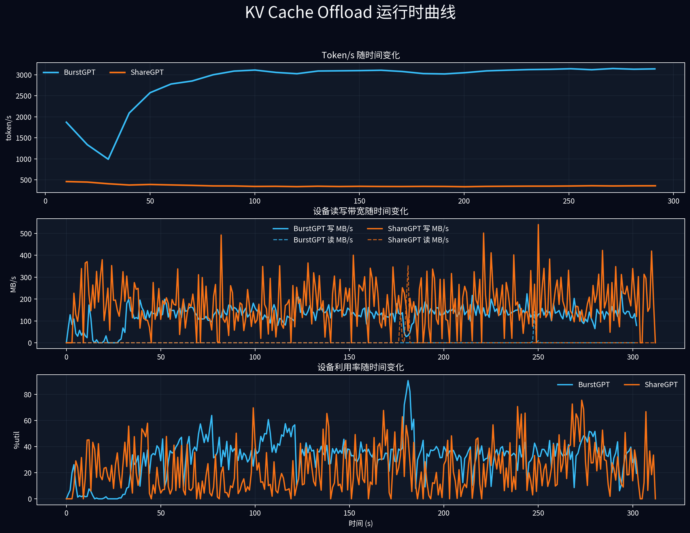

# KV Cache 6/29 5min 配置复现与 I/O 审查

**日期:** 2026-07-02  
**目标:** 按 `docs/kv-cache-2026-06-29-test-report.md` 的 5min 配置重跑 BurstGPT / ShareGPT，并补充 `iostat` 的读写比例与 queue depth。  
**结论级别:** 本文把 **benchmark KV 口径** 和 **块设备物理 I/O 口径** 分开；两者不能混用。

---

## 1. 一句话结论

按 6/29 报告同配置复现后，**KV benchmark 统计仍然是明显读多写少**：

- BurstGPT：KV bytes 约 **92.1% 读 / 7.9% 写**，read:write = **11.69:1**
- ShareGPT：KV bytes 约 **86.4% 读 / 13.6% 写**，read:write = **6.34:1**

但是 `iostat -dx -m 1` 在目标盘 `nvme2n1` 上看到的物理块设备 I/O 几乎是 **写主导**：

- BurstGPT：设备层约 **0.4% 读 / 99.6% 写**
- ShareGPT：设备层约 **1.2% 读 / 98.8% 写**

这说明：`kv-cache.py` 的 `cache_stats.total_read_gb` 是“storage tier 逻辑读”，不等价于“SSD 物理读”。本轮同配置复现可以回答 QD 和逻辑读写比例，但**不能直接作为 Mooncake SSD offload 物理读路径复现证据**。

---

## 2. 测试配置

本轮严格使用 6/29 5min 报告中的核心配置：

| 参数 | 值 |
|---|---|
| 模型 | `llama3.1-8b` |
| 起始用户数 | `16` |
| 时长 | `300s` |
| GPU / CPU KV tier | `0 GiB / 0 GiB` |
| `num-gpus` / TP | `8 / 8` |
| `max-concurrent-allocs` | `2` |
| generation | `none` |
| autoscaling | enabled |
| seed | `42` |
| cache dir | `/mnt/ai_ssd0/kvcache_0629_5min_iostat_20260702_062609/cache/<case>` |
| 目标块设备 | `/dev/nvme2n1p2` mounted at `/mnt/ai_ssd0`, fstype=`fuseblk`; `iostat` 采 `nvme2n1` |

复现脚本：

```bash
scripts/run_kvcache_0629_5min_iostat_repro.sh
```

每轮测试结束后脚本会：

1. 复制 `result.json` / `iostat.log` / `run.log` / metadata 到 `results/kvcache-profile/0629_5min_iostat_repro_20260702_062609/`
2. 删除该轮 cache 目录，释放 `/mnt/ai_ssd0` 空间
3. 再启动下一轮测试

---

## 3. 汇报图





---

## 4. 结果总表

| 指标 | BurstGPT 5min | ShareGPT 5min |
|---|---:|---:|
| Avg token/s | **3195.6** | 372.1 |
| 请求数 | 3926 | 600 |
| 总 token | 958,685 | 111,641 |
| Cache hit rate | 97.9% | 72.2% |
| KV 逻辑读 | 433.9 GiB | 349.7 GiB |
| KV 逻辑写 | 37.1 GiB | 55.1 GiB |
| KV 读占比 | **92.1%** | 86.4% |
| KV 写占比 | 7.9% | **13.6%** |
| KV read:write | 11.69:1 | 6.34:1 |
| KV 读带宽 | 1.45 GiB/s | 1.17 GiB/s |
| KV 写带宽 | 0.12 GiB/s | 0.18 GiB/s |
| iostat 设备读 | 0.16 GiB | 0.68 GiB |
| iostat 设备写 | 37.20 GiB | 54.12 GiB |
| iostat 设备读占比 | 0.4% | 1.2% |
| iostat 设备写占比 | 99.6% | 98.8% |
| QD mean | 30.1 | **78.2** |
| QD p50 | 29.2 | **60.8** |
| QD p95 | 62.0 | **198.8** |
| QD max | 94.9 | **292.9** |

原始数据：

- 仓库内汇总：`docs/assets/kvcache-0629-iostat-repro/summary.csv` / `summary.json`
- `results/kvcache-profile/0629_5min_iostat_repro_20260702_062609/summary.csv`
- `results/kvcache-profile/0629_5min_iostat_repro_20260702_062609/burstgpt_0629_5min/result.json`
- `results/kvcache-profile/0629_5min_iostat_repro_20260702_062609/sharegpt_0629_5min/result.json`
- `results/kvcache-profile/0629_5min_iostat_repro_20260702_062609/*/iostat.log`

---

## 5. 和 6/29 报告的关系

6/29 报告的主盘 5min 数据：

| 指标 | 6/29 BurstGPT | 本轮 BurstGPT | 6/29 ShareGPT | 本轮 ShareGPT |
|---|---:|---:|---:|---:|
| Avg token/s | 6088.5 | 3195.6 | 847.5 | 372.1 |
| 请求数 | 7571 | 3926 | 1370 | 600 |
| 总 token | 1,826,593 | 958,685 | 254,264 | 111,641 |
| Cache hit | 97.9% | 97.9% | 67.8% | 72.2% |
| KV 读 | 815.2 GiB | 433.9 GiB | 861.1 GiB | 349.7 GiB |
| KV 写 | 70.6 GiB | 37.1 GiB | 123.0 GiB | 55.1 GiB |
| KV 读占比 | 92.0% | 92.1% | 87.5% | 86.4% |
| KV read:write | 11.55 | 11.69 | 7.00 | 6.34 |

判断：

- **读写混合比例复现得比较一致。** BurstGPT 的 KV bytes 读占比 92.0% vs 92.1%，ShareGPT 87.5% vs 86.4%。
- **绝对吞吐更低。** 本轮目标盘是 `/mnt/ai_ssd0` 上的 `nvme2n1`，文件系统是 `fuseblk`，不是 6/29 报告里的主盘环境；所以 token/s 和总 I/O 量不应直接做盘型结论。
- **6/29 报告没有 iostat/QD 时间线。** 因此 6/29 文档不能回答“queue depth 如何变化”；本轮补上了这个缺口。

---

## 6. QD 如何变化

BurstGPT：

- 平均 QD 约 30，p95 约 62，最大约 95。
- token/s 在 50s 后爬升到 3000+，QD 随 autoscaling 上升，但整体没有 ShareGPT 那么尖。
- 写带宽大多在 100-180 MB/s 区间波动。

ShareGPT：

- 平均 QD 约 78，p95 约 199，最大约 293。
- token/s 低，约 350-450 token/s，但 QD 明显更高。
- 这说明 ShareGPT 的大上下文和更低 hit rate 会造成更重的排队压力；业务吞吐低不代表 SSD 压力低。

对 AI SSD 预研有价值的结论：

- 只看 token/s 会低估 ShareGPT 类工作负载的设备排队压力。
- QD 不是常量，而是随 autoscaling、上下文长度、cache hit rate 共同变化。
- 需要同时看 token/s、KV bytes、设备 QD、设备利用率，单一指标不够。

---

## 7. 最重要的问题：为什么设备读这么少

本轮最关键的发现是这个矛盾：

| 口径 | BurstGPT | ShareGPT |
|---|---:|---:|
| KV benchmark 逻辑读 | 433.9 GiB | 349.7 GiB |
| iostat 物理设备读 | 0.16 GiB | 0.68 GiB |

合理解释：

1. `cache_stats` 统计的是 `StorageBackend.read()` 这类 storage tier 逻辑访问，不保证每次访问都下发到块设备。
2. 当前 benchmark 使用普通文件 I/O，不是 `O_DIRECT`；Linux page cache / FUSE 层可能直接命中刚写入的数据。
3. 本轮 cache 文件在同一个 run 内写入后又读取，读路径很容易被 page cache 吸收。
4. `/mnt/ai_ssd0` 是 `fuseblk`，不是 ext4/XFS direct-I/O 友好的生产 offload 路径。

因此，本轮同配置复现不能得出“SSD 承担了 433.9 GiB / 349.7 GiB 物理读”的结论。能得出的严谨结论是：

> `kv-cache.py` 在 storage tier 逻辑上产生了读多写少的 KV 访问模式；但在当前文件系统和缓存条件下，块设备实际承受的是写主导负载。要证明真实 SSD 读压力，必须使用 bpftrace/blktrace/iostat 并控制 page cache。

---

## 8. 和三路 LBA 报告的关系

`docs/kv-cache-io-three-way-comparison-2026-06-29.md` 使用的是：

- `num-users=8`
- `duration=120`
- `TP=1`
- `GPU/CPU=0/0`
- `bpftrace tracepoint:block:block_rq_issue`
- per-I/O `sector/bytes/rwbs` 事件流

它的证据链比 5min 报告更适合分析 LBA，因为数据来自 block layer per-I/O trace，而不是 benchmark 逻辑计数。

但是它和本轮 5min 复现不是同一配置：

| 项目 | 5min 报告复现 | 三路 LBA 报告 |
|---|---|---|
| users | 16 + autoscaling | 8 |
| duration | 300s | 120s |
| TP | 8 | 1 |
| 目标 | 复现 5min throughput / QD | 分析真实 LBA 跳跃 |
| 采集 | result.json + iostat | bpftrace block trace |

所以使用方式应该是：

- 用本轮 5min 复现回答：同配置下读写混合比例、token/s、QD 时间变化。
- 用三路 LBA 报告回答：真实 block I/O 的 LBA 随机性、块大小、相邻跳跃。
- 不要把三路 LBA 的 8u/TP1 结论直接套到 5min/TP8/autoscaling 上。

---

## 9. Mooncake 风格图能否达成

能画出类似 Mooncake benchmark 的 token/s / throughput / QD 曲线，但如果目标是“证明 SSD offload 物理读路径”，当前 6/29 5min 命令还不够。

要达到 Mooncake 图的证据强度，下一轮测试应改成：

1. 使用 ext4/XFS 上的 cache dir，避免 `fuseblk`。
2. 预写足够大的 KV cache working set。
3. `sync; echo 3 > /proc/sys/vm/drop_caches`，清 OS page cache。
4. 运行 decode/read-heavy phase。
5. 同时采集：
   - `result.json`
   - `iostat -dx -m 1`
   - `bpftrace tracepoint:block:block_rq_issue`
6. 每轮结束立即归档结果并删除 cache，避免空间被打满。

只有当 `cache_stats` 的 storage read 和 `iostat/bpftrace` 的物理 read 同时成立时，才可以说复现了 Mooncake SSD offload 的真实读路径。

---

## 10. 本轮结论给老板汇报怎么讲

建议一句话：

> 我们复现了 6/29 的 5min KV workload 配置，并补齐了设备 QD 证据。逻辑 KV 层确实是读多写少，但本机文件系统/page cache 让物理 SSD 实测变成写主导；因此旧报告里的 storage read 不能直接当作 SSD 物理读。下一步 AI SSD 预研要把测试方法升级到 direct/cold-cache/block-trace，否则无法严谨评估 SSD read-path 能力。

可以展开成三点：

1. **Workload 形态成立：** BurstGPT 与 ShareGPT 的 KV 层读写比例和 6/29 报告一致。
2. **设备证据不足：** iostat 显示实际设备读很少，说明 page cache 或文件系统层吸收了逻辑读。
3. **AI SSD 测试方向：** 必须建立 cold-cache / direct-I/O / bpftrace 三件套，才能把 token/s 曲线和 SSD 产品能力绑定。
