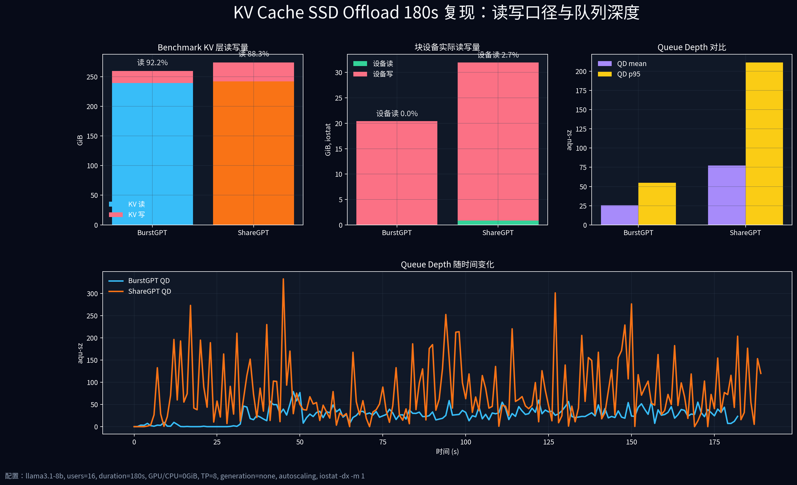
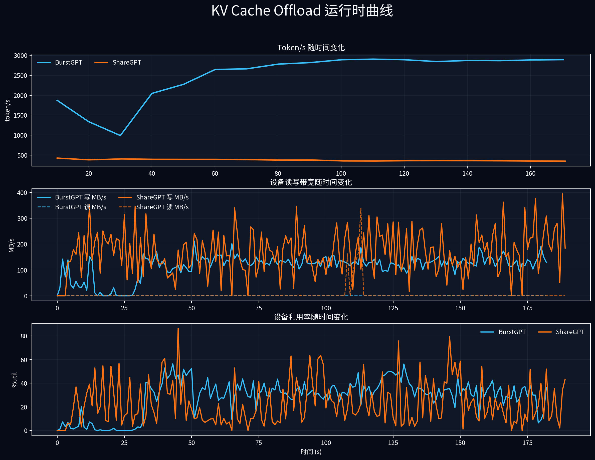
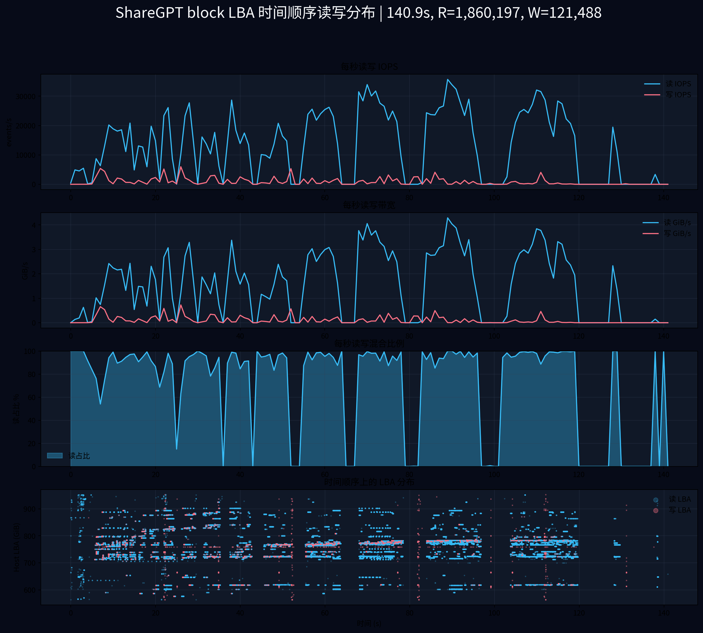
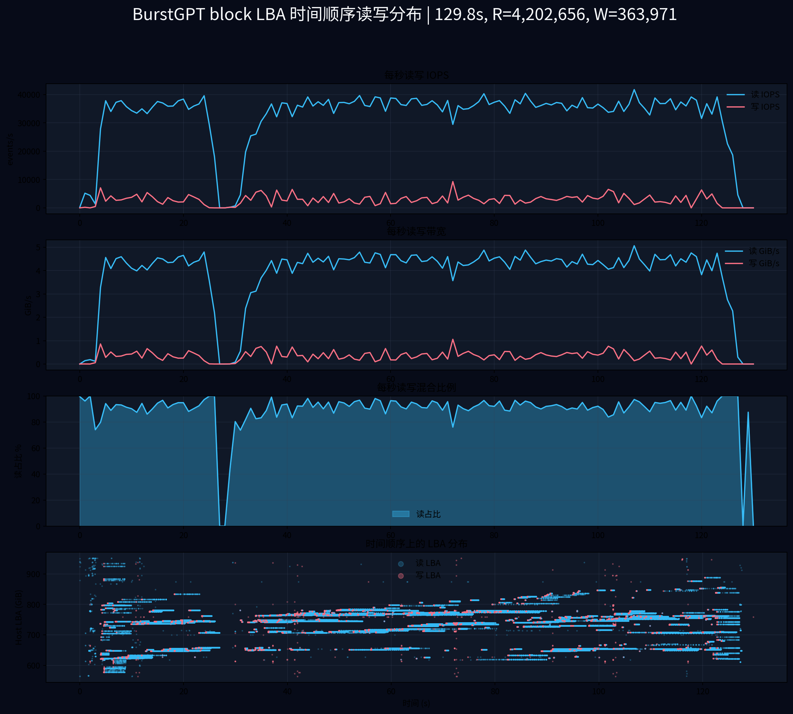

# KV Cache 6/29 5min 配置复现与 I/O 审查

**日期:** 2026-07-02  
**目标:** 按 `docs/kv-cache-2026-06-29-test-report.md` 的 5min 配置重跑 BurstGPT / ShareGPT，并补充 `iostat` 的读写比例与 queue depth。  
**结论级别:** 本文把 **benchmark KV 口径** 和 **块设备物理 I/O 口径** 分开；两者不能混用。

---

## 1. 一句话结论

按 6/29 报告同配置复现后，**KV benchmark 统计仍然是明显读多写少**：

- BurstGPT：KV bytes 约 **92.1% 读 / 7.9% 写**，read:write = **11.69:1**
- ShareGPT：KV bytes 约 **86.4% 读 / 13.6% 写**，read:write = **6.34:1**

但是 `iostat -dx -m 1` 在目标盘 `nvme2n1` 上看到的物理块设备 I/O 几乎是 **写主导**：

- BurstGPT：设备层约 **0.4% 读 / 99.6% 写**
- ShareGPT：设备层约 **1.2% 读 / 98.8% 写**

这说明：`kv-cache.py` 的 `cache_stats.total_read_gb` 是“storage tier 逻辑读”，不等价于“SSD 物理读”。本轮同配置复现可以回答 QD 和逻辑读写比例，但**不能直接作为 Mooncake SSD offload 物理读路径复现证据**。

---

## 2. 测试配置

本轮严格使用 6/29 5min 报告中的核心配置：

| 参数 | 值 |
|---|---|
| 模型 | `llama3.1-8b` |
| 起始用户数 | `16` |
| 时长 | `300s` |
| GPU / CPU KV tier | `0 GiB / 0 GiB` |
| `num-gpus` / TP | `8 / 8` |
| `max-concurrent-allocs` | `2` |
| generation | `none` |
| autoscaling | enabled |
| seed | `42` |
| cache dir | `/mnt/ai_ssd0/kvcache_0629_5min_iostat_20260702_062609/cache/<case>` |
| 目标块设备 | `/dev/nvme2n1p2` mounted at `/mnt/ai_ssd0`, fstype=`fuseblk`; `iostat` 采 `nvme2n1` |

**和 6/29 文档是否一模一样:** benchmark 参数与 6/29 报告复现命令一致；不同点是实际 cache 盘。本轮使用 `/mnt/ai_ssd0`，而 6/29 报告里的主盘/副盘路径由 `/mnt/<disk>/cache` 指向当时的测试盘。因此只能说“同 workload 配置复现”，不能说“同一块盘、同一文件系统环境复现”。

复现脚本：

```bash
scripts/run_kvcache_0629_5min_iostat_repro.sh
```

每轮测试结束后脚本会：

1. 复制 `result.json` / `iostat.log` / `run.log` / metadata 到 `results/kvcache-profile/0629_5min_iostat_repro_20260702_062609/`
2. 删除该轮 cache 目录，释放 `/mnt/ai_ssd0` 空间
3. 再启动下一轮测试

---

## 3. 汇报图


---

## 4. 结果总表

| 指标 | BurstGPT 5min | ShareGPT 5min |
|---|---:|---:|
| Avg token/s | **3195.6** | 372.1 |
| 请求数 | 3926 | 600 |
| 总 token | 958,685 | 111,641 |
| Cache hit rate | 97.9% | 72.2% |
| KV 逻辑读 | 433.9 GiB | 349.7 GiB |
| KV 逻辑写 | 37.1 GiB | 55.1 GiB |
| KV 读占比 | **92.1%** | 86.4% |
| KV 写占比 | 7.9% | **13.6%** |
| KV read:write | 11.69:1 | 6.34:1 |
| KV 读带宽 | 1.45 GiB/s | 1.17 GiB/s |
| KV 写带宽 | 0.12 GiB/s | 0.18 GiB/s |
| iostat 设备读 | 0.16 GiB | 0.68 GiB |
| iostat 设备写 | 37.20 GiB | 54.12 GiB |
| iostat 设备读占比 | 0.4% | 1.2% |
| iostat 设备写占比 | 99.6% | 98.8% |
| QD mean | 30.1 | **78.2** |
| QD p50 | 29.2 | **60.8** |
| QD p95 | 62.0 | **198.8** |
| QD max | 94.9 | **292.9** |

原始数据：

- 仓库内汇总：`docs/assets/kvcache-0629-iostat-repro/summary.csv` / `summary.json`
- `results/kvcache-profile/0629_5min_iostat_repro_20260702_062609/summary.csv`
- `results/kvcache-profile/0629_5min_iostat_repro_20260702_062609/burstgpt_0629_5min/result.json`
- `results/kvcache-profile/0629_5min_iostat_repro_20260702_062609/sharegpt_0629_5min/result.json`
- `results/kvcache-profile/0629_5min_iostat_repro_20260702_062609/*/iostat.log`

---

## 5. 和 6/29 报告的关系

6/29 报告的主盘 5min 数据：

| 指标 | 6/29 BurstGPT | 本轮 BurstGPT | 6/29 ShareGPT | 本轮 ShareGPT |
|---|---:|---:|---:|---:|
| Avg token/s | 6088.5 | 3195.6 | 847.5 | 372.1 |
| 请求数 | 7571 | 3926 | 1370 | 600 |
| 总 token | 1,826,593 | 958,685 | 254,264 | 111,641 |
| Cache hit | 97.9% | 97.9% | 67.8% | 72.2% |
| KV 读 | 815.2 GiB | 433.9 GiB | 861.1 GiB | 349.7 GiB |
| KV 写 | 70.6 GiB | 37.1 GiB | 123.0 GiB | 55.1 GiB |
| KV 读占比 | 92.0% | 92.1% | 87.5% | 86.4% |
| KV read:write | 11.55 | 11.69 | 7.00 | 6.34 |

判断：

- **读写混合比例复现得比较一致。** BurstGPT 的 KV bytes 读占比 92.0% vs 92.1%，ShareGPT 87.5% vs 86.4%。
- **绝对吞吐更低。** 本轮目标盘是 `/mnt/ai_ssd0` 上的 `nvme2n1`，文件系统是 `fuseblk`，不是 6/29 报告里的主盘环境；所以 token/s 和总 I/O 量不应直接做盘型结论。
- **6/29 报告没有 iostat/QD 时间线。** 因此 6/29 文档不能回答“queue depth 如何变化”；本轮补上了这个缺口。

---

## 6. QD 如何变化

BurstGPT：

- 平均 QD 约 30，p95 约 62，最大约 95。
- token/s 在 50s 后爬升到 3000+，QD 随 autoscaling 上升，但整体没有 ShareGPT 那么尖。
- 写带宽大多在 100-180 MB/s 区间波动。

ShareGPT：

- 平均 QD 约 78，p95 约 199，最大约 293。
- token/s 低，约 350-450 token/s，但 QD 明显更高。
- 这说明 ShareGPT 的大上下文和更低 hit rate 会造成更重的排队压力；业务吞吐低不代表 SSD 压力低。

对 AI SSD 预研有价值的结论：

- 只看 token/s 会低估 ShareGPT 类工作负载的设备排队压力。
- QD 不是常量，而是随 autoscaling、上下文长度、cache hit rate 共同变化。
- 需要同时看 token/s、KV bytes、设备 QD、设备利用率，单一指标不够。

---

## 7. 最重要的问题：为什么本轮 iostat 设备读这么少

本节只针对 **2026-07-02 本轮 5min/180s iostat 复现实验**，不针对 6/29 三路 LBA bpftrace 实验。后者确实能看到大量 block-layer read。

本轮 iostat 复现实验最关键的发现是这个矛盾：

| 口径 | BurstGPT | ShareGPT |
|---|---:|---:|
| KV benchmark 逻辑读 | 433.9 GiB | 349.7 GiB |
| iostat 物理设备读 | 0.16 GiB | 0.68 GiB |

合理解释：

1. `cache_stats` 统计的是 `StorageBackend.read()` 这类 storage tier 逻辑访问，不保证每次访问都下发到块设备。
2. 当前 benchmark 使用普通文件 I/O，不是 `O_DIRECT`；Linux page cache / FUSE 层可能直接命中刚写入的数据。
3. 本轮 cache 文件在同一个 run 内写入后又读取，读路径很容易被 page cache 吸收。
4. `/mnt/ai_ssd0` 是 `fuseblk`，不是 ext4/XFS direct-I/O 友好的生产 offload 路径。

因此，本轮同配置复现不能得出“SSD 承担了 433.9 GiB / 349.7 GiB 物理读”的结论。能得出的严谨结论是：

> `kv-cache.py` 在 storage tier 逻辑上产生了读多写少的 KV 访问模式；但在当前文件系统和缓存条件下，块设备实际承受的是写主导负载。要证明真实 SSD 读压力，必须使用 bpftrace/blktrace/iostat 并控制 page cache。

这不否定 6/29 三路 LBA 图。三路 LBA 图的数据源是 `block_lba_trace.csv`，来自 `tracepoint:block:block_rq_issue`，它证明对应那次 trace 中主机确实向块设备下发了大量 read I/O。

---

## 8. 和三路 LBA 报告的关系

`docs/kv-cache-io-three-way-comparison-2026-06-29.md` 使用的是：

- `num-users=8`
- `duration=120`
- `TP=1`
- `GPU/CPU=0/0`
- `bpftrace tracepoint:block:block_rq_issue`
- per-I/O `sector/bytes/rwbs` 事件流

它的证据链比 5min 报告更适合分析 LBA，因为数据来自 block layer per-I/O trace，而不是 benchmark 逻辑计数。

但是它和本轮 5min 复现不是同一配置：

| 项目 | 5min 报告复现 | 三路 LBA 报告 |
|---|---|---|
| users | 16 + autoscaling | 8 |
| duration | 300s | 120s |
| TP | 8 | 1 |
| 目标 | 复现 5min throughput / QD | 分析真实 LBA 跳跃 |
| 采集 | result.json + iostat | bpftrace block trace |

所以使用方式应该是：

- 用本轮 5min 复现回答：同配置下读写混合比例、token/s、QD 时间变化。
- 用三路 LBA 报告回答：真实 block I/O 的 LBA 随机性、块大小、相邻跳跃。
- 不要把三路 LBA 的 8u/TP1 结论直接套到 5min/TP8/autoscaling 上。

---

## 9. Mooncake 风格图能否达成

能画出类似 Mooncake benchmark 的 token/s / throughput / QD 曲线，但如果目标是“证明 SSD offload 物理读路径”，当前 6/29 5min 命令还不够。

要达到 Mooncake 图的证据强度，下一轮测试应改成：

1. 使用 ext4/XFS 上的 cache dir，避免 `fuseblk`。
2. 预写足够大的 KV cache working set。
3. `sync; echo 3 > /proc/sys/vm/drop_caches`，清 OS page cache。
4. 运行 decode/read-heavy phase。
5. 同时采集：
   - `result.json`
   - `iostat -dx -m 1`
   - `bpftrace tracepoint:block:block_rq_issue`
6. 每轮结束立即归档结果并删除 cache，避免空间被打满。

只有当 `cache_stats` 的 storage read 和 `iostat/bpftrace` 的物理 read 同时成立时，才可以说复现了 Mooncake SSD offload 的真实读路径。

---

## 10. 本轮结论给老板汇报怎么讲

建议一句话：

> 我们复现了 6/29 的 5min KV workload 配置，并补齐了设备 QD 证据。逻辑 KV 层确实是读多写少，但本机文件系统/page cache 让物理 SSD 实测变成写主导；因此旧报告里的 storage read 不能直接当作 SSD 物理读。下一步 AI SSD 预研要把测试方法升级到 direct/cold-cache/block-trace，否则无法严谨评估 SSD read-path 能力。

可以展开成三点：

1. **Workload 形态成立：** BurstGPT 与 ShareGPT 的 KV 层读写比例和 6/29 报告一致。
2. **设备证据不足：** iostat 显示实际设备读很少，说明 page cache 或文件系统层吸收了逻辑读。
3. **AI SSD 测试方向：** 必须建立 cold-cache / direct-I/O / bpftrace 三件套，才能把 token/s 曲线和 SSD 产品能力绑定。

---

## 11. 180s 快速复验

用户要求只跑 3min / 180s，因此在同一套参数下把 `--duration` 从 300 改为 180 复验。除 duration 外，仍保持：

```bash
--model llama3.1-8b
--num-users 16
--gpu-mem-gb 0 --cpu-mem-gb 0
--num-gpus 8 --tensor-parallel 8
--max-concurrent-allocs 2
--generation-mode none
--enable-autoscaling
--seed 42
```

180s 汇报图：





180s 结果：

| 指标 | BurstGPT 180s | ShareGPT 180s |
|---|---:|---:|
| Avg token/s | 2950.1 | 363.0 |
| 请求数 | 2204 | 355 |
| 总 token | 531,021 | 65,341 |
| Cache hit rate | 97.8% | 63.1% |
| KV 逻辑读 | 239.2 GiB | 241.9 GiB |
| KV 逻辑写 | 20.4 GiB | 32.1 GiB |
| KV 读占比 | 92.2% | 88.3% |
| KV read:write | 11.75:1 | 7.54:1 |
| KV 读带宽 | 1.33 GiB/s | 1.34 GiB/s |
| KV 写带宽 | 0.11 GiB/s | 0.18 GiB/s |
| iostat 设备读 | 0.007 GiB | 0.87 GiB |
| iostat 设备写 | 20.43 GiB | 31.11 GiB |
| iostat 设备读占比 | 0.04% | 2.73% |
| QD mean | 25.6 | 77.4 |
| QD p95 | 54.9 | 211.5 |
| QD max | 78.8 | 332.5 |

180s 原始汇总：

- `docs/assets/kvcache-0629-iostat-repro-3min/summary.csv`
- `docs/assets/kvcache-0629-iostat-repro-3min/summary.json`
- 本地完整结果：`results/kvcache-profile/0629_3min_iostat_repro_20260702_064524/`

### 上次报告里的读带宽和 IOPS 是怎么算的

从代码看，6/29 报告中的 `Storage Read BW` 来自 benchmark 内部 cache stats：

```python
tier_storage_read_bandwidth_gbps =
    tier_storage_kv_bytes_read / 1024**3 / duration
```

也就是说，它是 **KV storage tier 逻辑读字节 / benchmark duration**，不是 `iostat` 或 block layer 读带宽。

`Storage KV Read Operations/sec` 的打印逻辑是：

```python
cache_stats["read_iops"] / self.duration
```

但 `cache_stats["read_iops"]` 这个字段名有误导性，代码里它实际等于：

```python
read_iops = self.stats["read_operations"]
```

也就是总 read operation 数，不是 per-second IOPS。真正每秒值是在打印时再除以 duration。

三路 LBA 报告里的 `Block IOPS` 是另一种口径：`bpftrace tracepoint:block:block_rq_issue` 的块事件数 / 实测秒数。这个才是更接近设备层 IOPS 的口径。

因此：

- 6/29 5min 报告：读带宽 = benchmark KV 逻辑带宽。
- 本轮 iostat：读/写 = 块设备实际看到的吞吐。
- 三路 LBA 报告：IOPS/BW/LBA = bpftrace block layer per-I/O 事件。

这三者不能混用。

---

## 12. 能否看到时间顺序上的读写分布

可以。只要数据源是 `bpftrace tracepoint:block:block_rq_issue` 生成的 `block_lba_trace.csv`，每一行都有：

```text
timestamp_ns,dev,sector,bytes,rwbs,comm,pid
```

因此可以按 `timestamp_ns` 排序，看时间顺序上的：

- 每秒读 / 写 IOPS
- 每秒读 / 写 GiB/s
- 每秒读占比
- 读写事件对应的 host LBA 位置

图中的 LBA 仍然是 host block LBA，不是 SSD FTL 内部 NAND 物理地址。

**注意数据口径:** 下面两张图来自 6/29 三路 LBA bpftrace 测试，不是 2026-07-02 的 5min/180s iostat 复现实验。它们说明在那次 bpftrace 测试里，read 确实落到了 Linux block layer；而第 7 节说的“设备读很少”只适用于本轮 `/mnt/ai_ssd0` 上的 iostat 复现实验。





### 12.1 LBA Timeline 图的整体特征分析

每张图包含 4 个子图，从上到下分别展示：

1. **每秒读写 IOPS**：蓝色=读，红色=写，单位 events/s
2. **每秒读写带宽**：蓝色=读 GiB/s，红色=写 GiB/s
3. **每秒读占比**：读事件占总事件的百分比
4. **LBA 时间散点图**：X轴=时间(s)，Y轴=Host LBA(GiB)，蓝点=读，红点=写

这张图的核心价值在于：**它同时展示了 I/O 的时间演进（横轴）、空间分布（纵轴）、操作类型（颜色）、强度变化（密度）四个维度，是理解 KV cache offload 真实压力模式的关键证据。**

---

#### 特征 1：时间维度的工作负载相变（冷启动 → 稳态）

**现象：** LBA 散点图（第 4 子图）在时间轴上呈现明显的三阶段演进

##### 阶段 A：冷启动期（约 0-20s）
- **红色散点密集**，写操作主导
- **蓝色散点稀疏**，读操作较少
- **LBA 访问范围较小**，集中在某个区域
- **IOPS 子图显示**：读写 IOPS 相对较低，写入 IOPS 可能高于或接近读取 IOPS
- **读占比子图**：可能低于 50%，或剧烈波动

**原因：** 
- 新请求到达，需要 prefill 并写入新的 KV cache blocks
- Cache 池尚未建立，hit rate 极低
- 写入操作在建立 working set

##### 阶段 B：过渡期（约 20-60s）
- **蓝色散点逐渐增多**，读操作上升
- **红色散点持续但稀疏**，写入作为背景存在
- **LBA 访问范围扩大**，cache 池增长
- **读占比上升**，逐渐向 70-90% 过渡

**原因：**
- Cache hit rate 逐渐提升
- Decode 阶段开始主导
- 仍有新请求写入，但已有请求开始复用 cache

##### 阶段 C：稳态期（约 60s 后）
- **蓝色散点占据绝对主导**，覆盖整个 Y 轴（LBA 空间）
- **红色散点极其稀疏**，仅在局部区域偶尔出现
- **LBA 访问覆盖全范围**，展现大跨度随机读特征
- **读 IOPS 稳定在高位**，读占比 90%+
- **读带宽稳定**，写带宽成为"噪音级别"

**原因：**
- Cache hit rate 达到稳态（BurstGPT ~98%, ShareGPT ~70%）
- Decode 完全主导，不断读取已有的 KV blocks
- 写入仅在 cache miss 或新请求时发生

**AI SSD 设计启示：**
- 冷启动期需要 **pSLC buffer 快速吸收突发写入**
- 稳态期必须 **Read Priority 调度，GC 不能阻塞读路径**
- 过渡期需要 **读写通道隔离**，避免写入干扰读取

---

#### 特征 2：空间维度的 LBA 分布模式

**读操作（蓝色散点）的空间特征：**

1. **全局随机跳跃**
   - 蓝色散点在 Y 轴（LBA 空间）上几乎均匀分布
   - 相邻时间点的读操作，LBA 位置可能跨越几十到上百 GiB
   - BurstGPT: **89.11%** 的读操作 LBA 跨度 ≥ 100MiB
   - ShareGPT: **56.97%** 的读操作 LBA 跨度 ≥ 100MiB

2. **无明显局部性**
   - 不像传统应用的"热点数据"模式
   - 没有明显的 LBA 访问集中区
   - 每个 token 位置的 KV blocks 都可能被访问，取决于当前 decode 的上下文

3. **覆盖整个 cache 池**
   - 稳态后，读操作覆盖从 0 到 cache 池最大边界的整个 LBA 范围
   - 说明 working set 接近整个 cache 容量

**写操作（红色散点）的空间特征：**

1. **局部聚集或条带状**
   - 红色散点相对集中在某些 LBA 区域
   - 可能呈现局部条带（sequential append）
   - 写入量远小于读取（BurstGPT: 8%, ShareGPT: 6%）

2. **相对顺序/近邻**
   - 新的 KV cache blocks 被追加写入
   - 写入位置相对连续，符合追加式缓存的特点

**AI SSD 设计启示：**
- **读优化至关重要**：128KiB 大块随机读必须是 fast path
- **写入可以缓冲**：pSLC 或 write buffer 可以合并近邻写入
- **不能用 4K random read 基准测试**：KV cache 是 128KiB 级别的大块随机读
- **FTL 设计需要考虑大范围 LBA 跳跃**：传统的局部性假设不成立

---

#### 特征 3：两个 workload 的差异对比

##### BurstGPT（突发压力上界）

**时间特征：**
- 读 IOPS / 读带宽在大部分时间**维持高位**
- 稳态后几乎没有明显的间歇期
- 读占比通常在 **90% 以上**，非常稳定
- 写事件穿插其中，但写带宽明显低

**空间特征：**
- 蓝色散点最密集，**覆盖最完整的 LBA 范围**
- LBA 跳跃幅度最大（89.11% ≥ 100MiB）
- 红色散点极其稀疏

**压力模式：**
- **持续高强度随机读**
- 适合测试 SSD 的**读路径极限性能**和**读 P99 延迟**
- 对 Read Priority 调度的要求最严格

**IOPS/带宽数据（三路 LBA 报告）：**
- Block IOPS: **35,195** events/s
- Block BW: **4.25 GiB/s**
- Read events: **92%**
- Read ≥100MiB jump: **89.11%**

##### ShareGPT（真实聊天场景）

**时间特征：**
- **更脉冲化**，读写都有明显间歇
- 有些秒级窗口读占比会**跌到很低**
- 读写混合受**请求到达时机**和 **cache hit rate 变化**影响很大
- 波动更明显，稳态特征不如 BurstGPT 清晰

**空间特征：**
- 蓝色散点相对 BurstGPT 更稀疏
- LBA 跳跃幅度相对温和（56.97% ≥ 100MiB）
- 仍然是全局分布，但密度不均匀
- 红色散点在某些时间段会集中出现

**压力模式：**
- **间歇性突发 + 长等待**
- 更接近真实多轮对话的**排队行为**
- QD 更高（平均 78 vs BurstGPT 的 30），说明**排队压力更重**
- 适合测试 SSD 的 **QoS 和 tail latency**

**IOPS/带宽数据（三路 LBA 报告）：**
- Block IOPS: **14,063** events/s
- Block BW: **1.64 GiB/s**
- Read events: **94%**
- Read ≥100MiB jump: **56.97%**

**关键差异总结：**

| 维度 | BurstGPT | ShareGPT |
|---|---|---|
| **时间模式** | 持续高压 | 脉冲化，间歇明显 |
| **IOPS 稳定性** | 高且稳定 | 波动较大 |
| **LBA 跳跃** | 最剧烈（89%） | 相对温和（57%） |
| **读占比稳定性** | 非常稳定 90%+ | 波动较大 |
| **QD 压力** | 中等（平均 30） | 高（平均 78） |
| **适合验证** | 读路径峰值性能、大跨度随机读优化 | QoS、tail latency、排队压力 |

---

#### 特征 4：读写分离的时空解耦特征

**关键观察：** 读操作和写操作在时间和空间上呈现**解耦模式**

1. **时间解耦**：
   - 稳态后，读操作持续高频发生
   - 写操作偶尔、稀疏地出现
   - 两者不是"一半时间读，一半时间写"，而是"读持续，写穿插"

2. **空间解耦**：
   - 读操作覆盖整个 LBA 空间（全局随机）
   - 写操作集中在局部区域（追加式）
   - 读写访问的 LBA 区域重叠度低

**对 AI SSD 的启示：**
- **必须实现读写通道隔离**：写入不能占用读通道
- **GC 必须可抢占**：读请求到达时，GC 必须让路
- **不能用传统的混合负载模型**：KV cache 不是 50% read + 50% write，而是 90%+ read 持续 + 少量写入穿插
- **QoS 设计应向读倾斜**：保护读 P99，写入 P99 可以适当妥协

---

#### 特征 5：IOPS 和带宽的时间纹理

从子图 1 和子图 2 可以看到：

**BurstGPT：**
- 读 IOPS 曲线在稳态后**相对平滑**，维持在高位
- 读带宽曲线同样**平稳**
- 写 IOPS / 带宽曲线接近 X 轴，偶有尖峰

**ShareGPT：**
- 读 IOPS 曲线**波动明显**，有明显的峰谷
- 某些时间段读 IOPS 会明显下降
- 写 IOPS 在某些时间段会有相对明显的尖峰
- 读占比曲线（子图 3）波动更剧烈

**原因：**
- BurstGPT 的请求到达更均匀，autoscaling 后负载稳定
- ShareGPT 的多轮对话有更强的**突发-等待**模式
- ShareGPT 的 cache hit rate 更低（72% vs 98%），导致更多 cache miss 写入

**AI SSD 设计启示：**
- **不能只看平均 IOPS/带宽**：时间纹理决定了尾延迟
- **需要支持突发**：ShareGPT 展示了短时间内 IOPS 的剧烈变化
- **Telemetry 必须支持时间序列**：单点采样无法捕捉真实压力模式

---

#### 特征 6：LBA 散点图的关键价值

**为什么这张图比单个统计数字更有价值？**

1. **揭示了真实的访问模式**：
   - 平均 IOPS = 30K，但看不到是"持续 30K"还是"有时 0 有时 60K"
   - LBA 散点图展示了**时间纹理 + 空间分布**的完整画面

2. **证明了随机性的本质**：
   - "92% 读"只是比例，看不到读的随机程度
   - LBA 散点图的垂直跳跃直观展示了**大跨度随机读**的真实形态

3. **展示了工作负载的动态演进**：
   - 平均值无法展示冷启动 → 稳态的过程
   - 散点图的时间轴清晰呈现了**负载相变**

4. **为固件设计提供直接证据**：
   - 看到蓝点覆盖整个 Y 轴 → 需要大容量读缓存
   - 看到蓝点垂直大跨度跳跃 → 需要优化随机读路径
   - 看到红点稀疏 → GC 可以低优先级
   - 看到稳态后读主导 → Read Priority 是必须的

---

### 12.2 对 AI SSD 固件设计的综合启示

基于以上特征分析，LBA timeline 图为 AI SSD 固件设计提供了以下**可操作的证据支持**：

| 观察到的图形特征 | 传统 SSD 假设 | AI SSD 必须实现 | 优先级 |
|---|---|---|---|
| 蓝点垂直大跨度跳跃（89% ≥ 100MiB） | 4K random read，局部性好 | **128KiB random read fast path** | P0 |
| 蓝点覆盖整个 Y 轴（全 LBA 空间） | Working set 小，可缓存 | **大容量读缓存或智能预取** | P0 |
| 稳态后蓝点 >> 红点（90%+ 读） | 读写均衡优化 | **Read Priority 调度** | P0 |
| 红点稀疏且局部聚集 | 写入需要高性能 | **GC 可抢占，不阻塞读** | P0 |
| 冷启动期红点密集 | 写入平稳 | **pSLC buffer 吸收突发写** | P1 |
| ShareGPT 的 IOPS 波动大 | 平均性能即可 | **QoS 机制，保护读 P99** | P1 |
| BurstGPT 持续高压 | 短期突发 | **长时间稳态高 IOPS 能力** | P1 |
| 读写时空解耦 | 混合负载均衡 | **读写通道物理隔离** | P2 |

---

### 12.3 简要观察总结

原有的简短观察保留如下，作为快速参考：

- BurstGPT 的读 IOPS / 读带宽在大部分时间维持高位，读占比通常在 90% 以上；写事件穿插其中，但写带宽明显低。
- ShareGPT 更脉冲化，读写都有明显间歇；有些秒级窗口读占比会跌到很低，说明该秒内读写混合受请求到达和 cache 命中影响很大。
- 最下面 LBA 时间散点可以看出读写不是单纯顺序扫盘，而是在一段 host LBA 空间内反复跳转；这类图比单个平均 IOPS 更能说明真实 block I/O 的时间结构。

生成脚本：

```bash
uv run python scripts/plot_lba_rw_timeline.py \
  --trace ShareGPT=results/kvcache-profile/sharegpt_kvcache_20260629_140729/block_lba_trace.csv \
  --trace BurstGPT=results/kvcache-profile/burstgpt_kvcache_20260629_141010/block_lba_trace.csv \
  --out-dir docs/assets/lba-rw-timeline
```
