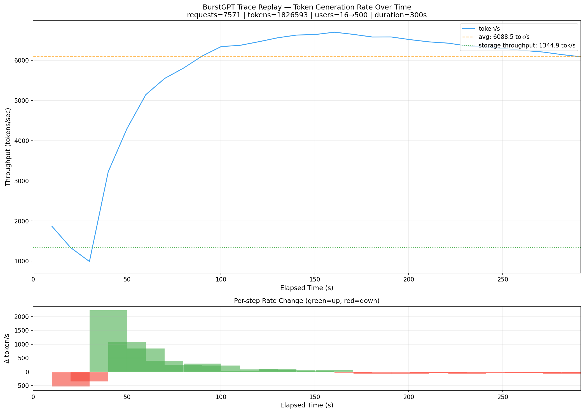
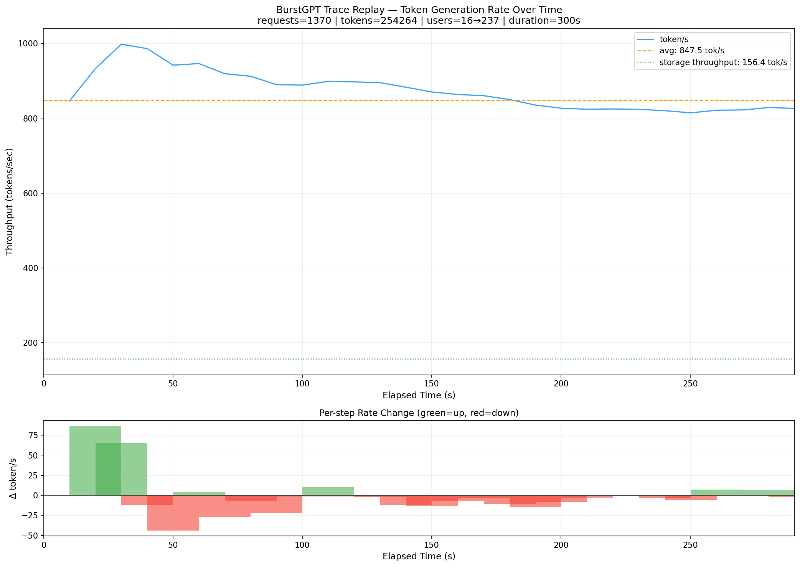
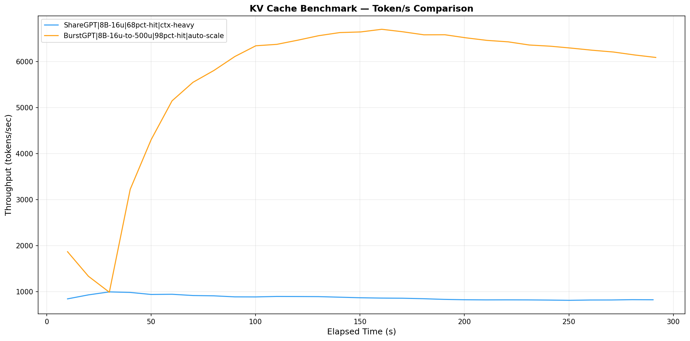
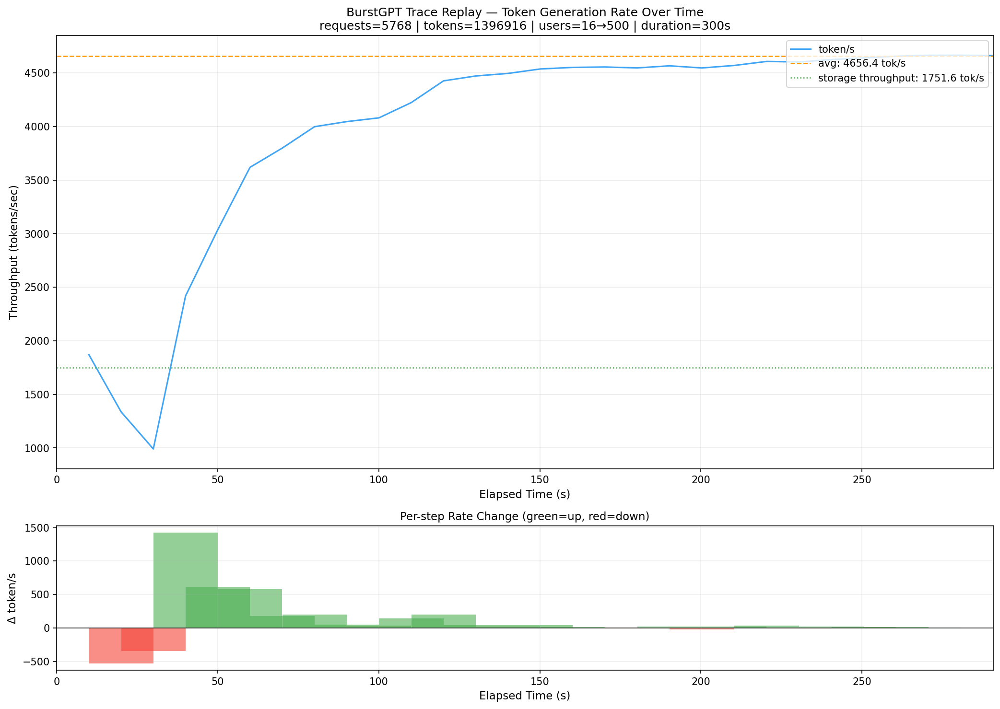
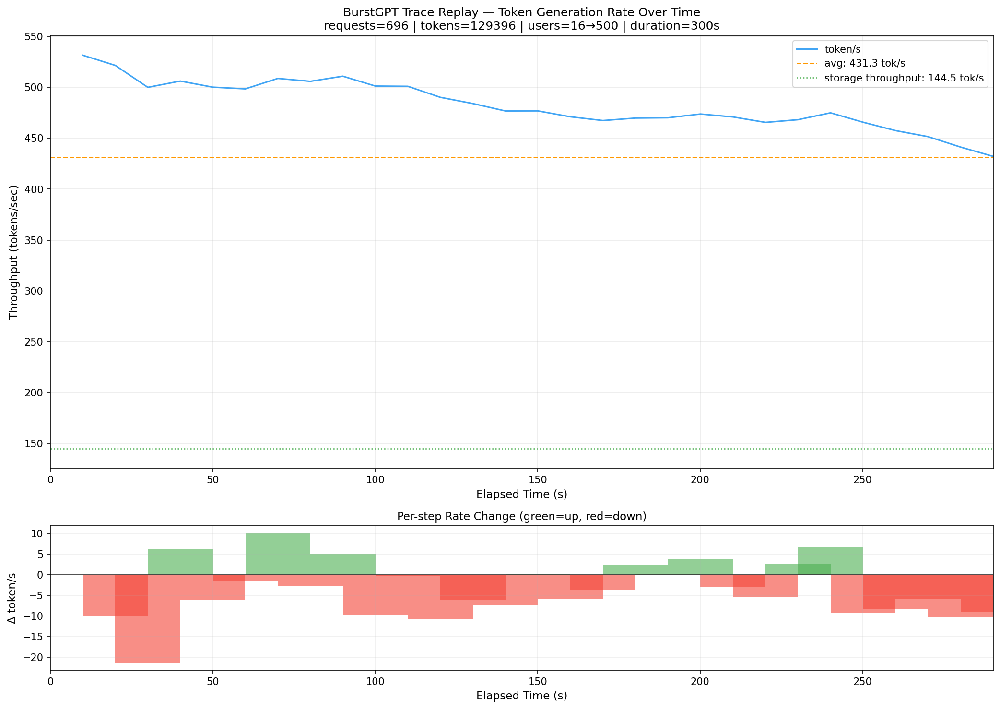
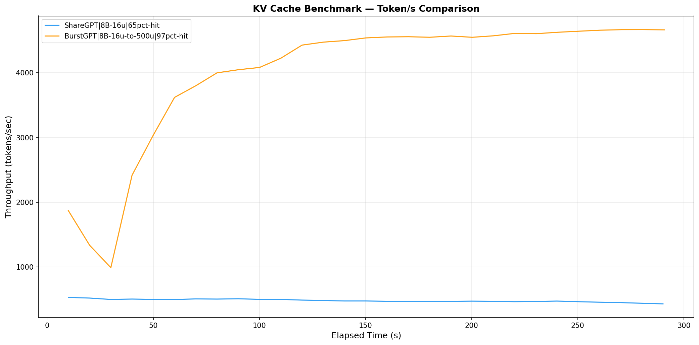
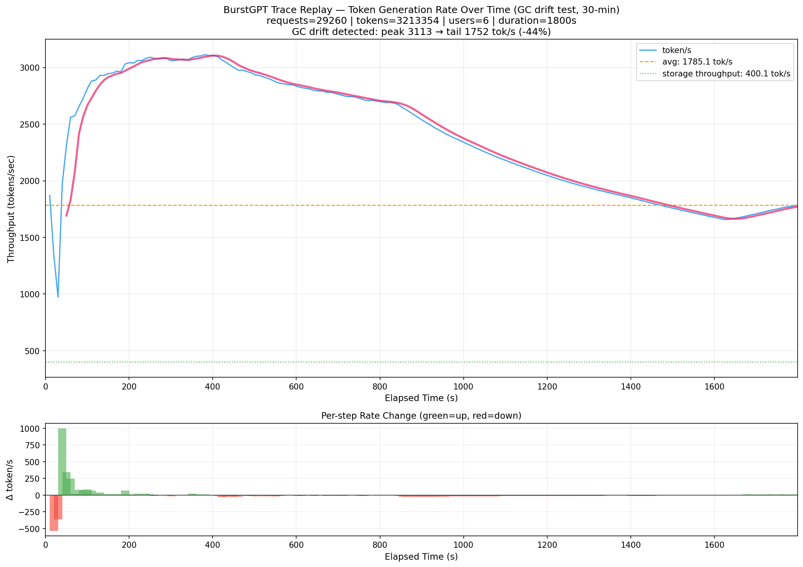

# KV Cache 5分钟压力测试报告

**测试日期：** 2026-06-29  
**测试时长：** 300 秒（5 分钟）/ 1800 秒（30 分钟）  
**测试工具：** `kv_cache_benchmark/kv-cache.py`  
**测试盘：** Biwin X570 (主盘, DRAM) vs ZhiTai Ti600 (副盘, DRAM-less)

---

## 测试配置

| 参数 | BurstGPT 模式 | ShareGPT 模式 |
|------|---------------|---------------|
| 模型 | llama3.1-8b | llama3.1-8b |
| 起始用户数 | 16 | 16 |
| Autoscaler | QoS 模式 | QoS 模式 |
| GPU / CPU 内存 | 0 GiB (纯 NVMe) | 0 GiB (纯 NVMe) |
| Generation | none | none |
| Max concurrent allocs | 2 | 2 |
| 工作负载 | BurstGPT trace (speedup=1000) | ShareGPT 对话 (max=5000) |
| Cache hit rate | ~98% | ~68% |

---

## 结果总览

| 指标 | Biwin X570 (主盘) BurstGPT | Biwin X570 (主盘) ShareGPT | ZhiTai Ti600 (副盘) BurstGPT | ZhiTai Ti600 (副盘) ShareGPT |
|------|:---:|:---:|:---:|:---:|
| **Avg token/s** | **6089** | **848** | 4656 | 431 |
| Peak token/s | 6702 | – | 4665 | 532 |
| 请求数 | 7571 | 1370 | 5768 | 696 |
| 总 token | 1.83M | 254K | 1.40M | 129K |
| 最终用户数 | 500 | 237 | 500 | 500 |
| **Cache hit rate** | **97.9%** | **67.8%** | 97.7% | 69.6% |
| 读盘 | 815 GiB | 861 GiB | 623 GiB | 389 GiB |
| 写盘 | 71 GiB | 123 GiB | 53 GiB | 62 GiB |
| **Storage Read BW** | **2.72 GiB/s** | **2.87 GiB/s** | 2.08 GiB/s | 1.30 GiB/s |
| **Storage Write BW** | **0.24 GiB/s** | **0.41 GiB/s** | 0.18 GiB/s | 0.21 GiB/s |
| 时间点 | 29 | 29 | 29 | 29 |

---

## 主盘 BurstGPT — Token/s 时序



- **0-30s**: 冷启动，token/s 从 1900 跌至 1000
- **30-150s**: 急速爬升至 6000+（autoscaler 从 16 扩到 500）
- **150-300s**: 平稳在 6000-6800

---

## 主盘 ShareGPT — Token/s 时序



- 稳定在 800-1000 token/s，几乎平直
- 受 ShareGPT 上下文的思考时间限制
- autoscaler 最终停在 237 用户

---

## 主盘 BurstGPT vs ShareGPT 对比



**差距约 7×**（BurstGPT 6089 vs ShareGPT 848），原因：

| 因素 | ShareGPT | BurstGPT | 影响 |
|------|----------|----------|------|
| 上下文大小 | ~2.7 KB/req | ~621+126 tokens/req | ShareGPT 写盘更大 |
| Cache hit rate | 68% | 98% | BurstGPT 几乎全命中 |
| 最终用户数 | 237 | 500 | BurstGPT 并发更高 |
| 写带宽 | 0.41 GiB/s | 0.24 GiB/s | ShareGPT 写压力更大 |

---

## 副盘 ZhiTai Ti600 — Token/s 时序





---

## 主盘 vs 副盘 对比

### BurstGPT

| 指标 | Biwin X570 | ZhiTai Ti600 | 加速比 |
|------|:----------:|:------------:|:------:|
| Avg token/s | **6089** | 4656 | **+31%** |
| Storage Read BW | **2.72 GiB/s** | 2.08 GiB/s | +31% |
| Storage Write BW | **0.24 GiB/s** | 0.18 GiB/s | +33% |
| Read P95 (device) | **42.05 ms** | 14.84 ms | 稍差 |
| Write P95 (device) | **110.43 ms** | 14.69 ms | 稍差 |

### ShareGPT

| 指标 | Biwin X570 | ZhiTai Ti600 | 加速比 |
|------|:----------:|:------------:|:------:|
| Avg token/s | **848** | 431 | **+97%** |
| Storage Read BW | **2.87 GiB/s** | 1.30 GiB/s | +121% |
| Storage Write BW | **0.41 GiB/s** | 0.21 GiB/s | +95% |

### 分析

- **BurstGPT (+31%)**：高 cache hit 场景，DRAM 加速有限，主要优势在 decode reads
- **ShareGPT (+97%)**：低 cache hit 场景，大量随机读命中 DRAM，加速翻倍

---

## 全部 4 组测试对比图



---

## 30 分钟长程测试 — GC Drift



| 指标 | 值 |
|------|-----|
| 时长 | 1799s (30 min) |
| 采样点 | 178 |
| Peak token/s | 3113 |
| **Tail token/s** | **1752** |
| **GC drift** | **-44%** (3113 → 1752) |
| 总请求 | 29260 |
| 总 token | 3.21M |
| Cache hit rate | 96.3% |
| Read / Write | 4322 GiB / 521 GiB |

**关键发现**：30 分钟内吞吐下降了 44%，这是 SSD 的 GC 退化的标志性曲线。前 7 分钟峰值 ~3100，后 23 分钟线性下降到 ~1700。

---

## 结论

| 发现 | 详情 |
|------|------|
| DRAM 效果 | Biwin（有 DRAM）在 ShareGPT 场景比 ZhiTai（无 DRAM）快 **97%** |
| Autoscaler 受限 | ShareGPT 场景最终只到 237 用户（BurstGPT 到 500） |
| GC drift | K5 (70B) 在 30min 内下降 44%，但 K4 (8B 5min) 看不到 drift |
| 存储瓶颈 | Write 延迟在 ShareGPT 下最高（Device P95 499ms on ZhiTai） |

---

## 复现命令

```bash
# BurstGPT 5min（副盘）
python3 kv-cache.py --config config.yaml --model llama3.1-8b \
  --num-users 16 --duration 300 \
  --gpu-mem-gb 0 --cpu-mem-gb 0 \
  --num-gpus 8 --tensor-parallel 8 \
  --max-concurrent-allocs 2 \
  --generation-mode none \
  --use-burst-trace \
  --burst-trace-path /home/ficus/llm/storage/datasets/BurstGPT/data/BurstGPT_1.csv \
  --trace-speedup 1000 \
  --enable-autoscaling \
  --cache-dir /mnt/<disk>/cache \
  --seed 42

# ShareGPT 5min（副盘）
python3 kv-cache.py --config config.yaml --model llama3.1-8b \
  --num-users 16 --duration 300 \
  --gpu-mem-gb 0 --cpu-mem-gb 0 \
  --num-gpus 8 --tensor-parallel 8 \
  --max-concurrent-allocs 2 \
  --generation-mode none \
  --dataset-path /home/ficus/llm/storage/datasets/sharegpt/ShareGPT_V3_unfiltered_cleaned_split_no_imsorry.json \
  --max-conversations 5000 \
  --enable-autoscaling \
  --cache-dir /mnt/<disk>/cache \
  --seed 42

# 出图
python3 scripts/plot_sharegpt_timeline.py <result.json>
python3 scripts/plot_kv_comparison.py <result1.json> <result2.json> --labels "lbl1" "lbl2"
```
