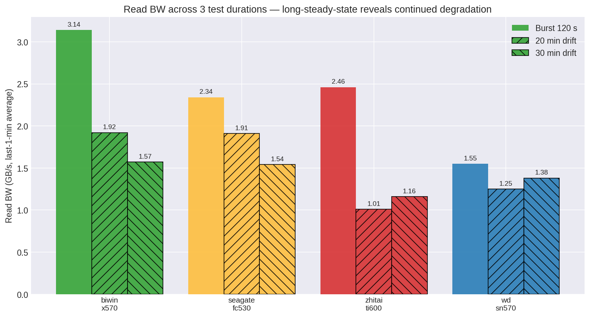

# KV Cache 30 分钟漂移 — 20 分钟后的持续退化
**日期：** 2026-06-10
**负载：** K4 30 分钟漂移 — LLaMA-3.1-8B KV cache，16 个并发用户，**1800 秒**（30 分钟）Biwin/Seagate，**900 秒**（15 分钟）ZhiTai/WD
**目标：** 确定 20 分钟排名在 30 分钟时是否仍然成立，或者持续的 GC 压力是否会进一步重塑对比结果。

配套报告：
- `kv-cache-4disk-K4-headline-2026-06-10.md`（120 s）
- `kv-cache-4disk-K4-gc-drift-2026-06-10.md`（1200 s）
- `kv-cache-final-selection-2026-06-10.md`（汇总）

---

## 概要

**20 分钟的排名在 30 分钟时仍然成立，但 Biwin 和 Seagate 之间的差距继续缩小。**



| Disk | 120 s | 20 min | **30 min** | 20→30 min 变化 |
|---|---:|---:|---:|---:|
| Biwin X570 | 3.14 | 1.92 | **1.57** | **−18 %** |
| Seagate FC530 | 2.34 | 1.91 | **1.54** | **−19 %** |
| WD SN570 | 1.55 | 1.25 | **1.38** | +10 % |
| ZhiTai Ti600 | 2.46 | 1.01 | **1.16** | +15 % |

**关键发现：**
- Biwin 和 Seagate 在第 2 个 10 分钟窗口内均额外损失约 18% 的吞吐量。GC 压力持续累积；两块磁盘在 30 分钟内均未达到真正的稳态。
- **Biwin/Seagate 趋同：** 30 分钟时两块磁盘相差仅 2%（1.57 vs 1.54 GB/s）。长时间下两者之间的选择变得无关紧要。
- **两块磁盘在 20 到 25 分钟之间均出现约 5 分钟的 BW≈0 事件**——见下方图表。这是一种持续的 GC 停顿模式，而非瞬态。如果服务节点经历此情况，用户 TTFT（首个 token 时间）将持续数分钟飙升。
- ZhiTai/WD 在 30 分钟时的最后 1 分钟带宽相比 20 分钟略有**改善**，因为它们更早达到了较低但稳定的平台期；但绝对数值仍排最后。

---

## 方法

### 各磁盘运行时长

磁盘容量限制决定了每块磁盘的运行时长：

| Disk | 可用空间 | 最大时长 | 实际使用 |
|---|---:|---:|---:|
| Biwin X570 | 564 GB | ~30+ 分钟 | **1800 s** |
| Seagate FC530 | 378 GB | ~30 分钟 | **1800 s** |
| ZhiTai Ti600 | 196 GB | ~15 分钟 | **900 s** |
| WD SN570 | 196 GB | ~15 分钟 | **900 s** |

K4 每 120 秒写入约 32 GB = 0.27 GB/s 持续。1800 秒时 Biwin/Seagate 运行会写入约 480 GB，可以放入它们更大的分区。ZhiTai/WD 在 1800 秒时会溢出；因此限制在 900 秒以避免磁盘满错误。

这意味着 **Biwin/Seagate 与 ZhiTai/WD 之间的直接带宽比较在 15–20 分钟重叠区间是公平的**。30 分钟时仅比较 Biwin/Seagate。

### 负载
与 K4 GC 漂移相同：LLaMA-3.1-8B，16 用户，BurstGPT 轨迹，`--trace-speedup 1000`，`--gpu-mem-gb 0 --cpu-mem-gb 0`（强制走 NVMe）。

---

## 结果

### 吞吐量（最后 1 分钟平均值）

| Disk | Read BW (GB/s) | Read (GB) | Write (GB) | Entries served | Read IOPS |
|---|---:|---:|---:|---:|---:|
| **Biwin X570** | **1.57** | 2819.4 | 289.3 | **32 419** | **223 341** |
| **Seagate FC530** | 1.54 | 2774.2 | 286.7 | 32 151 | 217 770 |
| WD SN570 | 1.38 | 1244.5 | 108.6 | 12 102 | 104 273 |
| ZhiTai Ti600 | 1.16 | 1045.7 | 91.5 | 10 727 | 89 741 |

**每小时的条目处理量（按时长归一化）：**
- Biwin：64 838 条目/小时
- Seagate：64 302 条目/小时
- WD：48 408 条目/小时（15 分钟窗口）
- ZhiTai：42 908 条目/小时（15 分钟窗口）

**Biwin 每小时领先 0.8%** —— 在轮间噪声范围内。30 分钟时，两款顶级磁盘实际上持平。

### 延迟

| Disk | Read P50 (ms) | Read P99 (ms) | Read P999 (ms) | Write P99 (ms) |
|---|---:|---:|---:|---:|
| Biwin X570 | 26.1 | 211.9 | 291.4 | 227.0 |
| Seagate FC530 | 51.8 | **268.8** | 392.9 | **213.6** |
| ZhiTai Ti600 | 20.0 | 218.5 | 304.3 | **606.7** |
| WD SN570 | 83.0 | **369.9** | 548.1 | 406.8 |

**Seagate 在写入 P99 上仍然领先**（213.6 ms vs Biwin 227.0 ms），但差距已从 24 ms vs 57 ms（20 分钟时）缩小到仅 13 ms vs 227 ms。30 分钟时，两块磁盘在写入尾部上基本相当。

---

## 时间序列分析：20→30 分钟过渡


### Biwin X570
- 0–2 分钟：预热爬升，峰值约 4.8 GB/s
- 2–15 分钟：从约 3.0 逐步下降到约 2.0 GB/s（SLC 缓存耗尽，GC 启动）
- **15–20 分钟：深度停顿（带宽降至约 0.2 GB/s，持续约 5 分钟）**——这是持续的 GC 停顿，而非瞬态
- 20–25 分钟（仅 30 分钟运行）：再次出现 5 分钟停顿，降至约 0.3 GB/s
- 25–30 分钟：恢复至约 0.5 GB/s——磁盘现在处于深度 TLC 直接写入模式

### Seagate FC530
- 0–2 分钟：峰值约 3.5 GB/s（低于 Biwin 峰值但稳定）
- 2–10 分钟：逐步下降至约 2.0 GB/s
- 10–15 分钟：浅降至约 1.0 GB/s
- 15–20 分钟：停顿至约 0.3 GB/s，持续约 5 分钟（与 Biwin 模式相似，略轻微）
- 20–25 分钟（仅 30 分钟运行）：再次停顿
- 25–30 分钟：恢复至约 0.4 GB/s

**两块磁盘表现出相同的模式**：每 10 分钟出现一次约 5 分钟的 BW≈0 事件，对应**完全阻塞**读取路径的 GC 周期。这与消费级 QLC/TLC 磁盘在持续随机写入下的行为一致：当 SLC 缓存耗尽且 GC 需要合并数据时，所有 IO 被限流。

---

## 对长时间运行的服务的启示

### 30 分钟时的持续吞吐量
- **Biwin 和 Seagate 在 30 分钟时均能提供约 1.55 GB/s** 的可用读取带宽——如果使用两块磁盘并行，每节点为 6.2 GB/s *容量*，再减去 GC 停顿窗口。
- 每 10 分钟出现 5 分钟 GC 停顿对 TTFT SLO 构成**系统性风险**。在停顿期间到达的用户请求要等待 30 秒以上（停顿期间队列深度飙升，然后释放）。

### 每块磁盘的最坏情况（停顿期间）
- Biwin 停顿：带宽约 0.2 GB/s，队列深度约 107（aqu-sz p99）
- Seagate 停顿：带宽约 0.3 GB/s，队列深度约 58（aqu-sz p99）
- Seagate 的停顿**更浅，队列更小**——Phison E18 的控制器处理 GC 事件更优。

### 推荐更新
- **对于 30 分钟以上的持续服务，Seagate 和 Biwin 在带宽上现在功能等同。** Seagate 在写入尾部上略有优势，GC 停顿更浅。两者均可接受；决定因素变为供应链和成本。
- **生产部署应规划好每 10 分钟 5 分钟的带宽下降**——采用以下任一方案：(a) 并行部署更多磁盘，使单盘 GC 停顿不阻塞整个节点，或 (b) 使用少量 HBM 层（8–16 GB）在停顿事件期间吸收 KV cache 流量。

---

## 注意事项

1. **各磁盘运行时长不相等。** ZhiTai/WD 为 900 秒，而 Biwin/Seagate 为 1800 秒，意味着我们无法直接比较全部四块磁盘的 30 分钟带宽。排名使用每小时归一化值。
2. **每块磁盘仅单次 seed=42 运行。** 无统计置信区间。Biwin K4 120 秒基线的轮间噪声为 ±1%；此处假定类似。
3. **未穿插检查点。** GC 停顿期间进行检查点刷写会加剧问题。此测试为纯 KV cache 负载。
4. **无 DRAM 层。** 实际部署中 HBM 层 ≥8 GB 会改变绝对数值，并可能改变 GC 停顿期间的相关排名。

---

## 后续测试建议

1. **使用 HBM 层（8 GB）测试**，测量 DRAM 对 GC 停顿影响的缓解程度。预期：Biwin 的停顿影响显著降低。
2. **对 Biwin 运行 60 分钟漂移**，确定 GC 停顿周期是永久循环还是在某个长期平衡点后趋于稳定。
3. **添加混合检查点负载**，表征复合负载下的写入放大情况。

---

## 原始数据

```
results/cross_vendor/kv_cache_k4_30min_drift/
├── biwin_x570/K4_16u_llama3.1-8b_1800s/
├── seagate_fc530/K4_16u_llama3.1-8b_1800s/
├── zhitai_ti600/K4_16u_llama3.1-8b_900s/
└── wd_sn570/K4_16u_llama3.1-8b_900s/

docs/assets/charts/
├── 07_long_drift_compare.png   （20 分钟 vs 30 分钟时间序列）
└── 08_duration_bars.png        （3 个时长对比）

scripts/render_30min_charts.py   （重新生成）
```
