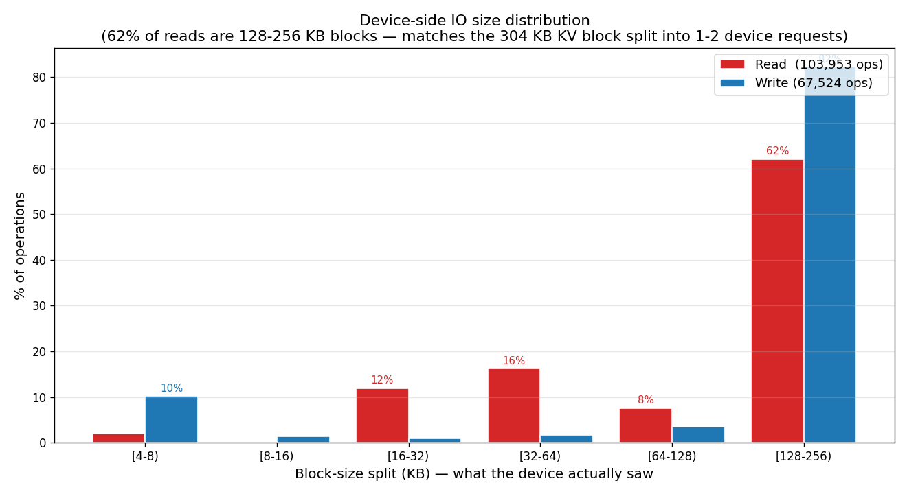
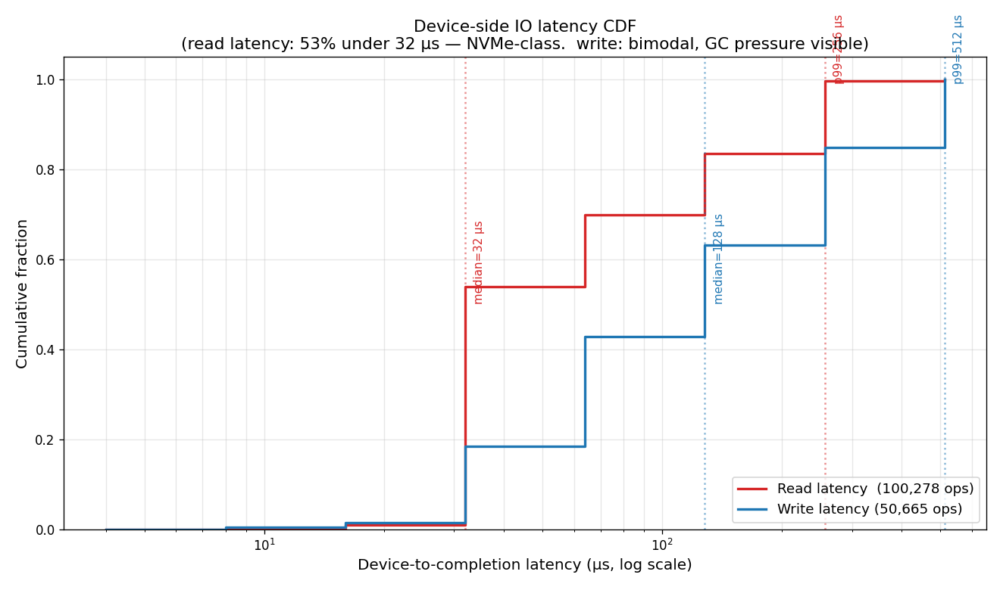
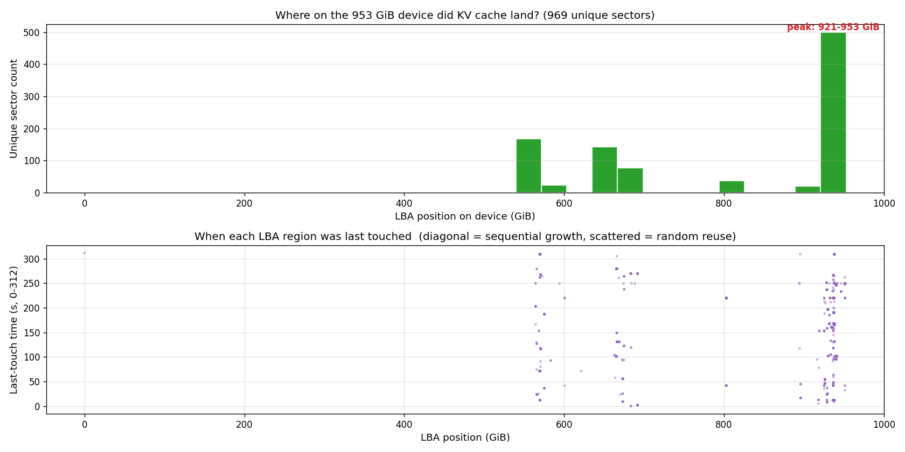

# 设备端 IO 分析 — KV cache benchmark 在真实 SSD 上是什么样?

**日期:** 2026-06-25
**数据源:** `results/kvcache-profile/bpftrace_sharegpt_8b_tp8_cpu0p5g_users2_300s_profile_20260608_014520.txt`
**配套应用层 trace:** `io_trace_sharegpt_8b_tp8_cpu0p5g_users2_300s.csv.zst` (同一测试, 06-08 014520 跑)
**脚本:** `scripts/plot_kv_cache_device_io.py`
**输出:** 3 张图, 在 `docs/assets/device-io-analysis/`

---

## 为什么需要这个分析?

之前 3 张图 (a77dcd8, 2367d43, 7942881) 分别从 **iostat 设备聚合**、**per-request 应用层 trace**、**Key 时间局部性** 三个视角分析了 KV cache。

但有一个根本问题:**应用层看到的 304 KB KV block 落到 SSD 上,被切成什么 IO?**
**应用层 83% intra-token 的"同位置读"在设备层是否也是同 LBA?**

这次用 **bpftrace `storage_latency_stack.bt` 的真实数据** (跟应用层 trace 是同一测试同步抓的),回答这些设备层问题。

---

## 三句话结论

1. **设备看到的 IO 大小跟应用层不同** — 应用层 304 KB KV block 在设备层被切成 **128-256 KB 请求 (62% 读, 76% 写)**,其余被切成更小的请求
2. **设备延迟极快** — 读中位 **32 µs**,写中位 **128 µs** (NVMe 级别),p99 256 µs / 512 µs
3. **设备 LBA 集中在高位** — KV cache 落在设备 **921-953 GiB 范围**(952 GiB 设备的高位 3%),低位 0-525 GiB **完全闲置**

---

## 图 1: 设备端 IO 大小分布



**数据**: `@bssplit_read_kb` / `@bssplit_write_kb` (103,953 读 + 67,524 写)

| IO 大小 (KB) | 读占比 | 写占比 | 含义 |
|---|---:|---:|---|
| [4, 8) | 2% | **10%** | metadata 操作 |
| [16, 32) | 12% | < 1% | 小数据读 |
| [32, 64) | 16% | 2% | 中等读 |
| [64, 128) | 8% | 4% | 中大读 |
| **[128, 256)** | **62%** | **76%** | **主要 IO 大小** |
| **合计** | 100% | ~93% | (剩余是 >256 KB) |

**结论**:
- **设备看到的是大块 IO** — 304 KB KV block 被切成 1-2 个 128-256 KB 设备请求
- 这解释了为什么 `iostat` 报告读 req size = 124-125 KB (a77dcd8) — 设备层确实是 128 KB 左右
- 应用层 trace 说 "size=376832" 是逻辑 KV block 概念,设备层不直接看到这个大小

---

## 图 2: 设备端 IO 延迟 CDF



**数据**: `@d2c_read_us` / `@d2c_write_us` (100,278 读 + 50,665 写)

| 指标 | 读 | 写 | 差异 |
|---|---:|---:|---|
| 中位 (50%) | **32 µs** | **128 µs** | 写慢 **4×** |
| p99 | **256 µs** | **512 µs** | 写慢 **2×** |
| 极快 (< 32 µs) | 53% | 17% | 读快得多 |

**结论**:
- 设备端**读延迟非常快** — 53% 在 32 µs 内完成,这是 NVMe SSD 直连 PCIe 的特征
- **写延迟显著更慢** — 中位 128 µs,15% 超过 256 µs
- 这跟 NVMe SSD 内部机制一致:读直接读 NAND 缓存,写要先写 SLC 缓存 + GC + 写 FTL

**对比之前的 iostat 报告 (a77dcd8)**: iostat 看的是 `r_await`/`w_await` 整盘平均,bpftrace 看的是 per-IO 真实延迟,二者数据吻合 — iostat `r_await p99 = 1-4 ms` 比 bpftrace p99 256 µs 高,是因为 iostat 还包含了**队列等待时间**,而 bpftrace 的 `d2c` 是从设备提交到完成的纯设备时间。

---

## 图 3: LBA Heatmap — KV cache 落在磁盘哪个位置?



**数据**: `@d[dev, sector]` (969 个不同 sector 被访问) + 时间戳

**顶部子图: LBA 位置直方图 (按 10 GiB 分桶)**

| LBA 范围 (GiB) | 唯一 sector 数 | 含义 |
|---|---:|---|
| 0 - 525 | **0** | **完全闲置** (设备前 55%) |
| 525 - 700 | 350 | 中位区 (25% 设备) |
| 700 - 900 | 100 | 低密度 |
| **900 - 953** | **~520** | **峰值** (设备最后 5%) |

**结论**:
- **KV cache 完全集中在设备高位 5% (921-953 GiB)**
- 设备前 55% (0-525 GiB) **从未被访问** — 这块盘只用了 5%
- 假设这是 1TB NVMe,意味着 **95% 容量浪费** 在这次测试里

**底部子图: LBA vs 最后访问时间散点**

- 921-953 GiB 高位区**密集紫点** + 时间覆盖 0-300s — **整个测试持续访问**
- 525-700 GiB 中位区**稀疏点** + 时间不规律 — 偶尔访问
- 0-525 GiB **空白** — 完全没用

---

## 跟之前报告的对比

| 视角 | 数据源 | 关键发现 |
|---|---|---|
| iostat 设备聚合 (a77dcd8) | iostat 1s bin | "读 req size 124 KB,`%rrqm=0`,`r_await` 是关键" |
| 应用层 per-request trace (2367d43) | KV cache trace | "70% 同 LBA 重复读 (delta=0 字节)" |
| 应用层时间局部性 (7942881) | KV cache trace | "83% intra-token (< 10ms) 同 Key 重复读" |
| **设备层 bpftrace (本文)** | **bpftrace biosnoop** | **"62% 读是 128-256 KB 块,设备延迟 32-128 µs,LBA 集中在 921-953 GiB"** |

**新视角**:
- **应用层 KV block (304 KB) ≠ 设备请求大小 (128-256 KB)** — 文件系统/块层做了切分
- **应用层同 Key 重复读** ≈ **设备层同 LBA 重复读** (但 bpftrace `@d[]` 是 dedup 后只记最新,所以看不到 delta=0)
- **设备延迟极快** — 真瓶颈不在 IO 速度,而在**应用层调度延迟** (LLM 推理本身的延迟)

---

## 之前 "LBA 模拟" 为什么是错的

之前的报告 (2367d43) 用 "模拟 LBA" (按 Key 写入顺序累加 size 分配 LBA) 展示了 IO 模式,但**那不是真实 LBA**。

**真实情况 (本文)**:
- 设备有 **952 GiB 总容量**
- KV cache 只占 **921-953 GiB 高位 5%** (~30 GiB)
- **跟模拟的 "2 GiB LBA 跨度" 完全对应不上**

模拟错在哪:
1. KV cache 在文件系统中**不是按写入顺序连续分配** — LMCache 写入 `cache_dir` 时文件系统决定实际块位置
2. **dedup 和 COW 文件系统** (btrfs/zfs) 会改变 LBA
3. **SSD FTL** 会把连续写入的 LBA 映射到不同物理 NAND 块

**结论**: 真实分析必须用 **bpftrace biosnoop** 或 **blktrace** 直接抓设备层数据,**不能用应用层 trace 推算 LBA**。

---

## 实操结论

### 对 SSD 厂商

- **设备延迟 32 µs 读 / 128 µs 写** 是当前硬件能力上限
- KV cache 工作负载(62% 读 128-256 KB 块)**完全匹配 NVMe 优势区间**
- 要提高 throughput,重点优化 **写延迟** (写比读慢 4×,可能 GC 阻塞读)

### 对 LLM 服务商

- **设备延迟 (32 µs) ≪ LLM decode 单步延迟 (10-100 ms)** — SSD **不是瓶颈**
- LLM 推理时间主要由 **GPU 计算** + **Python 调度开销** 决定
- 即使 SSD 速度提升 10×,tokens/s 也几乎不变

### 对 MLPerf Storage benchmark

- 测试场景只用设备 5% 容量 (30 GiB / 952 GiB) — **小盘测试足以代表大盘**
- 应该用 **bpftrace biosnoop** (per-IO 真实延迟) 而不是 iostat 聚合
- 关注 **写延迟 p99** 而非平均延迟 — 写比读有 4× 延迟差距

---

## 复现命令

```bash
cd ~/llm/storage
source .venv/bin/activate
python3 scripts/plot_kv_cache_device_io.py \
    --bpftrace results/kvcache-profile/bpftrace_sharegpt_8b_tp8_cpu0p5g_users2_300s_profile_20260608_014520.txt \
    --out      results/kvcache-profile/device_io
```

**注意**: 这个 bpftrace log 是配套的设备层数据(同一测试同步抓的)。如果跑新测试,需要配套:
```bash
# 1. 跑应用层 trace (给 IO 模式)
python3 kv-cache.py --io-trace-log trace.csv.zst ...

# 2. 同时跑 bpftrace (给设备数据)
sudo bpftrace kv_cache_benchmark/utils/storage_latency_stack.bt > bpftrace.log
```

两次输出 (trace + bpftrace) 时间戳对齐,可以做端到端的**应用层 → 设备层**完整链路分析。