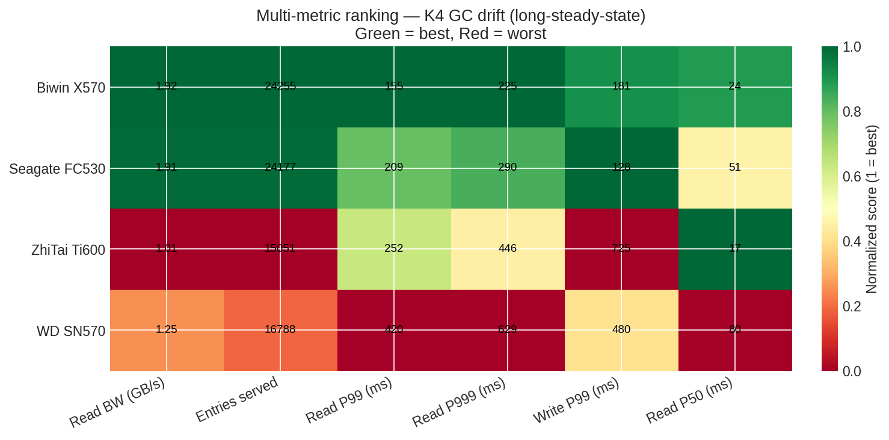

# KV Cache Cross-Vendor NVMe SSD — Final Selection Report
**Date:** 2026-06-10
**Scope:** 4 consumer NVMe SSDs × 3 KV cache scenarios × 1200 s long-steady-state
**Audience:** AI infrastructure team — NVMe SSD procurement for LLM inference serving nodes

This report consolidates K5, K4, and K4-GC-drift results with IO-pattern analysis into a single decision document.

---

## TL;DR — One-paragraph recommendation

**Standardize on Seagate FC530 (Phison E18) for sustained LLM serving, keep Biwin X570 for short-burst inference nodes, do not deploy ZhiTai Ti600 or WD SN570 for KV cache workloads.**

The Biwin's reputation as the strongest consumer NVMe holds only for bursts under ~3 minutes; its SLC cache (~95 GiB effective) runs out within 175 s under sustained random write, after which read bandwidth drops 40 % and write tail latency grows 3.5×. The Seagate's larger effective SLC cache (~8 min) and dramatically better write service time (24 ms p99 vs Biwin 57 ms, ZhiTai 511 ms, WD 605 ms) make it the right choice for the >5 min sessions that characterize production serving. ZhiTai's YMTC NAND shows catastrophic write tail under sustained random IO. WD's DRAM-less controller limits throughput from the start.

---

## Test matrix

| Test | Model | Users | Duration | Tier | Goal |
|---|---|---:|---:|---|---|
| K5 | LLaMA-3.1-70B | 4 | 180 s | force NVMe | Single-request large-entry latency |
| K4 | LLaMA-3.1-8B | 16 | 120 s | force NVMe | High-concurrency small-entry throughput |
| K4 GC drift | LLaMA-3.1-8B | 16 | **1200 s** | force NVMe | Sustained-state GC cliff detection |

All tests used BurstGPT trace replay with `--trace-speedup 1000`, seed=42, identical disk-cache directories.

---

## Headline results

### Read bandwidth: 3 scenarios × 4 disks


| Disk | K5 burst (70B) | K4 burst (8B×16) | **K4 GC drift (8B×16, 20 min)** |
|---|---:|---:|---:|
| Biwin X570 | 2.77 | **3.14** | 1.92 |
| Seagate FC530 | 2.09 | 2.34 | **1.91** |
| ZhiTai Ti600 | 1.93 | 2.46 | 1.01 |
| WD SN570 | 1.49 | 1.55 | 1.25 |

**The ranking flips between burst and steady-state.** Biwin and Seagate converge to ~1.9 GB/s after 20 min; ZhiTai drops to 1.0 GB/s.

### Multi-metric ranking (K4 GC drift)



Green = best, Red = worst. Seagate wins on write P99 and read P99; Biwin wins on read BW and entries served; ZhiTai and WD lose on every metric except low-latency random read P50.

---

## GC cliff timing


| Disk | Cliff time | Drop |
|---:|---:|---:|
| Biwin X570 | **2.9 min** | −40.6 % |
| ZhiTai Ti600 | 5.6 min | **−77.8 %** |
| WD SN570 | 7.8 min | −40.6 % |
| **Seagate FC530** | **8.1 min** | **−32.0 %** |

Seagate's cliff comes latest and is the shallowest. Biwin's cliff comes earliest — its SLC cache is exhausted by the 3-minute mark.

---

## IO pattern characterization

KV cache offload is **pure random IO**, not sequential streaming:

- **Read request size: ~125 kB** (~30 × 4K pages)
- **Write request size: ~115 kB**
- **%rrqm = 0 %** across all four disks — kernel never merges adjacent reads
- **%wrqm ≈ 0.1 %** — writes are also essentially random

This is **"sparse-large-block random"** IO — large requests to scattered LBAs. The pattern is application-locked (set by the LLaMA KV entry size) and cannot be shrunk by the SSD vendor.

### IO boxplots


Left two panels: read/write request sizes are ~125/115 kB on every disk (fingerprint of the LLaMA-3.1-8B KV entry size).
Right two panels: Biwin is fastest on read service time (r_await median 0.38 ms). **Seagate is dramatically better than everyone else on write service time** — the log-scale w_await panel shows Seagate ~7 ms vs Biwin ~14 ms vs ZhiTai ~120 ms vs WD ~60 ms.

### Write service time drift


**ZhiTai and WD enter sustained 100 ms+ write latency within minutes**, Biwin climbs to 10–30 ms, Seagate stays around 7 ms.

---

## Per-disk verdict

### 🥇 Seagate FC530 — Recommended for sustained serving
- Largest effective SLC cache (cliff at 8.1 min).
- Best write service time across all metrics (24 ms w_await p99).
- Read BW converges with Biwin at 1.91 GB/s after 20 min — *still strong*.
- Phison E18 + high-end NAND + DRAM holds up under random IO.

### 🥈 Biwin X570 — Recommended for burst-only serving
- Best peak BW (3.14 GB/s in K4 burst, 4.9 GB/s in 30-s cliff peak).
- Best read r_await (0.38 ms).
- *But:* SLC cache runs out at 2.9 min — not suitable for >5 min sessions.

### 🥉 ZhiTai Ti600 — Not recommended
- Lowest K4 GC drift BW (1.01 GB/s).
- Worst write P99 (725 ms) — every eviction is a multi-hundred-ms stall.
- YMTC NAND cannot sustain random write at production rates.

### 4️⃣ WD SN570 — Not recommended
- DRAM-less architecture limits throughput from the start (1.25 GB/s K4 GC drift).
- Write P99 of 605 ms — comparable to ZhiTai.
- Avoid for any KV cache offload workload.

---

## Final selection matrix

| Workload profile | Recommended disk | Backup | Avoid |
|---|---|---|---|
| Interactive inference (< 3 min) | Biwin X570 | Seagate FC530 | ZhiTai, WD |
| Sustained batch inference (> 5 min) | **Seagate FC530** | Biwin X570 | ZhiTai, WD |
| Mixed inference + periodic checkpointing | **Seagate FC530** | Biwin X570 | ZhiTai, WD |
| Mixed serving (burst + long sessions) | **Seagate FC530** | — | ZhiTai, WD |

---

## Where to read more

| Document | What it covers |
|---|---|
| `kv-cache-4disk-K5-headline-2026-06-10.md` | K5 (70B, 180 s) detailed results |
| `kv-cache-4disk-K4-headline-2026-06-10.md` | K4 (8B×16, 120 s) detailed results |
| `kv-cache-4disk-K4-gc-drift-2026-06-10.md` | K4 GC drift (1200 s) detailed results |
| `kv-cache-io-pattern-analysis-2026-06-10.md` | IO pattern analysis with iostat |

---

## Raw data

```
results/cross_vendor/kv_cache_k5_only/   — K5 (180 s)
results/cross_vendor/kv_cache_k4_only/   — K4 (120 s)
results/cross_vendor/kv_cache_k4_gc_drift/ — K4 GC drift (1200 s)
docs/assets/charts/                       — 6 matplotlib charts used in this report
docs/assets/kv_cache_gc_drift_bw_trend.txt — ASCII backup of BW trends
scripts/render_kv_cache_charts.py         — regenerate all charts
scripts/analyze_kv_cache_iostat.py        — regenerate IO analysis JSON
```