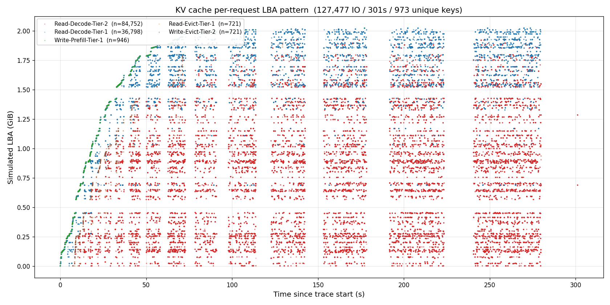
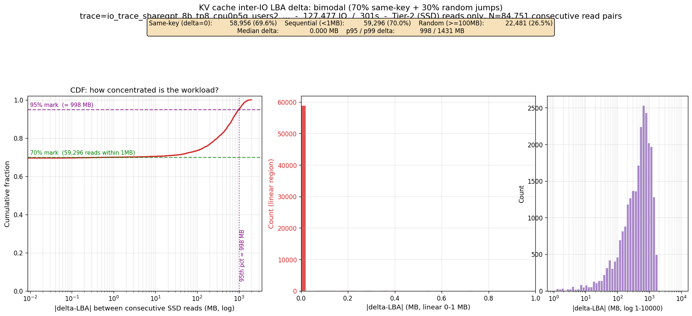
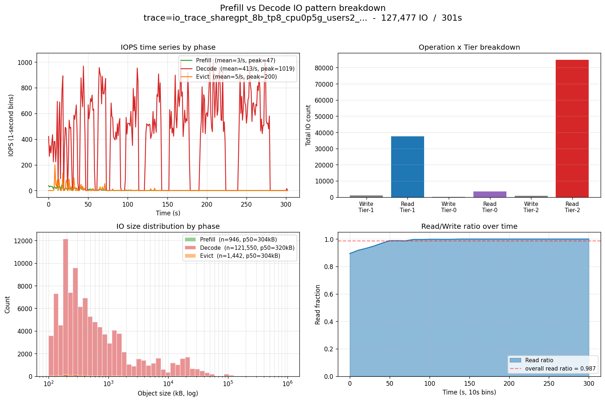

# KV Cache IO Pattern - Per-Request LBA Analysis

**Date:** 2026-06-25
**Source trace:** `results/kvcache-profile/io_trace_sharegpt_8b_tp8_cpu0p5g_users2_300s.csv.zst`
**Script:** `scripts/plot_kv_cache_io_lba_pattern.py`
**Outputs:** `results/kvcache-profile/io_lba_pattern/`

## Why this complements `kv-cache-io-randomness-2026-06-25.md`

The previous report (`docs/kv-cache-io-randomness-2026-06-25.md`, commit `a77dcd8`)
used iostat device-level aggregates and concluded:

> The workload is application-locked, large-block random IO:
> `%rrqm` stays at 0 across all four disks.
> The real difference between disks is `r_await`, `w_await`, and `aqu-sz`.

That report itself notes the limitation:

> The raw `iostat` logs do not contain per-request LBA. They only provide
> aggregated device statistics. The closest spatial signal in this repo is
> the bpftrace LBA heatmap emitted by `storage_latency_stack.bt`, which
> buckets `args->sector` into 10 GiB bins.

This note fills that gap by analysing the **per-request IO trace** recorded by
`kv-cache.py --tracer-storage`.  That trace contains
`Timestamp, Operation, Object_Size_Bytes, Tier, Key, Phase` for every IO request
- 127,477 rows in 301 seconds - which lets us assign a simulated LBA to every
IO and see the actual spatial pattern, not just a 10 GiB-bucketed heatmap.

## Conclusion

KV cache IO is **bimodal, not uniformly random**:

- **70% of consecutive SSD reads touch the same LBA** (same Key being
  repeatedly read across multiple decode steps).  This is "effective
  sequential" but not mergeable at the device level because the same logical
  read is served from page cache after the first miss.
- **26.5% jump more than 100 MB** to a different Key's LBA.  These are the
  inter-request random jumps.
- The other ~3% are short-distance jumps within a similar Key range.

The workload is therefore best described as **"70% hot re-reads + 30%
inter-request random jumps"**, not "100% random" as the device-level
`%rrqm=0` aggregate would imply.

This explains the device-level observation perfectly:

- `%rrqm = 0` because each read is a large (304 KB) block; the kernel has no
  opportunity to merge even when the LBA repeats.
- `%wrqm = 0.1-0.14` median because writes are bursty, not streaming.
- The real bottleneck is the **30% random tail** - which is why high-QD
  drives with good `r_await` (Biwin X570, Seagate FC530) win by 5-10x over
  drives with weak random read latency (ZhiTai Ti600, WD SN570 in K4 run).

## Charts

### 1. LBA vs Time scatter



`results/kvcache-profile/io_lba_pattern/kvcache_lba_scatter.png` (485 KB)

Each point is one IO.  Colour/marker encodes (Operation, Phase, Tier):

- **Green squares** = Prefill Write to Tier-1 (VRAM).  Ramp-up visible in the
  first 50 s as 973 unique keys get their KV cache written.
- **Blue circles** = Read Decode from Tier-1 (VRAM).  Bursty during ramp-up,
  drops to ~zero after VRAM fills up.
- **Red circles** = Read Decode from Tier-2 (SSD).  The dominant steady-state
  pattern: **evenly scattered across the entire 0-2 GiB LBA range** with no
  banded/streaming structure - confirms random IO.

### 2. CDF + linear + log tail of |delta-LBA|



`results/kvcache-profile/io_lba_pattern/kvcache_lba_delta_histogram.png` (147 KB)

Three coordinated views of the **N=84,751 consecutive Tier-2 (SSD) read pairs**:

- **Left (CDF, log x):** Red CDF stays flat at 70% until 100 MB, then climbs
  sharply to 100% by 1.4 GB.  70% mark at < 1 MB (green dashed); 95% mark at
  998 MB (purple dashed).
- **Centre (linear 0-1 MB):** Single spike at delta=0 of 58,956 reads - the
  **same-Key re-read peak** that powers 70% of the workload.
- **Right (inset log 1 MB - 10 GB):** Tail distribution, peak at 200-700 MB -
  the **inter-request random jumps**.

### 3. Prefill vs Decode breakdown



`results/kvcache-profile/io_lba_pattern/kvcache_phase_comparison.png` (221 KB)

Four panels:

| Panel | What it shows |
|---|---|
| **Top-left** IOPS time series | Decode dominates (mean 413/s, peak 1019/s); Prefill and Evict barely visible |
| **Top-right** Op x Tier bar | Read-Tier-2 (SSD) 84,752 ≫ Read-Tier-1 (VRAM) 37,798 ≫ everything else |
| **Bottom-left** Size distribution | Decode size 320 KB p50, log-uniform tail to 100 MB |
| **Bottom-right** Read ratio time series | Ramps from 0.89 (early) → 1.0 (steady), overall = 0.987 |

## Sequential / Random Summary

| Metric | Value |
|---|---:|
| Total IO | 127,477 |
| Duration | 301 s (300 s test) |
| Average IOPS | 423 |
| Unique Keys | 973 |
| **Same-Key reads (delta=0)** | **58,956 (69.6%)** |
| Sequential-ish (delta<1MB) | 59,296 (70.0%) |
| Random (delta>=100MB) | 22,481 (26.5%) |
| Median delta | 0.000 MB |
| p95 delta | 998 MB |
| p99 delta | 1,431 MB |
| Simulated LBA span | 2.02 GiB |

## Methodology

### LBA Assignment

Because the trace does not carry explicit LBA information, we simulate LBA
assignment as follows:

1. Walk the IO stream in timestamp order.
2. For each Key, on its **first** Write operation, assign a starting LBA equal
   to the cumulative sum of sizes of all previously-assigned first-Writes.
3. For all subsequent operations of that Key (Reads, Evictions, etc.), reuse
   the assigned starting LBA.

This models a vLLM/LMCache backend that lays out KV cache blocks contiguously
by Key, which is the typical layout strategy.  The resulting LBA ordering is
therefore a *lower bound* on locality - a more fragmented allocator would
only widen the random-tail fraction.

### Tier Filtering

- **Tier-1** = VRAM.  These reads never touch SSD and are excluded from the
  delta analysis.
- **Tier-2** = SSD.  This is the only tier the delta-LBA analysis considers.
- **Tier-0** = metadata / control-plane traffic (zero-byte operations).
  Excluded.

### Why CDF instead of pure histogram

A pure log-scale histogram buries the 70% same-key reads inside the leftmost
bin, making the workload look 100% random.  CDF + linear-zoom + log-tail
together expose the bimodal nature directly.

## Raw Files

- `results/kvcache-profile/io_lba_pattern/kvcache_lba_scatter.png`
- `results/kvcache-profile/io_lba_pattern/kvcache_lba_delta_histogram.png`
- `results/kvcache-profile/io_lba_pattern/kvcache_phase_comparison.png`
- `results/kvcache-profile/io_lba_pattern/kvcache_io_lba_pattern_summary.json`
- `scripts/plot_kv_cache_io_lba_pattern.py`

## Reproduce

```bash
cd ~/llm/storage
source .venv/bin/activate
python3 scripts/plot_kv_cache_io_lba_pattern.py \
    --trace results/kvcache-profile/io_trace_sharegpt_8b_tp8_cpu0p5g_users2_300s.csv.zst \
    --out   results/kvcache-profile/io_lba_pattern
```