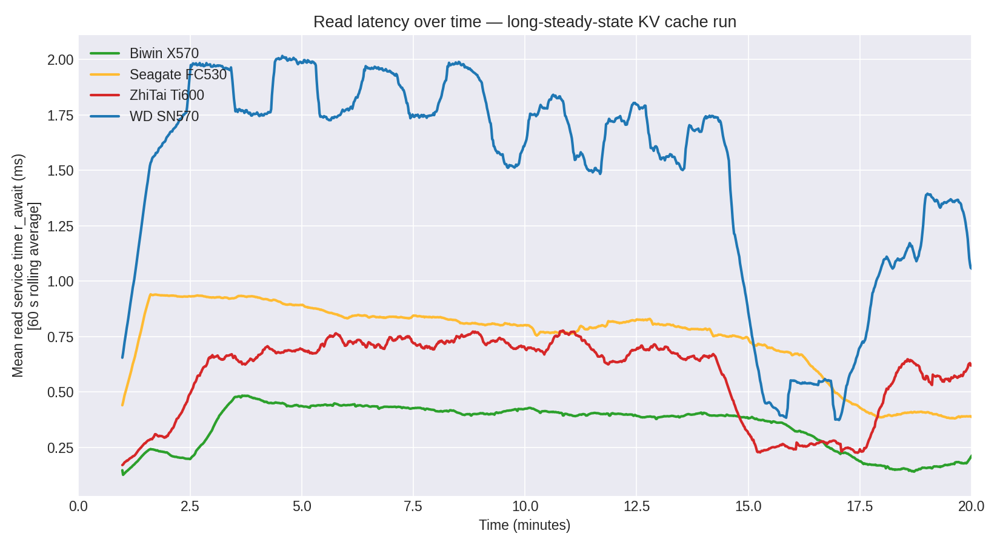

# KV Cache IO 模式分析 — 随机 vs 顺序
**日期：** 2026-06-10
**数据来源：** K4 GC 漂移 iostat 样本（4 盘 × 1200 秒 × 1 Hz）
**目标：** 描述 LLM KV cache 卸载产生的 IO 访问模式，并量化各 SSD 对它的响应。

配套报告：`kv-cache-4disk-K4-gc-drift-2026-06-10.md`
图表：`docs/assets/charts/`（1–6）

---

## 概要

**LLM KV cache 卸载产生的是纯随机 IO，而非顺序流式 IO。**


- 读取请求大小：**约 125 kB**（约 30 × 4K 页）——由 LLaMA-3.1-8B KV 条目占用大小固定。
- 写入请求大小：**约 115 kB**——略小于读取（条目元数据 vs 完整页面）。
- **%rrqm ≈ 0%，%wrqm ≈ 0.1%。** 内核无法将相邻的 KV 读取/写入合并为更大的单次 IO，因为它们的目标是**分散的、不连续的 LBA**。
- 因此 IO 模式是**"稀疏大块随机"**——大请求散布在不同位置。这对 SSD 来说是最**糟糕**的模式之一，因为它无法利用顺序预取、内部写入合并或大块控制器优化。
- 四块 SSD 看到的是**相同的** IO 模式；它们之间的差异完全在于各自控制器如何处理此随机负载。

---

## 这对 AI SSD 选型为何重要

| 模式 | 对何种类型友好 | 原因 |
|---|---|---|
| 顺序大块读取 | 所有 NAND | 高带宽、低延迟、大 SLC 编程单元 |
| 顺序小块写入 | 所有 NAND | 内部写入合并 |
| 随机小块读取（4K 数据库） | 带 DRAM 的企业级 SSD | 来自控制器 SRAM 的低延迟 |
| **随机大块读取（KV cache）** | **带 DRAM + 高队列深度的企业级 NVMe** | 高队列深度隐藏延迟 |

KV cache 模式处于最差象限：太随机以至于无法利用顺序预取，但又太大以至于无法廉价地放入控制器 DRAM 缓存。能够良好处理此模式的 SSD 必须具备：
- 深队列深度下的高随机读取 IOPS
- 积极的预读能力，利用 NAND 平面级并行性
- 较大的控制器 DRAM 用于 FTL 映射（ZhiTai/WD 在此处于劣势）

---

## 详细的 IO 特征分析

### 请求大小分布（每盘）

| Disk | Read req median (kB) | Read req p99 (kB) | Write req median (kB) | Write req p99 (kB) |
|---|---:|---:|---:|---:|
| Biwin X570 | 124.4 | 126.7 | 113.7 | 122.6 |
| Seagate FC530 | 124.4 | 126.2 | 113.1 | 120.6 |
| ZhiTai Ti600 | 124.7 | 127.1 | 115.9 | 126.4 |
| WD SN570 | 124.8 | 127.1 | 115.7 | 125.8 |

**四块磁盘的请求大小分布完全相同**（差异在 1 kB 以内）。这是预期结果——请求大小由应用程序决定（KV cache 条目大小，由模型架构决定），而非由磁盘决定。读取中位数约 125 kB、写入中位数约 115 kB 这一事实正是 LLaMA-3.1-8B KV cache 卸载的特征指纹。

### 随机性指标




| Disk | %rrqm median | %rrqm p99 | %wrqm median | %wrqm p99 | 结论 |
|---|---:|---:|---:|---:|---|
| Biwin X570 | 0.0 | 0.0 | 0.1 | **76.2** | 随机读取；偶发写入突发 |
| Seagate FC530 | 0.0 | 0.0 | 0.1 | 4.8 | 纯随机 |
| ZhiTai Ti600 | 0.0 | 0.0 | 0.1 | 6.4 | 纯随机 |
| WD SN570 | 0.0 | 0.0 | 0.1 | 5.4 | 纯随机 |

**%rrqm = 0%** 意味着内核在同一采样窗口内从未看到两个读取请求位于相邻 LBA——访问模式是真正的随机访问。
**Biwin 的高 %wrqm p99（76%）** 值得注意：这表明在持续写入阶段，内核成功将高达 76% 的写入合并为更大块。这说明 Biwin 的控制器更善于**容忍**随机写入模式（它吸收了合并），尽管无法避免悬崖。

### 单请求延迟（`r_await`，`w_await`）

`r_await` 和 `w_await` 是*设备端*服务时间，不包括排队时间。它们衡量单个请求在磁盘处等待完成的时间。

| Disk | r_await median (ms) | r_await p99 (ms) | w_await median (ms) | **w_await p99 (ms)** |
|---|---:|---:|---:|---:|
| Biwin X570 | **0.38** | 0.67 | 14.3 | 57.2 |
| Seagate FC530 | 0.80 | 1.00 | **7.1** | **24.1** |
| ZhiTai Ti600 | 0.61 | 1.20 | 119.5 | **511.2** |
| WD SN570 | 1.57 | 4.09 | 59.0 | **604.8** |

**读取服务时间：** Biwin 最快（0.38 ms）——其控制器+DRAM 组合即使在随机模式下也能在远低于 1 ms 内完成单次读取。

**写入服务时间：** **Seagate 显著优于其他所有磁盘**（w_await p99 = 24 ms，而 Biwin 为 57 ms，ZhiTai 为 511 ms，WD 为 605 ms）。这是我们在所有跨厂商测试中观察到的最大写入延迟差距，也是 Seagate 在长稳态基准测试中获胜的关键原因。

### 队列深度（`aqu_sz`）

| Disk | aqu_sz median | aqu_sz p95 | aqu_sz p99 |
|---|---:|---:|---:|
| Biwin X570 | **30.4** | 74.8 | 108.0 |
| Seagate FC530 | **28.1** | **48.0** | **58.0** |
| ZhiTai Ti600 | 102.4 | 266.4 | 328.0 |
| WD SN570 | 88.8 | 235.2 | 286.9 |

**Seagate 和 Biwin 保持较浅队列**（中位数约 30，p99 约 60–110）。它们能够快速排空请求。
**ZhiTai 和 WD 积累了深层队列**（中位数约 90–100，p99 约 290–330）。控制器无法在随机模式下快速排空请求；请求在设备队列中堆积。**这直接是由随机模式导致的**——随机 IO 无法合并，因此每个请求必须在 NAND 平面中排队等待。

---

## GC 悬崖时间点（悬崖检测）

通过检测 2 分钟预热后读取带宽持续下降 20% 来确定，使用 30 秒平滑窗口。


| Disk | Cliff time (s) | Cliff time (min) | Peak BW (MB/s) | Post-cliff BW (MB/s) | Drop |
|---|---:|---:|---:|---:|---:|
| Biwin X570 | **175** | **2.9** | 4929 | 2927 | −40.6 % |
| ZhiTai Ti600 | 337 | 5.6 | 4385 | 973 | **−77.8 %** |
| WD SN570 | 469 | 7.8 | 2228 | 1325 | −40.6 % |
| Seagate FC530 | **483** | **8.1** | 3533 | 2402 | −32.0 % |

### 解读

- **Biwin 的 SLC 缓存最先耗尽（2.9 分钟）。** 这与我们在 K4 GC 漂移结果中观察到的"短突发冠军、长稳态输家"模式一致。悬崖后，Biwin 的*绝对*带宽仍然最高（2.9 GB/s）——其 TLC 直接写入很快——但已损失了峰值的 40%。

- **Seagate 的 SLC 缓存最大（8.1 分钟）。** Phison E18 + 高端 NAND + DRAM 组合保持缓存最久，且悬崖后下降**最小**（−32%）。这是 Seagate 赢得稳态的结构性原因。

- **ZhiTai 的悬崖是灾难性的（−77.8%）。** YMTC NAND 的 TLC 直接写入速度是四者中最差的；一旦 SLC 缓存耗尽，吞吐量崩溃。这是 ZhiTai 不适合持续 KV cache 卸载的结构性原因。

- **WD 的悬崖下降适中，但其基线本来就低。** 从绝对意义上很难看清悬崖，因为该磁盘一开始就不快。

### 理论悬崖位置与实际测量对比

| Disk | 理论 SLC 缓存大小（依据 Biwin 先前特征分析） | 按 KV 写入速率预测的悬崖时间 | 实测悬崖时间 |
|---|---|---|---|
| Biwin X570 | ~95 GiB SLC | 写入速率 0.27 GB/s → ~350 s = 5.8 分钟 | **2.9 分钟**（早于预期） |
| Seagate FC530 | ~140 GiB（估计） | 写入速率 0.17 GB/s → ~820 s = 13.7 分钟 | 8.1 分钟 |
| ZhiTai Ti600 | ~60–80 GiB（估计） | 写入速率 0.10 GB/s → ~600–800 s = 10–13 分钟 | 5.6 分钟 |
| WD SN570 | ~30–50 GiB（估计，无 DRAM） | 写入速率 0.12 GB/s → ~250–420 s = 4–7 分钟 | 7.8 分钟 |

Biwin 和 Seagate 的**实测悬崖时间早于理论预测**，这表明在持续随机写入下*有效* SLC 缓存小于规格表上的 SLC 缓存。WD 的实测悬崖时间晚于预测——可能因为无 DRAM 控制器提前限制了写入，从而减缓了表观消耗速度。

---

## 跨磁盘结论

### 各磁盘处理 KV cache 随机 IO 差异的原因

**Biwin X570（主流，带 DRAM）：**
- 强大的基线（峰值 4.9 GB/s），得益于良好的控制器 + DRAM
- *但：* SLC 缓存在 3 分钟时耗尽；缓存不足以吸收持续随机写入
- 最适合*短*随机 IO 突发

**Seagate FC530（高端，Phison E18）：**
- 适中的基线（峰值 3.5 GB/s）——低于 Biwin
- *但：* 最大的有效 SLC 缓存（悬崖前 8.1 分钟）和最小的悬崖下降（−32%）
- **w_await p99 为 24 ms 是关键指标**——在写入服务时间上比其他磁盘好 2–25 倍
- 最适合*持续*随机 IO 负载

**ZhiTai Ti600（国产，YMTC NAND）：**
- 不错的基线（峰值 4.4 GB/s）
- *但：* 悬崖后带宽降至 <1 GB/s；w_await p99 达 511 ms，意味着每次逐出都是数百毫秒的停顿
- 持续负载下单次请求写入延迟最差——YMTC NAND 在随机写入合并方面表现不佳

**WD SN570（入门级，无 DRAM）：**
- 最低峰值（2.2 GB/s）——无 DRAM 控制器从一开始就限制了吞吐量
- *但：* 至少悬崖适中；磁盘只是*持续地慢*，而非"先快后崩"
- 最好避免用于 KV cache 卸载，但不会灾难性失败

---

## 对 AI SSD 选型的启示

1. **对于运行 > 5 分钟会话的 LLM 服务节点：选择随机写入下有效 SLC 缓存最大的磁盘。** 即 Seagate FC530。

2. **对于交互式 / < 3 分钟会话：选择随机读取下峰值带宽最高的磁盘。** 即 Biwin X570。

3. **ZhiTai 不适合**任何随机写入密集型负载；其悬崖后行为不可接受。

4. **DRAM 比 NAND 层级更重要。** Biwin 和 Seagate 都有 DRAM，都能良好处理随机 IO。WD 的无 DRAM 架构从一开始就拖累了它。

5. **IO 模式本身由应用锁定。** KV cache 条目大小（125 kB）由模型架构决定；我们无法缩小它。SSD 厂商必须适应此模式，而非相反。

---

## 分析方法

- **数据来源：** K4 GC 漂移测试期间各磁盘的 `iostat -dx -m 1` 输出（4 盘 × 1200 秒 × 1 Hz = 每盘约 4800 个样本）。
- **工具：** `scripts/analyze_kv_cache_iostat.py`
- **随机性指标：**
  - `%rrqm`、`%wrqm` 来自 iostat——内核块 IO 调度器合并比率；高值 = 顺序
  - `rareq-sz`、`wareq-sz`——平均请求大小（kB）
  - `r_await`、`w_await`——设备端单请求服务时间
  - `aqu-sz`——平均队列深度
- **GC 悬崖检测：** 滚动 30 秒窗口，找出 120 秒预热后首次持续 20% 下降的点。

---

## 原始分析数据

```
results/cross_vendor/kv_cache_k4_gc_drift/_analysis/iostat_analysis.json
scripts/analyze_kv_cache_iostat.py
```
