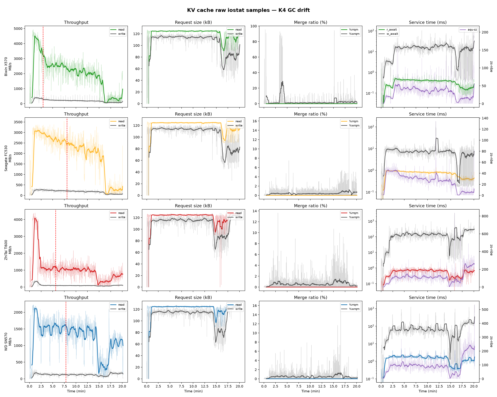
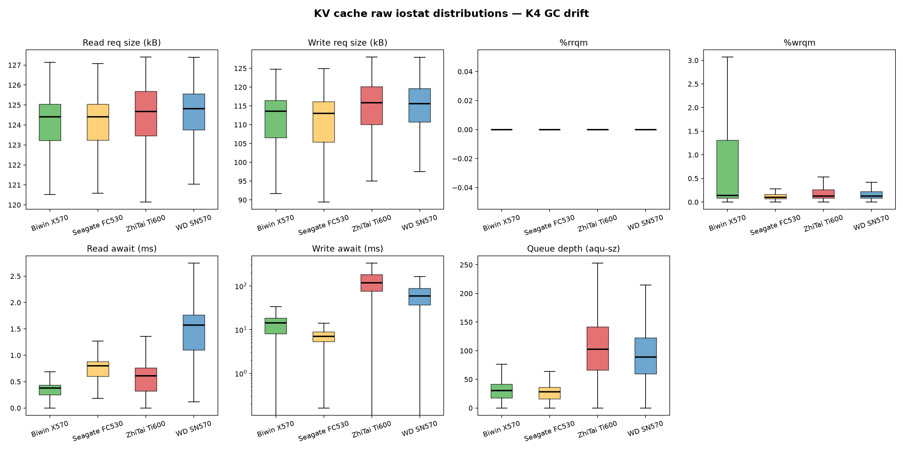

# KV Cache IO Randomness Raw Data

**Date:** 2026-06-25
**Source:** `results/cross_vendor/kv_cache_k4_gc_drift`

This note documents the raw `iostat` samples behind the KV cache K4 long-run test
and the charts generated directly from those samples.

## Conclusion

The workload is not sequential streaming. It is application-locked, large-block random IO:

- read request size stays tightly clustered around 124-125 kB
- write request size stays tightly clustered around 113-116 kB
- `%rrqm` stays at 0 across all four disks
- `%wrqm` is near zero in median, with occasional write merge spikes
- the real difference between disks is `r_await`, `w_await`, and `aqu-sz`

## Charts

### Raw time series

### Distribution view

## Raw Summary

| Disk | Samples | Cliff (min) | Read req p50 (kB) | Read req p99 (kB) | Write req p50 (kB) | Write req p99 (kB) | %rrqm p50 | %wrqm p50 | r_await p99 (ms) | w_await p99 (ms) | aqu p99 |
|---|---:|---:|---:|---:|---:|---:|---:|---:|---:|---:|---:|
| Biwin X570 | 1206 | 2.9 | 124.40 | 126.69 | 113.68 | 122.63 | 0.00 | 0.14 | 0.67 | 57.23 | 107.98 |
| Seagate FC530 | 1205 | 8.1 | 124.41 | 126.15 | 113.05 | 120.55 | 0.00 | 0.10 | 1.00 | 24.10 | 58.03 |
| ZhiTai Ti600 | 1208 | 5.6 | 124.69 | 127.06 | 115.94 | 126.39 | 0.00 | 0.13 | 1.20 | 511.24 | 328.03 |
| WD SN570 | 1211 | 7.8 | 124.82 | 127.12 | 115.67 | 125.81 | 0.00 | 0.13 | 4.09 | 604.80 | 286.92 |

## LBA Note

The raw `iostat` logs do not contain per-request LBA. They only provide aggregated device
statistics. The closest spatial signal in this repo is the bpftrace LBA heatmap emitted by
`kv_cache_benchmark/utils/storage_latency_stack.bt`, which buckets `args->sector` into 10 GiB bins.

For example, the profiling log for the 70B users6 run shows:

- reads concentrated in `570-900GiB`
- writes concentrated in `570-940GiB`

That is spatially clustered, but it is still a heatmap summary, not an individual request log.

## Generated Files

- `results/cross_vendor/kv_cache_k4_gc_drift/_analysis/kvcache_io_randomness_timeseries.png`
- `results/cross_vendor/kv_cache_k4_gc_drift/_analysis/kvcache_io_randomness_boxplots.png`
- `results/cross_vendor/kv_cache_k4_gc_drift/_analysis/kvcache_io_randomness_summary.csv`
- `results/cross_vendor/kv_cache_k4_gc_drift/_analysis/kvcache_io_randomness.md`
- `scripts/plot_kv_cache_io_randomness.py`
