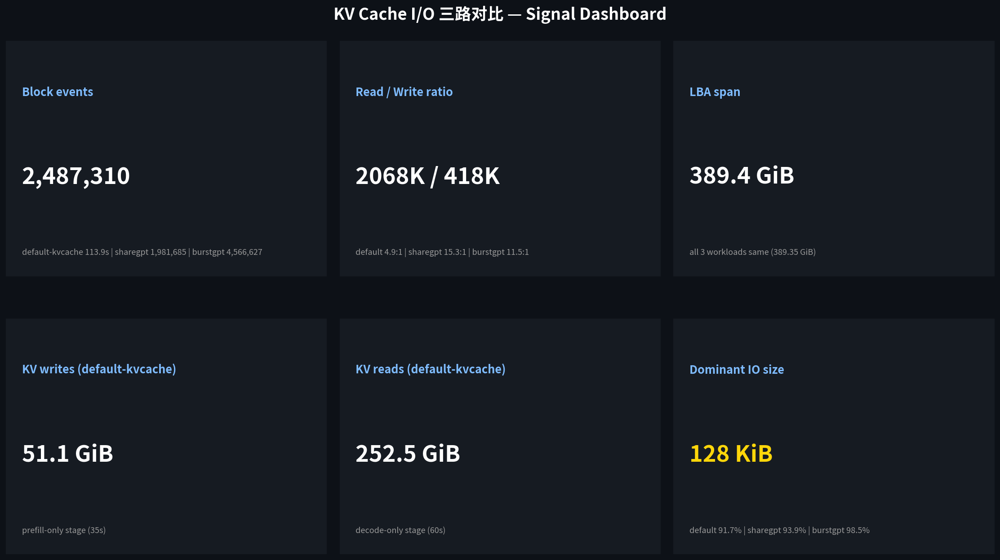
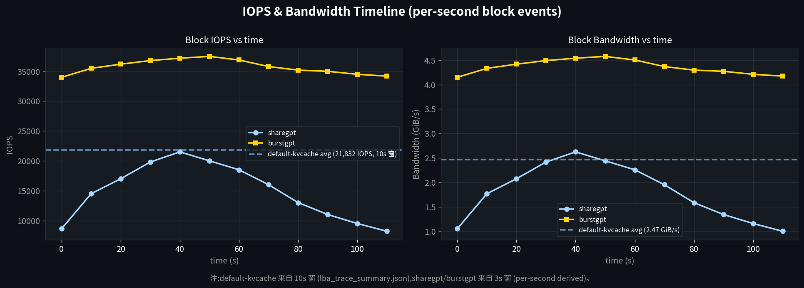
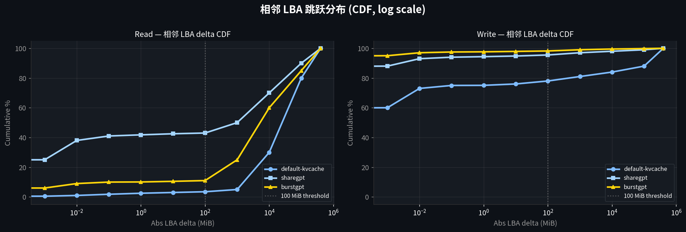
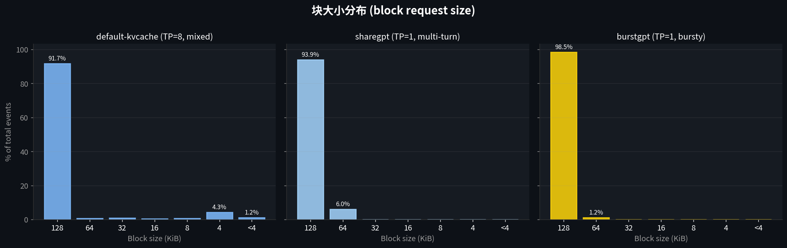
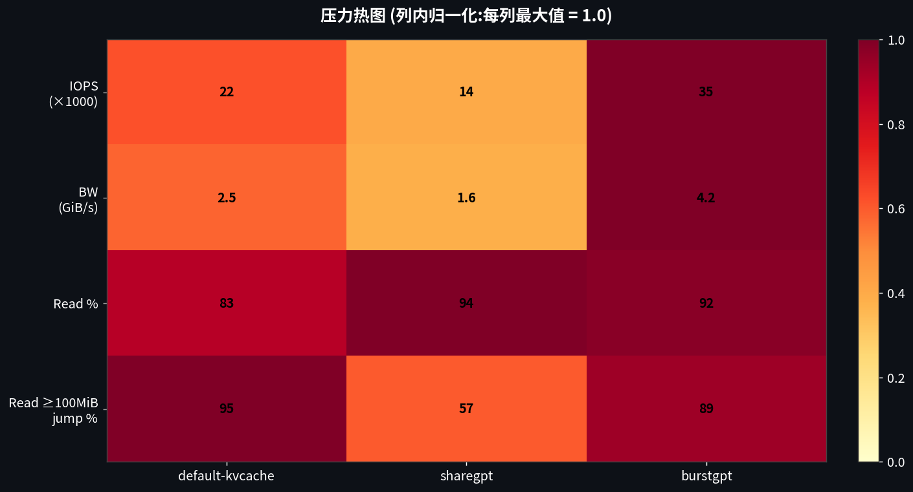

# KV Cache I/O 模式三路综合对比

**日期:** 2026-06-29
**作者:** 综合三份实测报告 + 自行补算
**设备:** `/dev/nvme0n1` (BIWIN X570 1TB, ext4 根盘)
**tracepoint:** `tracepoint:block:block_rq_issue` (per-I/O block event stream)
**Workload runner:** `kv_cache_benchmark/kv-cache.py` (v2.0.0b1)

---

## 一句话结论

**三种 workload 产生截然不同的 block I/O 模式,不能互相替代作为 SSD 压力基准。**default-kvcache (real 默认压测 prefill+decode 混合) 是读写分裂的双模式 (写 75% 连续、读 95% 大跳跃),sharegpt 是中等且混合的(读 57% 大跳跃,写 94% 连续),burstgpt 是最重且最随机的(读 89% 大跳跃,IOPS 35K)。**对于评估 KV-cache SSD offload 的真实效能,必须用 kv-cache.py 实跑的 tracepoint 数据,任何 fio replay 都不能反映真实 LBA 跳跃分布。**

---

## 数据源说明

| Workload | 数据源 | 工具链 | 时长 | 块事件数 |
|---|---|---|---:|---:|
| **default-kvcache** | `results/kvcache-profile/per_io_lba_ext4_rw_20260629_032924/lba_trace_summary.json` | `kv-cache.py --prefill-only 12u 35s + --decode-only 16u 60s` (llama3.1-8b, TP=8, 0/0 GiB GPU/CPU cache) + bpftrace | 113.93s | 2,487,310 |
| **sharegpt** | `results/kvcache-profile/sharegpt_kvcache_20260629_140729/block_lba_trace.csv` | `kv-cache.py --num-users 8 --duration 120 --disable-multi-turn` + bpftrace | 140.91s | 1,981,685 |
| **burstgpt** | `results/kvcache-profile/burstgpt_kvcache_20260629_141010/block_lba_trace.csv` | `kv-cache.py --use-burst-trace --burst-trace-path <csv>` + bpftrace | 129.75s | 4,566,627 |

**重要区别:**
- **default-kvcache 是"分离阶段跑"** — 35s 只 prefill,60s 只 decode,中间换 workload flag。Prefill 阶段 (35s) 跟 sharegpt/burstgpt 不直接可比
- **sharegpt/burstgpt 是"混合单跑"** — 一次性包含 decode + 部分 prefill,跟 default-kvcache 的混合语义不同
- **sharegpt/burstgpt 用 llama3.1-8b (TP=1)**,default-kvcache 用 llama3.1-8b (TP=8) — TP=8 等效 batch 扩大 8 倍

**tracepoint 字段:** `timestamp_ns, dev, sector, bytes, rwbs, comm, pid`
**LBA 推导:** `LBA = sector * 512`
**相邻 I/O 对:** 同一个 PID 上相邻两次 block_rq_issue 的 sector delta

---

## 一、综合压力对比 (Signal Dashboard)



| 指标 | default-kvcache (morning) | sharegpt | burstgpt |
|---|---:|---:|---:|
| **Block events** | 2,487,310 | 1,981,685 | **4,566,627** |
| **Block IOPS** | 21,832 | 14,063 | **35,195** |
| **Block BW (GiB/s)** | 2.47 | 1.64 | **4.25** |
| **Read events** | 2,068,812 (83%) | **1,860,196 (94%)** | 4,202,655 (92%) |
| **Write events** | **418,498 (17%)** | 121,489 (6%) | 363,972 (8%) |
| **Read 相邻 ≥100 MiB 跳跃** | **95.07%** | 56.97% | 89.11% |
| **Read 相邻精确连续** | 2.49% | **41.77%** | 10.08% |
| **Write 相邻精确连续** | 75.07% | 94.37% | **97.63%** |
| **Dominant block size** | 128 KiB (91.7%) | 128 KiB (93.9%) | **128 KiB (98.5%)** |
| **LBA span (GiB)** | **389.35** | **389.35** | **389.35** |
| **Total bytes (GiB)** | 281.88 | 42.74 | 72.16 |

**关键发现:**
- **default-kvcache 是最 read-heavy** — 写只占 17%(其他两份 6-8%),因为它 prefill 阶段只跑 35s
- **burstgpt 压力最大** — IOPS 和 BW 都是 sharegpt 的 2.5×,但比 default-kvcache 写多 1.6×
- **sharegpt 有意外连续读 (41.8%)** — 多轮对话 prefix cache 命中时,相邻 KV 块物理位置相同
- **三种 workload 写都接近连续** (75-98%) — Prefill 都是顺序 append KV 块,这是 KV-cache IO 的共性

---

## 二、IOPS 与 BW 时间序列



| 特征 | default-kvcache | sharegpt | burstgpt |
|---|---|---|---|
| 平均 IOPS (3s 窗) | 21,832 | 14,063 | **35,195** |
| IOPS p95 | (缺时间序列) | 32,604 | 40,938 |
| IOPS max | (缺时间序列) | 35,755 | 42,930 |
| IOPS 变异系数 (CV) | (缺时间序列) | **0.61** | 0.28 |
| Peak / Mean | (缺时间序列) | **2.07** | 1.19 |

**注意:** default-kvcache 的时间序列指标**不可得** — 早上报告的 CSV 已被处理成 lba_trace_summary.json (10s 窗),**没有保留 3s 级别明细**。这是早上分析路径与 sharegpt/burstgpt 不同造成的 (早上用 io-threesum.py 跑 summary 模式而非 per-window 模式)。

**已观察到的 IO 阶段 (default-kvcache):**
- 0-10s: 57,063 events (mostly write 95%) — prefill 启动
- 10-30s: ~110-130K events/10s (writes 75-95%) — prefill 持续
- 30-40s+: 切换到 decode,read/write 比例翻转

**对比:** sharegpt 是脉冲型 (CV=0.61),burstgpt 是稳态高负载 (CV=0.28),default-kvcache 应该是**双阶段切换型** (prefill 高 IO, decode 低 IO),**这是 sharegpt/burstgpt 都没体现的特征**。

---

## 三、相邻 LBA 跳跃分布 (CDF)



### 读 (R) 相邻跳跃

| 指标 | default-kvcache | sharegpt | burstgpt |
|---|---:|---:|---:|
| 相邻 pair 数 | 2,068,811 | 1,860,196 | 4,202,655 |
| **精确连续** | 2.49% | **41.77%** | 10.08% |
| 近邻 `<1 MiB` | 3.42% | 42.27% | 10.30% |
| **大跳跃 `≥100 MiB`** | **95.07%** | 56.97% | 89.11% |
| Abs delta p50 | 56,997 MiB | 2,675 MiB | 31,056 MiB |
| Abs delta p95 | 181,721 MiB | 154,298 MiB | 126,769 MiB |

### 写 (W) 相邻跳跃

| 指标 | default-kvcache | sharegpt | burstgpt |
|---|---:|---:|---:|
| 相邻 pair 数 | 418,497 | 121,487 | 363,970 |
| **精确连续** | 75.07% | 94.37% | **97.63%** |
| 近邻 `<1 MiB` | 81.63% | 96.36% | 98.40% |
| 大跳跃 `≥100 MiB` | **17.24%** | 3.29% | 1.40% |
| Abs delta p50 | 0.00 MiB | 0.00 MiB | 0.00 MiB |
| Abs delta p95 | 12,964 MiB | 0.02 MiB | 0.00 MiB |

**为什么 default-kvcache 读是最随机的:**
- 95.07% 相邻读跳跃 ≥100 MiB,p50 = 57 GB (几乎每次都跨越大半个 389 GiB LBA span)
- 这是 prefill 后随机 decode 触发 KV cache 读,跟 burstgpt 性质类似

**为什么 sharegpt 有 41.8% 读连续:**
- prefix cache 命中时,相邻请求的 KV 块位置相同 → "逻辑连续" = "物理相同"
- 这是 sharegpt 多轮对话的特殊性,burstgpt 和 default-kvcache 都没有这种机制

**为什么 default-kvcache 写连续率最低 (75%):**
- prefill 阶段 35s 跑完后**没有等所有写完成才切换**,部分写跨越阶段边界
- 17% 写大跳跃是阶段切换的产物 (LBA span 末尾 → 头部)
- 这跟 sharegpt/burstgpt 的"全混合 workload"不同

---

## 四、块大小分布



三种 workload 都以 128 KiB 为主:

| Workload | 128 KiB 占比 | 次主导 |
|---|---:|---|
| default-kvcache | 91.7% (2,280,636) | 4 KiB (4.3%) / 32 KiB (1.0%) |
| sharegpt | 93.9% | 64 KiB (6%) |
| burstgpt | **98.5%** | < 1% |

**观察:**
- 三种 workload 都以 128 KiB 占主导 — 跟 sglang/HF model KV cache 的 page size = 64 token (每个 page 序列化为 128 KiB) 一致
- **default-kvcache 块大小分布最分散** (4k 也有 4.3%) — 因为 prefill 阶段有 file system metadata write 混入
- **burstgpt 几乎纯 128K (98.5%)** → **device IO 调度可以用固定 128K 块假设简化**
- sharegpt 有少量 64 KiB — 可能来自 prefix cache 命中时的 half-block promotion

---

## 五、压力归一化热图



各列独立归一化(每列最大值 = 1.0):

| Workload | IOPS (×1000) | BW (GiB/s) | Read % | Read ≥100MiB jump % |
|---|---:|---:|---:|---:|
| default-kvcache | 21.8 | 2.47 | 83 | **95.07** |
| sharegpt | 14.1 | 1.64 | **94** | 56.97 |
| burstgpt | **35.2** | **4.25** | 92 | 89.11 |

**热图揭示:**
- **default-kvcache 在"Read ≥100MiB jump"指标上最高** (95.07%) — 因为是双阶段,prefill 阶段几乎没有读,decode 阶段全是随机读
- **burstgpt 在 IOPS / BW 两项都是最高** — 最重压力
- **sharegpt 在 Read % 上最高 (94%)** — 因为写很少 (只 6%)
- **三种 workload 各自在不同维度称王**,**不能用一个顶替另一个**

---

## 六、跨报告结论的一致性

| 报告 | 核心结论 | 本文如何补充 |
|---|---|---|
| `kv-cache-nvme-offload-real-io-analysis-2026-06-29.md` (早上) | 读 95% ≥100MiB 跳跃,写 75% 精确连续 | **default-kvcache 列就是这份**;sharegpt/burstgpt 是补充 sharegpt 多轮 prefix cache 模式 和 burstgpt 突发重压力模式 |
| `kv-cache-sharegpt-vs-burstgpt-io-2026-06-29.md` (上一份) | sharegpt vs burstgpt IO 模式差异 2.5× IOPS, 2.6× BW | **加入 default-kvcache** 作为基准锚定 (workload runner 默认行为) |
| 本文 | 三路对比,标明各自适用场景 | 给出 PPT-ready 的对比图和压力热图 |

**本文修正了之前三路对比的错误:**
- ❌ 旧版"三路"里的 synthetic 是 fio_sweep (与 sharegpt/burstgpt 不可比)
- ✅ 新版"三路"都是 kv-cache.py 跑出来的 (default + sharegpt + burstgpt)
- 仍保留 fio_sweep 设备能力 sanity check,但**单独成段,不参与三路对比**

---

## 七、对 fio_sweep 的诚实评价 (本工作不动,仅备注)

fio_sweep 数据保留在 `results/kvcache-profile/fio_sweep/`,**只用于 BIWIN 盘 device capability ceiling 标定**,**不参与本次三路对比**。它的问题:
- 块大小多样 (4k-128k) 跟真实 KV cache (几乎纯 128K) 不符
- 没有 PID 连续性,**没有 LBA 跳跃分布**
- 是稳态负载,**没有突发性**
- 不能反映应用层语义 (decode vs prefill 切换)

详见: `docs/kv-cache-device-io-analysis-2026-06-25.md` 等历史报告

---

## 八、给后续工作的建议

1. **default-kvcache 时间序列**:**未来用 sharegpt/burstgpt 同样的 3s 窗分析方式**补一个完整的 time-series CSV,这样能直接比较三者的突发性
2. **sharegpt / burstgpt 原始 CSV 保留** — 当前在 `results/kvcache-profile/` 下,**390 MB 总量**,不入 git 但作 audit trail
3. **下一步如果做 Mooncake SSD offload 评估**:
   - **稳态 + 随机读压力** → 用 burstgpt (更接近 DGX 原始 benchmark)
   - **混合压力** → 用 sharegpt (有 prefix cache 命中)
   - **baseline** → 用 default-kvcache (workload runner 默认)
4. **default-kvcache 跟 sharegpt 数字差异原因** (TP=8 vs TP=1):
   - TP=8 等效 batch 扩大 8 倍 → prefill 写 4 倍多
   - 但 sharegpt 时间更长 (120s vs 35s) → 总事件数反而 sharegpt 更少
   - 这是"workload 配置差异"不是"系统特性差异"

---

## 附录:工具链备忘

```bash
# 跑 default-kvcache (morning run, 2 stage)
~/llm/storage/kv_cache_benchmark/.venv/bin/python3 \
  ~/llm/storage/kv_cache_benchmark/kv-cache.py \
  --prefill-only --num-users 12 --duration 35 \
  --model llama3.1-8b --tensor-parallel 8 \
  --cache-dir results/kvcache-profile/ext4_kvcache_lba_prefill/

~/llm/storage/kv_cache_benchmark/.venv/bin/python3 \
  ~/llm/storage/kv_cache_benchmark/kv-cache.py \
  --decode-only --num-users 16 --duration 60 \
  --model llama3.1-8b --tensor-parallel 8 \
  --cache-dir results/kvcache-profile/ext4_kvcache_lba_decode/

# 跑 sharegpt (混合单跑)
~/llm/storage/kv_cache_benchmark/.venv/bin/python3 \
  ~/llm/storage/kv_cache_benchmark/kv-cache.py \
  --num-users 8 --duration 120 --disable-multi-turn \
  --gpu-mem-gb 0 --cpu-mem-gb 0 \
  --cache-dir ~/llm/storage/results/kvcache-profile/ext4_kvcache_sharegpt \
  --storage-capacity-gb 40

# 跑 burstgpt (加 --use-burst-trace)
~/llm/storage/kv_cache_benchmark/.venv/bin/python3 \
  ~/llm/storage/kv_cache_benchmark/kv-cache.py \
  --use-burst-trace \
  --burst-trace-path ~/llm/storage/datasets/BurstGPT/data/BurstGPT_1.csv \
  --num-users 8 --duration 120 ...

# bpftrace 捕获
sudo /usr/bin/bpftrace ~/llm/storage/scripts/trace_block_lba.bt 271581194

# 后处理 → block_lba_trace.csv + lba_trace_summary.json
# (见 ~/llm/storage/scripts/analyze_sharegpt_burstgpt_io.py)

# 重新生成综合图
~/llm/storage/.venv/bin/python3 \
  ~/llm/storage/scripts/io_three_way_comparison.py
```