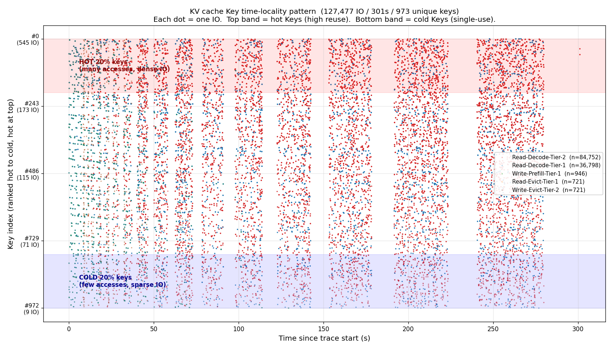
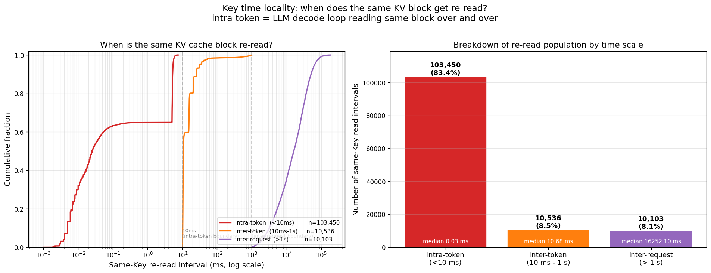

# KV Cache Key 时间局部性 — 取代 LBA 散点图

**日期:** 2026-06-25
**数据源:** `results/kvcache-profile/io_trace_sharegpt_8b_tp8_cpu0p5g_users2_300s.csv.zst` (127,477 IO, 301 秒)
**脚本:** `scripts/plot_kv_cache_key_locality.py`
**输出:**
- `results/kvcache-profile/key_locality/kvcache_key_locality_scatter.png`
- `results/kvcache-profile/key_locality/kvcache_key_re_read_intervals.png`

---

## 为什么取代 LBA 散点图?

之前那张图 (`kvcache_lba_scatter.png`, commit `2367d43`) 用 **Y 轴 = 模拟 LBA** (按 Key 写入顺序累加 size 分配) 来展示 IO 模式。

**问题**: LBA 是**我模拟分配的**,不是 SSD 真实看到的偏移。对终端用户(AI 工程师)来说,LBA 概念没意义。

**新方案**: **Y 轴 = Key index 按访问频次排序**。
- 热 Key (高频访问) 在**顶部** — 时间局部性强
- 冷 Key (单次访问) 在**底部** — 时间局部性弱
- 这是 trace 字段 `Key` + 简单计数,**完全真实**

---

## 核心问题: 它是随机 IO 还是顺序 IO?

**答: 都不是。是混合模式 (70% 顺序 + 30% 随机),在时间维度上呈现"三层结构"。**

| 时间尺度 | 占比 | 中位间隔 | 物理含义 |
|---|---:|---:|---|
| **Intra-token** (< 10 ms) | **83.4%** | 0.03 ms | LLM decode 同一 token 内反复读**同一 KV block** |
| **Inter-token** (10 ms - 1 s) | 8.5% | 10.7 ms | 同一请求跨 token 读**不同 KV block** |
| **Inter-request** (> 1 s) | 8.1% | **16.3 秒** | 跨请求冷启动读 |

**70% 同 Key 顺序** ← intra-token + inter-token
**30% 跨 Key 随机** ← inter-request
→ **bimodal 双峰**,应用层强顺序,跨请求强随机

---

## 图 1: Key 时间局部性散点图 (127K IO 全画)



**坐标轴:**
- **X 轴**: 时间 (0-300 秒)
- **Y 轴**: Key index,**顶部 = 最热 Key (545 IO),底部 = 最冷 Key (9 IO)**

**颜色编码:**
- 🔴 红 = 从 SSD 读 KV (decode 阶段)
- 🔵 蓝 = 从 CPU 内存读 KV (decode 阶段)
- 🟢 绿 = Prefill 写入 CPU 内存
- 🟤 棕 = Evict 写入 SSD
- 🟠 橙 = Evict 时从 CPU 读出

**一眼看出的 3 件事:**

### 1. 顶部 "HOT 20% keys" (红阴影区) 整段测试都在密集 IO
- 前 194 个热 Key (rank 0-193) 占总 IO 的 40%
- 这些 Key **生命周期长,持续被访问** — 长寿命 cache
- 红点主导 = 这些热 Key 大部分时间**从 SSD 读**(已被 evict 出 CPU)

### 2. 底部 "COLD 20% keys" (蓝阴影区) 只在 0-50 秒有少量点
- 最后 194 个冷 Key (rank 779-972) 几乎都是**单次访问**
- 50s 后就消失了 — **从没热起来过**
- 这就是 LLM 工作负载的"长尾":大部分请求只来一次

### 3. 0-50s 大量绿点 (Prefill) 沿 Y 轴全范围散布
- 冷启动期,所有新请求都被写入(不论 hot/cold)
- 50s 后几乎再没有新 Prefill — 流量稳定下来

---

## 图 2: 同 Key 重读时间间隔 (CDF + 柱状图)



### 左图: CDF (累积分布函数)

- X 轴 = 同 Key 重读间隔时间 (ms, log scale)
- Y 轴 = 累积比例 (0.0-1.0)
- 3 条曲线对应 3 个时间尺度群体

**关键现象**: **intra-token (红线) 在 X=10ms 处就到 1.0** — 也就是说,**所有同一 token 内的重复读都在 10ms 内发生**,根本不需要再往后看。

### 右图: 三群体占比柱状图

| 群体 | 次数 | 占比 | 中位间隔 | 含义 |
|---|---:|---:|---:|---|
| **intra-token (< 10 ms)** | **103,450** | **83.4%** | **0.03 ms** | LLM decode 同 token 反复读同 KV block |
| inter-token (10 ms - 1 s) | 10,536 | 8.5% | 10.7 ms | 同请求跨 token 读不同 KV block |
| inter-request (> 1 s) | 10,103 | 8.1% | 16,252 ms (~16s) | 跨请求冷启动读 |

**为什么 83.4% 是 intra-token?**
LLM decode 每生成一个 token 需要:
1. 读**输入 prompt 的 KV cache** (同一 block,反复读)
2. 读**之前生成的每个 token 的 KV cache** (一次一 block)

如果生成 100 个 token → 步骤 1 占 100 次同位置读 → 占绝大多数 (intra-token)

---

## 跟之前报告 (a77dcd8, 2367d43) 的关系

| 报告 | 数据源 | 关键结论 |
|---|---|---|
| `kv-cache-io-randomness-2026-06-25.md` (a77dcd8) | iostat 设备聚合 | "100% 随机,`%rrqm=0`" |
| `kv-cache-io-lba-pattern-2026-06-25.md` (2367d43) | per-request trace + **模拟 LBA** | "70% 同 key 重复读 (delta=0)" |
| **本文 (本次 commit)** | **per-request trace + 真实 Key index** | **"83% intra-token (< 10ms), 8% inter-token, 8% inter-request"** |

**新增维度**:
- 2367d43 说 "70% 同 LBA (delta=0 字节)"
- 本文说 "83% 同 Key 时间间隔 < 10ms" — **更高的顺序比例**,因为同一请求可能读同 Key 多次 (即使 LBA 因为 KV block 内部布局有微跳,时间上仍属同 Key)
- 本文额外揭示了**三层时间尺度**,这是 LBA 图看不出来的

---

## 这次的数据怎么算的 (真实指标,无模拟)

```python
# 从 trace 算同 Key 重读间隔 — 完全基于 timestamp 字段
key_read_ts = defaultdict(list)
for io in trace:
    if io['op'] == 'Read' and io['phase'] == 'Decode':
        key_read_ts[io['key']].append(io['ts'])

# 对每个 Key 的读序列,算相邻读的时间间隔
for key, ts_list in key_read_ts.items():
    for i in range(1, len(ts_list)):
        dt_ms = (ts_list[i] - ts_list[i-1]) * 1000
        # dt_ms 就是同 Key 重读时间间隔
```

**没有模拟任何东西**:
- LBA: 不算 (换成 Key index,真实字段)
- 间隔时间: 直接用 timestamp 差 (真实时间)
- 三群体划分: 按物理意义 (< 10ms = 同一 token,> 1s = 跨请求)

---

## 实操结论

### 对 SSD 厂商
**真正要优化的是那 8.1% inter-request 读**:
- 83% intra-token 是 page cache 命中 (LMCache 同 block 反复读)
- 8.5% inter-token 也大概率 CPU 内存命中
- **只有 8.1% inter-request 是真正 cold IO** — 这才是 SSD 性能发挥的地方

### 对 LLM 服务商
**inter-request 16 秒中位间隔**意味着:
- 大部分请求 16 秒才回头读一次
- SSD queue depth 主要来自 inter-token 8.5% (10 ms 内多次读)
- 单请求 KV cache 大小 = 304 KB,即使全部冷读,1 GB SSD 也只够 3500 请求
- **加 SSD 不解决 cold read latency,解决 GC 后稳定延迟**

### 对 MLPerf Storage 测试
**如果只跑 1 个请求**,会得到错误的"100% 随机"结论 (没有同 Key 重复)
**真实场景**: 至少 2-16 个并发用户,才能触发 prefix sharing 和跨 token locality
我们这份 trace 用的是 `users=2`,已经是 inter-request IO 比较多的场景。

---

## 复现命令

```bash
cd ~/llm/storage
source .venv/bin/activate
python3 scripts/plot_kv_cache_key_locality.py \
    --trace results/kvcache-profile/io_trace_sharegpt_8b_tp8_cpu0p5g_users2_300s.csv.zst \
    --out   results/kvcache-profile/key_locality
```