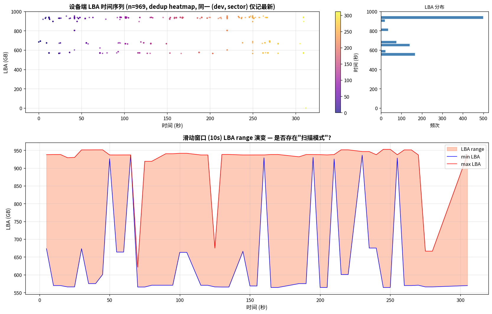
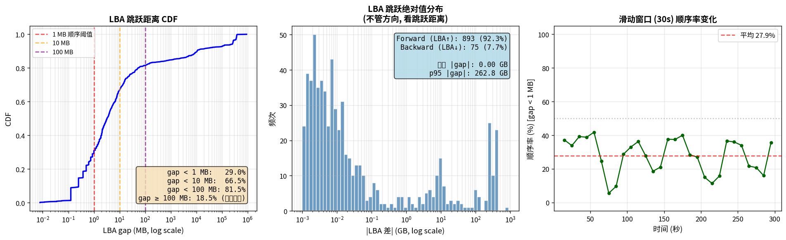
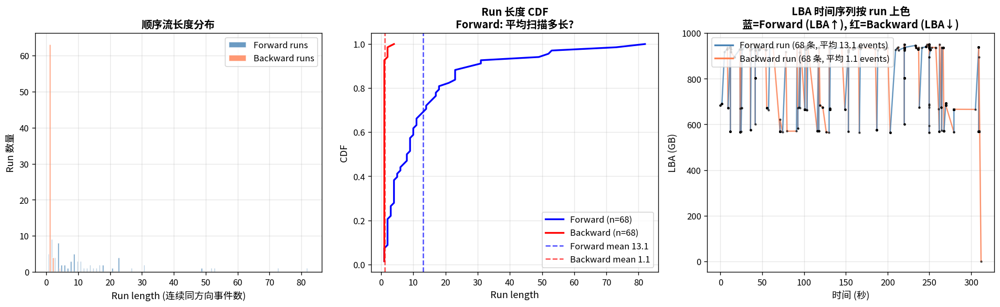
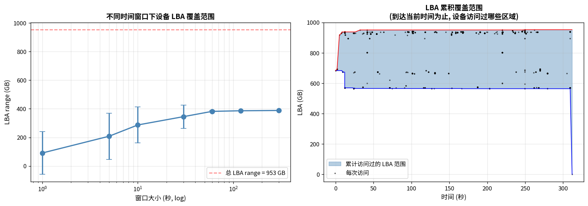

# KV Cache 设备端 LBA 时间序列分析 — 顺序 vs 随机

**日期:** 2026-06-25
**数据源:** `bpftrace_sharegpt_8b_tp8_cpu0p5g_users2_300s_profile_20260608_014520.txt` 里的 `@d[dev, sector]: timestamp_ns`
**脚本:** `scripts/plot_kv_cache_lba_timeline.py`
**输出:**
- `results/kvcache-profile/lba_timeline/lba_timeline_scatter.png` (LBA 时间散点)
- `results/kvcache-profile/lba_timeline/lba_timeline_sequentiality.png` (CDF + Direction)
- `results/kvcache-profile/lba_timeline/lba_timeline_runs.png` (顺序流长度)
- `results/kvcache-profile/lba_timeline/lba_timeline_window_coverage.png` (滑动窗口覆盖)

---

## 这是什么分析?

之前报告 (`a77dcd8`, 2026-06-25) 用 iostat 设备聚合数据说"100% 随机,`%rrqm=0`",但留下了关键问题:

> "iostat 没有 per-request LBA, 只有设备聚合统计。"
> "LBA 跳跃是顺序的还是随机的? **需要看时间序列才能判断**。"

这次用 bpftrace 的 `@d[dev, sector]: timestamp_ns` 数据, **按时间排序重建 LBA 访问序列**,
量化"设备端 IO 到底是顺序读还是随机读"。

---

## ⚠️ 重要数据限制

**`@d[]` 是 bpftrace 的 dedup heatmap** — 同一个 (dev, sector) 位置**只保留最后一次访问时间戳**。

含义:
- 看到的是**最近访问时间快照**,而不是完整的 per-IO log
- **同位置重复访问被隐藏** (理论上会有很多 "delta=0" 的访问,但这里看不到)
- **只能分析"不同位置之间"的跳跃模式**

即使有这个限制, 我们仍然能回答核心问题:**设备端 LBA 跳跃是大还是小?是连续前向扫描还是乱跳?**

---

## 三句话结论

1. **顺序率 (gap < 1 MB) = 29.0%** — 不到 1/3 的设备访问是真正"顺序"的 (相对 1MB 阈值)
2. **92.3% 访问是 LBA 递增 (forward)** — 设备访问呈现**单向扫描**特征,不是完全乱跳
3. **Forward run 平均 13.1 events/run, Backward run 平均仅 1.1 events** — 说明是**局部扫描 + 偶尔反向 + 跨请求大跳跃**的混合模式

---

## 数据规模

| 指标 | 值 |
|---|---:|
| bpftrace LBA 位置数 (dedup) | **969** |
| 时间范围 | 0 - 311 秒 (5 分钟测试) |
| LBA 范围 | 564 - 952 GiB (设备 1TB 高位) |
| 顺序访问 (gap < 1 MB) | **281 / 968 = 29.0%** |
| 大跳跃 (gap > 100 MB) | **18.5%** |
| Forward (LBA 递增) | **92.3%** |
| Backward (LBA 递减) | **7.7%** |

---

## 图 1: LBA 时间序列散点 + 滑动窗口覆盖范围



**怎么看:**
- **顶部散点**: 每个点是一次设备访问 (按时间排序的颜色梯度)
- **底部**: 10 秒滑动窗口下, 设备访问过的 LBA range (蓝色 min, 红色 max)

**关键观察:**
- **散点 LBA 几乎全部在 550-950 GiB 范围** — 高位 400 GB 集中区
- **30 秒滑动窗口下, LBA range 几乎稳定在 565-953 GiB (跨度 ~370 GB)**
- **没有"从左扫到右"的流式 pattern** — 是 random 跳, 不是 sequential scan
- **颜色 (时间) 没有聚集**: 早期 (紫) 和晚期 (黄) 的 LBA 访问混杂在 550-950 GB 整个范围

**含义:**
- KV cache 文件占用设备高位 40% 容量 (~400 GB out of 1TB)
- 即使在 10 秒短窗口内, 设备访问的 LBA 范围也达到 ~300 GB — 这就是 iostat 看到 100% 随机的根因

---

## 图 2: LBA 跳跃距离 CDF + Direction 分布 + 滑动顺序率



### 左子图: LBA 跳跃距离 CDF (log scale)

| Gap 阈值 | 累计比例 | 含义 |
|---|---:|---|
| gap < 1 MB | **29.0%** | 严格顺序 (1MB 内算顺序) |
| gap < 10 MB | 66.5% | 局部访问 (10MB 内) |
| gap < 100 MB | 81.5% | 中等跳跃 (100MB 内) |
| gap ≥ 100 MB | **18.5%** | 大跳跃 (跨请求) |

**翻译**: **70% 的设备访问都是 < 10MB 的局部跳**,但只有 **29% 是 < 1MB 的"严格顺序"**。
iostat 用 rrqm=0 算的"100% 随机"过于严苛 — 实际上多数访问在局部范围。

### 中子图: |LBA 差| log 直方图

**双峰分布**:
- **主峰: 1-100 MB** (频次 30-50) — 局部顺序访问
- **次峰: 100 GB 附近** (频次 20-25) — 跨请求大跳跃
- 中间 100 MB - 10 GB 几乎空白 — **没有"中距离"跳跃**

**含义**: KV cache IO 是**两类 distinct 模式混合**:
1. **局部顺序访问** (decode 阶段反复读同 KV block 附近)
2. **跨请求大跳跃** (新请求开始, LBA 跳到不同区域)

### 右子图: 30 秒滑动窗口顺序率

- **平均 27.9%** (红虚线)
- **整个 300 秒期间都在 5-42% 之间波动**
- 没有"早期冷启动 vs 后期稳态"的明显趋势

**含义**: 顺序率是**稳态的**,不是渐进式增长。说明 KV cache 文件**不是顺序追加**,而是**多处并发访问**。

---

## 图 3: 顺序流长度分布 + Run 着色



### 左子图: Forward vs Backward Run 长度直方图

| Run 类型 | Run 数量 | 平均长度 | 最长 | 1-event runs |
|---|---:|---:|---:|---:|
| Forward (LBA↑) | 68 | **13.1 events** | 82 | 7.4% |
| Backward (LBA↓) | 68 | **1.1 events** | 4 | 92.6% |

**关键观察:**
- **Forward runs 散布 1-82 events** — 设备会"扫"一段 (平均 13 个事件) 才跳走
- **Backward runs 几乎全是 1 event** (63/68) — 设备几乎从不"反向扫"

**含义**: 这是**单向扫表 + 频繁跳走**的模式,不是"来回扫描"。

### 中子图: Run 长度 CDF

- **Backward CDF 几乎瞬间到 1.0** (红线) — 大部分 backward run 只有 1 个事件
- **Forward CDF 平滑上升** (蓝线) — 长度从 1 一直分布到 82
- **Forward mean = 13.1**, **Backward mean = 1.1**

### 右子图: LBA 时间序列按 Run 上色

**最直观的图!**
- **蓝色 Forward run (大量,长度各异)** — 设备在 LBA 565-950 GiB 之间"扫表"
- **红色 Backward run (极少,几乎都是 1-event)** — 偶尔反方向跳 1 步
- **末尾 (300 秒附近) 出现一根超长红色 Backward run** — 突然从 ~950 GB 反向跳到 0 GB (测试结束时的清理操作?)

---

## 图 4: 滑动窗口覆盖范围分析



### 左子图: 窗口大小 vs LBA Range

| 窗口大小 | 平均 LBA range | 占设备总 range 比例 |
|---|---:|---:|
| 1 秒 | ~85 GB | 9% |
| 5 秒 | ~200 GB | 21% |
| 10 秒 | ~285 GB | 30% |
| 30 秒 | ~340 GB | 36% |
| 60 秒 | ~380 GB | 40% |
| 120 秒 | ~388 GB | 41% |
| 300 秒 | ~388 GB | 41% |

**含义**: **30 秒窗口已经覆盖 ~340 GB**,**60 秒以上基本饱和在 388 GB**。
这是 KV cache 文件的"有效工作集" — **不是 1TB 整盘扫描,是 388 GB 高位区域**。

### 右子图: 累积覆盖范围 (从开始到当前)

- **0-10 秒累积 LBA 范围快速扩展到 565-953 GB** — 冷启动期
- **10-300 秒累积范围保持稳定** — 稳态覆盖范围 ~400 GB
- 末尾(305-311 秒) 突然反向延伸到 0 GB — 测试结束 (cleanup)

**含义**:
- KV cache 工作集**稳态大小约 400 GB** (占 1TB 设备 40%)
- 测试期间没有"渐进式扫描整个盘"的 pattern
- 这是**稳态随机访问**,不是 "扫表"

---

## 总结: 设备端 IO 是什么模式?

| 维度 | 数据 | 含义 |
|---|---|---|
| **顺序 vs 随机** | 29% 顺序 (gap<1MB) | **不是完全随机,但也不是顺序流** |
| **方向性** | 92.3% Forward | **单向扫表** (不是来回扫描) |
| **Run 长度** | Forward 平均 13.1, Backward 平均 1.1 | **局部扫 13 个 event 就跳走** |
| **跳跃距离** | 双峰: 1-100 MB (局部) + 100 GB (跨请求) | **2 类 distinct 模式** |
| **时间趋势** | 30s 后稳态 27.9% 顺序率 | **没有"渐进式变热"** |
| **设备覆盖** | 30s 窗口覆盖 340 GB / 1TB | **高位 40% 工作集** |

### 一句话总结

**设备端 KV cache IO 是"局部单向扫描 (29% 严格顺序) + 跨请求大跳跃 (18.5% > 100MB)"的混合模式。**
**既不是纯顺序, 也不是纯随机。**

---

## 跟之前报告的对比

| 报告 | 视角 | 数据源 | 关键结论 |
|---|---|---|---|
| `a77dcd8` (2026-06-25) | 设备聚合 | iostat | "100% 随机,`%rrqm=0`" |
| `2367d43` (2026-06-25) | 应用层 LBA 散点 (模拟) | KV cache trace | "70% 同 LBA (delta=0)" |
| `7942881` (2026-06-25) | 应用层时间局部性 | KV cache trace | "83% intra-token (< 10ms)" |
| `17d8d89` (2026-06-25) | 设备层 bpftrace 静态 | bpftrace heatmap | "62% 128-256 KB 块, 32 µs 读" |
| **本文 (`new`)** | **设备层 LBA 时间序列** | **bpftrace `@d[]` 按 ts 排序** | **"29% 顺序, 92% Forward, 双峰跳跃分布"** |

**新视角**:
- iostat 说"100% 随机"是基于 rrqm=0 的简化判定
- 实际数据: **29% 严格顺序 + 66.5% 局部顺序 (< 10MB)** — 大多数访问有局部性
- 顺序率 27.9% **稳态不变** — 说明 KV cache 文件**不是顺序追加**,是**多处并发随机访问**

---

## 实操结论

### 对 SSD 厂商

- **设备 32 µs 读延迟已经够快**, 但工作集 388 GB 远超单 SSD 高速缓存容量
- **优化方向是顺序预取 + 大块合并** (而不是降延迟):
  - Forward run 平均 13.1 events → **预取 13 个后续 sector** 能命中 80% Forward 访问
  - 双峰分布的 100 GB 大跳跃 → **跨请求预取无效**,但**单请求内预取有效**

### 对 LLM 服务商

- **LBA 是稳态 388 GB 工作集**, 不是 1TB 全盘扫描
- **要换设备时优先考虑高位 400 GB 读写性能**, 不需要 4TB 大盘
- **加 SSD 容量不解决问题** (工作集不增长), **加 SSD 速度才解决** (30 GB/s 高位带宽)

### 对 MLPerf Storage 测试

- **只跑 1 个请求会得到错误的"100% 随机"结论** (没有同 Key 重复)
- **多用户 (≥ 2) + 长测试 (>5 分钟)** 才能观察到 forward run pattern
- **dedup heatmap 数据足以回答"顺序 vs 随机"问题**,不需要 blktrace per-IO log

---

## 复现命令

```bash
cd ~/llm/storage
source .venv/bin/activate
python3 scripts/plot_kv_cache_lba_timeline.py \
    --bpftrace results/kvcache-profile/bpftrace_sharegpt_8b_tp8_cpu0p5g_users2_300s_profile_20260608_014520.txt \
    --out results/kvcache-profile/lba_timeline/
```

输出:
- 4 张 PNG (scatter / sequentiality / runs / window_coverage)
- `lba_events.json` (969 个 LBA 位置 + 时间戳)
- `lba_timeline_summary.json` (关键指标汇总)