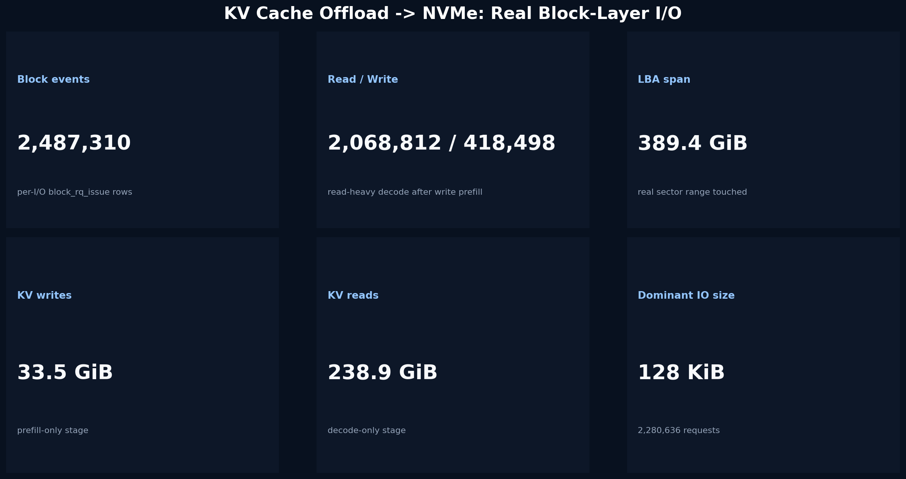
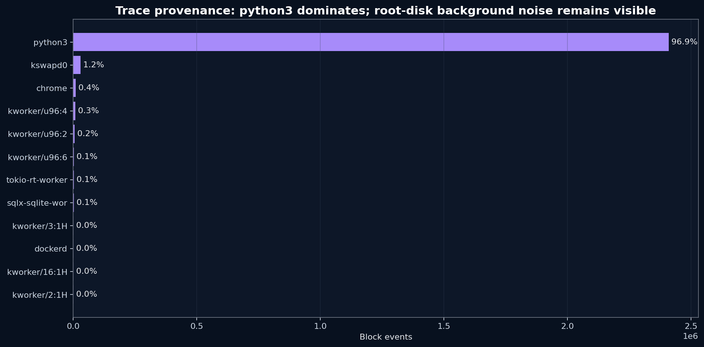
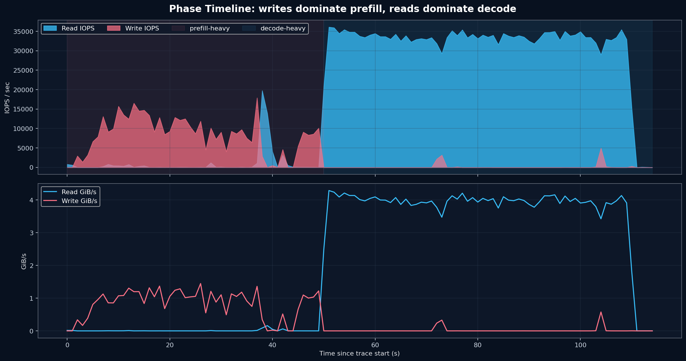
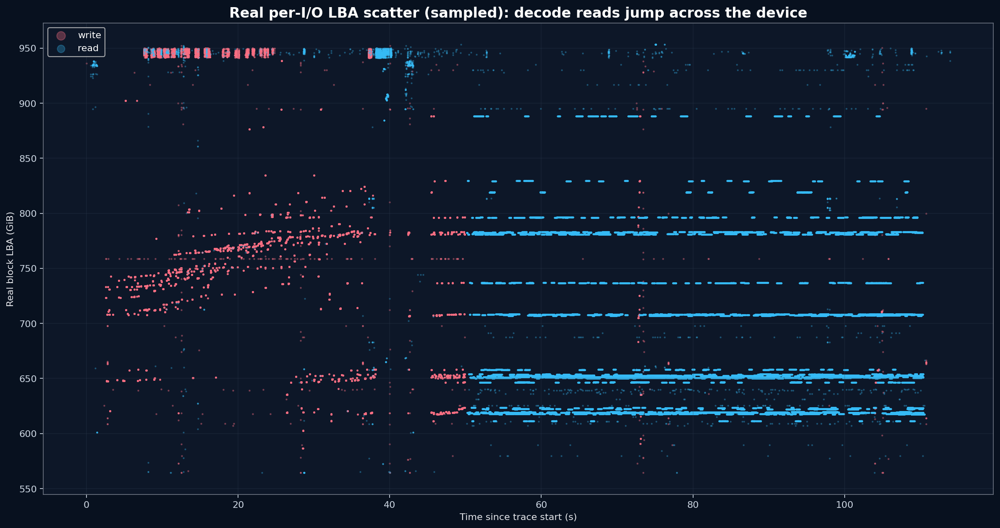
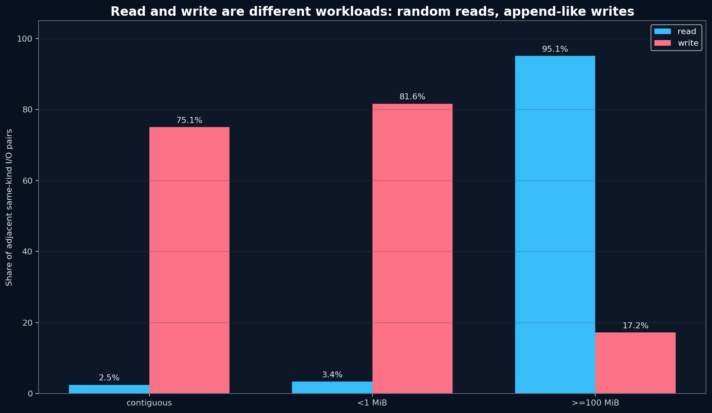
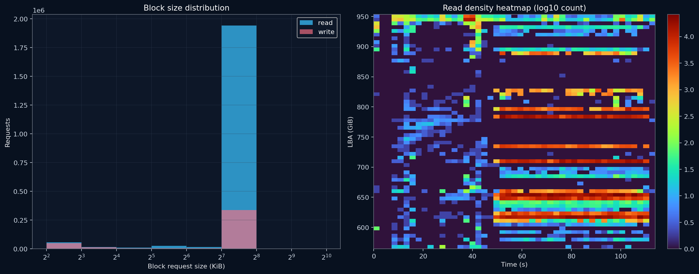

# KV Cache Offloading 到 NVMe SSD 的真实 I/O 分析

**日期:** 2026-06-29  
**有效数据源:** Linux `tracepoint:block:block_rq_issue` per-I/O event stream  
**原始 trace:** `results/kvcache-profile/per_io_lba_ext4_rw_20260629_032924/block_lba_trace.csv`  
**明确排除:** 模拟 LBA、`@d[]` 残留 map、仅由 `iostat` 聚合推导出的随机性结论

## 一句话结论

真实 block 层看到的 KV cache offload 是 **读写分裂的双模式**：

- **Decode 读:** 高度随机的大跨度 LBA 跳跃。读相邻 I/O 中 `>=100 MiB` 跳跃占 **95.1%**，精确连续只有 **2.5%**。
- **Prefill 写:** 更接近连续追加/批量写。写相邻 I/O 中精确连续占 **75.1%**，`<1 MiB` 近邻占 **81.6%**。



## 这次为什么比旧分析更可靠

旧分析里有三类需要排除或降级的证据：

| 旧证据 | 问题 | 本报告处理 |
|---|---|---|
| 应用层 trace + 模拟 LBA | Key offset 不是 SSD 真实 LBA | 不用于空间随机性结论 |
| bpftrace `@d[dev,sector]` 输出 | 该 map 是 D2C 临时 map 的残留/非完整事件流 | 不用于 sequential ratio |
| `iostat %rrqm≈0` | 只能说明块层没有合并，不能给出真实 LBA delta | 只作为辅助背景 |

本报告使用每次 block request issue 的真实字段：

```text
timestamp_ns,dev,sector,bytes,rwbs,comm,pid
```

其中 `LBA = sector * 512`。每一行是一条真实 block I/O。

## 测试配置

设备和文件系统：

- 设备：`/dev/nvme0n1`
- dev id：`259:10` / `271581194`
- 文件系统路径：ext4 根盘下的 `results/kvcache-profile/ext4_kvcache_lba_...`
- tracepoint：`block:block_rq_issue`

KV cache 两阶段 workload：

| 阶段 | 模式 | 用户数 | 时长 | 模型 | TP | GPU/CPU cache | 目的 |
|---|---:|---:|---:|---|---:|---|---|
| 1 | `--prefill-only` | 12 | 35s | `llama3.1-8b` | 8 | `0/0 GiB` | 产生真实 NVMe 写入 |
| 2 | `--decode-only` | 16 | 60s | `llama3.1-8b` | 8 | `0/0 GiB` | 产生真实 NVMe 读取 |

KV 层统计：

| 指标 | Prefill | Decode |
|---|---:|---:|
| Requests | 409 | 1,696 |
| Tokens | 48,876 | 223,109 |
| Storage KV written | 33.54 GiB | 0.00 GiB |
| Storage KV read | 0.00 GiB | 238.94 GiB |
| Storage read ops | 0 | 7,646 |
| Storage write ops | 409 | 0 |

## 真实 block trace 摘要

| 指标 | 值 |
|---|---:|
| Block events | 2,487,310 |
| Read events | 2,068,812 |
| Write events | 418,498 |
| Total block bytes | 281.88 GiB |
| Dominant request size | 128 KiB (2,280,636 events) |
| LBA min | 564.29 GiB |
| LBA max | 953.64 GiB |
| LBA span | 389.35 GiB |

Trace provenance: `python3` 贡献 **2,409,184 / 2,487,310** events (**96.9%**)。因为测试跑在根盘，仍有少量系统背景 I/O；结论主要由 `python3` 主导的百万级 KV I/O 支撑。



## 时间结构

0-50s 左右是 prefill-heavy，写入占主导；50s 后 decode-heavy，读取占主导。



10 秒窗口里，decode 阶段每个窗口读事件约 33 万条，LBA 覆盖仍在 370-389 GiB 量级。这意味着不是小范围热点顺序扫描，而是在很宽的设备地址空间内反复跳转。

## LBA 空间形态



读写的空间形态不同：

- 写入阶段有大量连续 128 KiB 请求，形成近连续写入带。
- 读取阶段在高位 LBA 范围内来回跳，前后相邻 read request 很少连续。

## 顺序性 / 随机性



| 指标 | Read | Write |
|---|---:|---:|
| Adjacent pairs | 2,068,811 | 418,497 |
| Exact contiguous | 2.5% | 75.1% |
| Near `<1 MiB` | 3.4% | 81.6% |
| Jump `>=100 MiB` | 95.1% | 17.2% |
| Delta p50 | 56997 MiB | 0 MiB |
| Delta p95 | 181721 MiB | 12964 MiB |
| Direction run p95 | 3 | 3 |

解读：

- **读路径是真随机压力源。** p50 LBA delta 已经达到 56997 MiB，95% 以上相邻读跨越至少 100 MiB。
- **写路径更像追加写。** p50 delta 为 0，75% 精确连续，说明 prefill 写入经过文件系统/块层后形成了大量连续提交。

## Request Size 与 Read Heatmap



128 KiB 是绝对主导的真实 block request size。这和 KV object 的逻辑大小不同：KV object 可能是几十到数百 MiB，落到块层后被拆成大量 128 KiB 请求。

## 修正后的结论

旧结论“KV cache 是随机大块 I/O”需要拆开：

1. **Decode read:** 是随机大跨度 read。SSD 选型应关注随机读尾延迟、队列处理能力、FTL/cache 行为。
2. **Prefill write:** 更接近连续追加写。SSD 选型应关注连续/近连续写吞吐、fsync 后台刷盘、GC cliff。
3. **不能再把读写混成一个随机模式。** 读写路径的 LBA 规律明显不同。
4. **应用层 locality 不等于设备层顺序性。** 即使应用层可能有同 Key 重读，实际 block 层 decode read 仍然表现为大跨度随机跳跃。

## 后续建议

- 在独立 ext4/xfs 测试盘上重复一次，减少根盘背景 I/O。
- 增加应用 trace 与 block trace 的时间对齐，把 Key/Phase 映射到真实 LBA。
- 分别产出 prefill-only、decode-only、mixed 三份 per-IO LBA 报告，避免阶段混合。
- 如果要比较 SSD，固定同一 trace replay，使用同样的 block-level 采集脚本。
