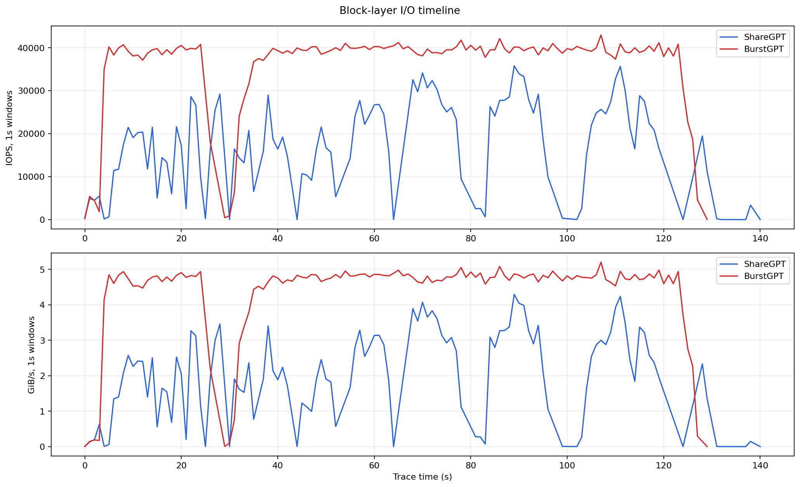
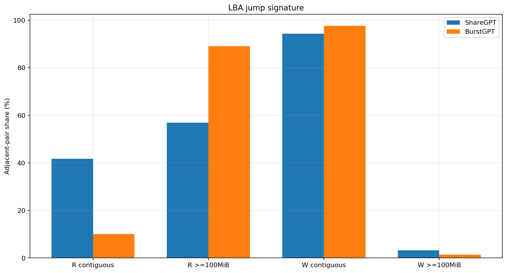
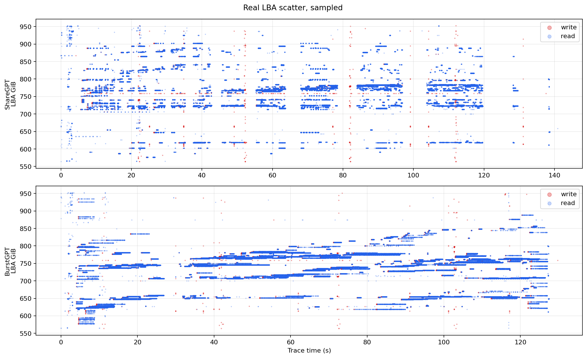
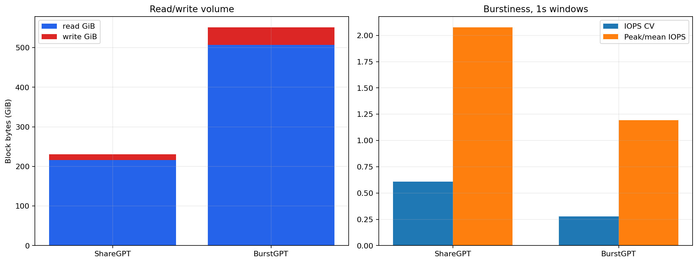

# KV Cache ShareGPT vs BurstGPT Real-Drive I/O

**Date:** 2026-06-29  
**Trace source:** Linux `tracepoint:block:block_rq_issue` per-I/O stream  
**Device:** `/dev/nvme0n1` parent block device for BIWIN X570 root ext4 filesystem on `/dev/nvme0n1p4`  
**Processed schema:** `timestamp_ns,dev,sector,bytes,rwbs,comm,pid`

## One-line conclusion

The two workloads produce distinct real block-layer I/O patterns. BurstGPT is the heavier and more random read workload: it generated **2.5x** the block IOPS, **2.6x** the block bandwidth, and **89.1%** of adjacent reads jumped at least 100 MiB. ShareGPT was still read-heavy, but had much more short-range/contiguous read adjacency and lower block-layer pressure.

## Methodology

Runs used the same benchmark binary and environment:

- Script: `kv_cache_benchmark/kv-cache.py`
- Python: `kv_cache_benchmark/.venv/bin/python3`
- Model: `llama3.1-8b`, TP=1
- Users: 8
- Duration flag: 120s
- Cache tier: forced NVMe with `--gpu-mem-gb 0 --cpu-mem-gb 0`
- Storage capacity guard: `--storage-capacity-gb 40`
- Generation mode: `none`, to keep the comparison storage-bound
- Trace: `scripts/trace_block_lba.bt 271581194`

Important workarounds and constraints:

- `llama3.2-3b` and `qwen3-4b-instruct` were not configured in this checkout, so `llama3.1-8b` was used.
- `--disable-multi-turn` triggers a dataset-mode `turn_number=None` comparison bug in this source tree. Multi-turn was left enabled, but no multi-turn hits occurred in either measured run.
- The suggested `--gpu-mem-gb 2 --cpu-mem-gb 4` kept data in GPU/CPU tiers during smoke testing. For real-drive I/O, both were set to 0 GiB, matching the reference report's forced-NVMe method.
- 100 GiB preallocation was attempted for each run and failed because the root ext4 filesystem did not have 100 GiB free. This is recorded in each `run.meta`.
- Initial partition-filter traces captured only headers; valid traces used parent device `/dev/nvme0n1` (`dev_t=271581194`), consistent with the reference methodology.

## Artifacts

| Workload | Run directory | Raw trace | Processed CSV |
|---|---|---|---|
| ShareGPT | `results/kvcache-profile/sharegpt_kvcache_20260629_140729` | `bpftrace.log` | `block_lba_trace.csv` |
| BurstGPT | `results/kvcache-profile/burstgpt_kvcache_20260629_141010` | `bpftrace.log` | `block_lba_trace.csv` |

Derived metrics and charts are in `docs/assets/sharegpt-vs-burstgpt/`.

## Benchmark-level results

| Metric | ShareGPT | BurstGPT |
|---|---:|---:|
| Requests completed | 1,238 | 564 |
| Tokens | 329,019 | 140,232 |
| Benchmark elapsed | 122.58s | 120.00s |
| KV storage read | 215.34 GiB | 506.71 GiB |
| KV storage write | 11.78 GiB | 41.31 GiB |
| KV read BW | 1.76 GiB/s | 4.22 GiB/s |
| KV write BW | 0.10 GiB/s | 0.34 GiB/s |

## Block trace summary

| Metric | ShareGPT | BurstGPT |
|---|---:|---:|
| Block events | 1,981,685 | 4,566,627 |
| Trace duration | 140.91s | 129.75s |
| Read events | 1,860,197 | 4,202,656 |
| Write events | 121,488 | 363,971 |
| Read / write event ratio | 15.31 | 11.55 |
| Block read bytes | 216.58 GiB | 507.29 GiB |
| Block write bytes | 14.08 GiB | 43.69 GiB |
| IOPS | 14,063 | 35,195 |
| Read IOPS | 13,201 | 32,390 |
| Write IOPS | 862 | 2,805 |
| Bandwidth | 1.64 GiB/s | 4.25 GiB/s |
| Read BW | 1.54 GiB/s | 3.91 GiB/s |
| Write BW | 0.10 GiB/s | 0.34 GiB/s |
| LBA span | 389.35 GiB | 389.35 GiB |
| Dominant request size | 128 KiB | 128 KiB |
| Dominant size share | 93.94% | 98.52% |

Both traces are dominated by `python3` benchmark I/O: 98.6% of ShareGPT events and 99.4% of BurstGPT events. Background root-drive events remain, but they are small relative to the KV-cache signal.

## LBA jump signature

| Metric | ShareGPT read | BurstGPT read | ShareGPT write | BurstGPT write |
|---|---:|---:|---:|---:|
| Adjacent pairs | 1,860,196 | 4,202,655 | 121,487 | 363,970 |
| Exact contiguous | 41.77% | 10.08% | 94.37% | 97.63% |
| Near `<1 MiB` | 42.27% | 10.30% | 96.36% | 98.40% |
| Jump `>=100 MiB` | 56.97% | 89.11% | 3.29% | 1.40% |
| Abs delta p50 | 2,674.75 MiB | 31,055.75 MiB | 0.00 MiB | 0.00 MiB |
| Abs delta p95 | 154,298.28 MiB | 126,769.29 MiB | 0.02 MiB | 0.00 MiB |
| Direction run p95 | 2 | 3 | 3 | 3 |

Interpretation:

- BurstGPT read I/O is much more random by adjacency: only 10.1% exact-contiguous reads and 89.1% large jumps.
- ShareGPT reads include a substantial contiguous/near-contiguous component: 41.8% exact-contiguous reads, but still 57.0% large jumps.
- Writes are strongly contiguous for both workloads, with BurstGPT slightly more contiguous.

## Burstiness

| 1s-window metric | ShareGPT | BurstGPT |
|---|---:|---:|
| Mean IOPS | 17,232 | 35,958 |
| IOPS p95 | 32,604 | 40,938 |
| IOPS max | 35,755 | 42,930 |
| IOPS coefficient of variation | 0.61 | 0.28 |
| Peak / mean IOPS | 2.07 | 1.19 |
| Mean BW | 2.01 GiB/s | 4.34 GiB/s |
| BW p95 | 3.90 GiB/s | 4.95 GiB/s |
| BW max | 4.30 GiB/s | 5.21 GiB/s |
| BW coefficient of variation | 0.63 | 0.28 |
| Peak / mean BW | 2.14 | 1.20 |

BurstGPT is higher pressure overall. ShareGPT is burstier relative to its own mean because it has more low-activity windows and sharper ramps. In absolute terms, BurstGPT's p95 and max IOPS/BW are higher.

## Comparison to the reference report

The reference report separated KV cache real I/O into random decode reads and near-contiguous prefill writes. These two mixed workload traces reproduce that split:

- Both workloads have mostly contiguous writes: 94-98% exact-contiguous adjacent write pairs.
- Reads are the differentiator. BurstGPT is closer to the reference decode-random pattern, with 89.1% of adjacent reads jumping at least 100 MiB. ShareGPT is mixed: it has random jumps, but also a much larger contiguous read component.
- Both workloads touch the same broad root-drive LBA span, about 389 GiB, so the difference is not spatial coverage but ordering and intensity.

## Conclusion

Yes, ShareGPT and BurstGPT produce distinct I/O patterns under the same forced-NVMe KV-cache configuration.

BurstGPT is heavier and more random: it drives 35.2K block IOPS, 4.25 GiB/s, 507 GiB of block reads, and 89.1% large read jumps. ShareGPT is lower intensity and more mixed: 14.1K block IOPS, 1.64 GiB/s, 217 GiB of block reads, and 57.0% large read jumps with 41.8% contiguous read adjacency.

For SSD stress, BurstGPT is the stronger random-read pressure workload. ShareGPT is burstier relative to its mean and still useful for mixed conversational replay, but it is less purely random at the block layer in this run.
