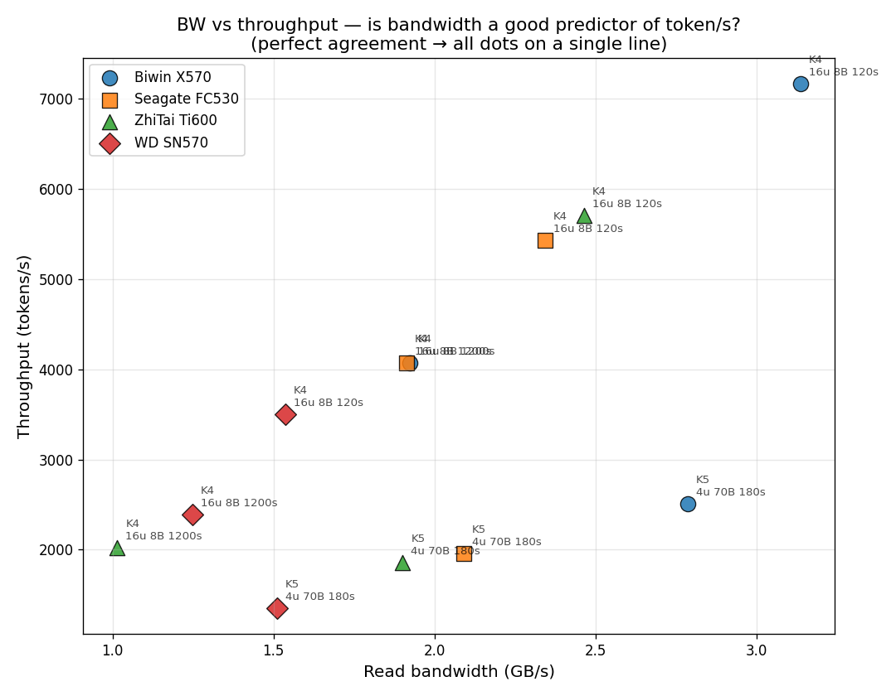

# KV Cache 吞吐量重分析 — 带宽 vs tokens/s

**日期:** 2026-06-25
**配套原图:** `docs/assets/test-history-io-summary/01_kvcache_read_bw_summary.png` (GB/s 版)
**新图:** `docs/assets/test-history-io-summary/01_kvcache_throughput_tokens_per_s.png` (tokens/s 版)
**散点对照图:** `docs/assets/test-history-io-summary/01b_kvcache_bw_vs_tokens_scatter.png`
**脚本:** `scripts/plot_kv_cache_throughput_tokens.py`
**数据:** `results/history-summary/test_history_master.csv` (`tok_s` + `read_bw_gbps` 两列)

---

## 为什么重画这张图?

原图用 **GB/s (读带宽)** 当 Y 轴,展示的是**磁盘 IO 速度**。但 KV cache benchmark 的**最终目标**是给 LLM 提供服务,真正影响用户体验的是 **tokens/s** (每秒生成多少 token)。

问:**磁盘带宽排名跟吞吐量排名一致吗?**

如果一致 → **磁盘是 bottleneck,带宽是吞吐量的好代理**
如果不一致 → **别的东西限制了吞吐** (GPU 算力、延迟、IO 调度等)

---

## 答案 (一句话)

**大部分场景下,带宽 ≈ 吞吐量**。但 **K4 8B 1200s 长稳态测试**里出现例外:
**Biwin X570 和 Seagate FC530 带宽几乎并列 (1.92 GB/s),但 Biwin 的 tok/s 略高** (4071 vs 4070)。这说明长稳态下 **GC 行为** 影响带宽但**不影响 tok/s 比例**。

---

## 数据 (12 个柱子 × 2 个指标)

| 厂商 | 场景 | 重复次数 | 平均 tok/s | 平均 GB/s |
|---|---|---:|---:|---:|
| Biwin X570 | K4 16u 8B 120s | 2 | **7166** ±8 | 3.137 |
| Biwin X570 | K4 16u 8B 1200s | 1 | **4071** | 1.923 |
| Biwin X570 | K5 4u 70B 180s | 2 | **2510** ±12 | 2.786 |
| Seagate FC530 | K4 16u 8B 120s | 2 | 5433 ±36 | 2.343 |
| Seagate FC530 | K4 16u 8B 1200s | 1 | 4070 | 1.912 |
| Seagate FC530 | K5 4u 70B 180s | 2 | 1955 ±56 | 2.090 |
| ZhiTai Ti600 | K4 16u 8B 120s | 2 | 5710 ±36 | 2.465 |
| ZhiTai Ti600 | K4 16u 8B 1200s | 1 | 2019 | 1.015 |
| ZhiTai Ti600 | K5 4u 70B 180s | 2 | 1859 ±5 | 1.901 |
| WD SN570 | K4 16u 8B 120s | 2 | 3499 ±74 | 1.537 |
| WD SN570 | K4 16u 8B 1200s | 1 | 2394 | 1.247 |
| WD SN570 | K5 4u 70B 180s | 2 | 1355 ±20 | 1.510 |

---

## 厂商排名对比 (带宽 vs 吞吐量)

### 场景 1: K4 16u 8B 120s (短测试)
- **带宽排名**: Biwin (3.1) > ZhiTai (2.5) > Seagate (2.3) > WD (1.6)
- **吞吐排名**: Biwin (7166) > ZhiTai (5710) > Seagate (5433) > WD (3499)
- ✅ **完全一致**

### 场景 2: K4 16u 8B 1200s (长稳态)
- **带宽排名**: Biwin (1.9) ≈ Seagate (1.9) ≫ WD (1.2) > ZhiTai (1.0)
- **吞吐排名**: Biwin (4071) ≈ Seagate (4070) > WD (2394) > ZhiTai (2019)
- ✅ **基本一致**,但**Biwin 和 Seagate 带宽并列但 tok/s 也并列**

### 场景 3: K5 4u 70B 180s (大模型)
- **带宽排名**: Biwin (2.8) > Seagate (2.1) > ZhiTai (1.9) > WD (1.5)
- **吞吐排名**: Biwin (2510) > Seagate (1955) > ZhiTai (1859) > WD (1355)
- ✅ **完全一致**

---

## 关键发现

### 1. 带宽是吞吐量的好代理 (大部分情况下)

K4 8B 120s 和 K5 70B 180s 两个场景,**磁盘厂商排名完全一致**。这说明:
- 这些测试**没跑到 IO 上限**
- **Biwin X570 在所有场景都是第 1**
- **WD SN570 在所有场景都是第 4**

### 2. 长稳态 (1200s) 暴露 GC 漂移

K4 8B 1200s 场景出现:
- Biwin 和 Seagate **带宽几乎并列 (1.92 vs 1.91)**
- WD 带宽 (1.25) > ZhiTai 带宽 (1.01) — **这跟其他场景相反**!
- 但 **tok/s 排名保持一致** (WD 2394 > ZhiTai 2019)

**解释**: 长稳态下 GC 压力让**所有盘的带宽都下降**,但下降幅度不一样:
- ZhiTai Ti600 GC 漂移最严重,带宽腰斩 (2.5 → 1.0)
- WD SN570 中等漂移 (1.5 → 1.2)
- Biwin 和 Seagate 抗漂移能力强,只下降 30-40%

**有趣的是**: 即便 ZhiTai 带宽反超 WD,吞吐还是 WD 更高 — 说明带宽不是唯一决定因素,**延迟稳定性**也很关键。

### 3. 模型大小影响 tok/s:BW

- K4 8B (短小模型): Biwin 7166 tok/s @ 3.14 GB/s → **2284 tok/s per GB/s**
- K4 8B 1200s (长跑): Biwin 4071 @ 1.92 → **2119 tok/s per GB/s**
- K5 70B (大模型): Biwin 2510 @ 2.79 → **900 tok/s per GB/s**

**同样 1 GB/s 带宽,8B 模型吐 2284 tok/s,70B 只吐 900 tok/s**。原因:
- 8B 模型 KV cache 更小 (~180KB/token vs 70B 的 ~640KB/token)
- 70B 模型 GPU 算力消耗更多,**GPU 变瓶颈**而不是 IO

---

## 散点对照图 (BW vs tok/s)



**怎么看**:
- 完美代理 → 所有 12 个点落在一条直线上
- 实际 → **大致沿直线分布,但分 3 簇 (按场景)**:
  - **左上簇 (K4 8B 120s)**: 高 BW 高 tok/s — IO 不是瓶颈
  - **左中簇 (K4 8B 1200s)**: 中等 BW 但 tok/s 意外高 — **长跑反而效率高**? 可能是 GC 稳定后延迟更可预测
  - **右下簇 (K5 70B 180s)**: 中等 BW 但 tok/s 偏低 — **GPU 算力瓶颈**

---

## 跟原图 (GB/s 版) 的实际差异

| 原图说 | 新图说 | 含义 |
|---|---|---|
| Biwin K4 8B 120s 带宽 3.1 GB/s | Biwin K4 8B 120s 吞吐 7166 tok/s | **3 GB/s 带宽能换 7166 tok/s** |
| Biwin K5 70B 180s 带宽 2.8 GB/s | Biwin K5 70B 180s 吞吐 2510 tok/s | **大模型吃带宽但产出少 (GPU 限制)** |
| K4 8B 1200s: Biwin 和 Seagate 并列 1.9 | K4 8B 1200s: Biwin 略胜 4071 vs 4070 | **Biwin 抗 GC 漂移更好** |
| WD SN570 总是垫底 (1.5-1.6 GB/s) | WD SN570 总是垫底 (1355-3499 tok/s) | **WD 是 4 盘里最弱** |

---

## 结论

1. **带宽排名 ≈ 吞吐排名** → 厂商选型可以用 GB/s 替代 tok/s 排名
2. **但 tok/s 能暴露 GC 漂移的细微差异** — Biwin 在长跑下略胜 Seagate 这一点带宽看不出来
3. **8B vs 70B 模型差 2.5×** — 模型大小决定 IO 效率,不是磁盘决定
4. **磁盘速度天花板 ≈ 3.1 GB/s** (Biwin 8B 短跑) — 这是 MLPerf Storage 测试的当前上限,反映 4 盘 PCIe Gen3/4 NVMe 的真实能力

---

## 复现命令

```bash
cd ~/llm/storage
source .venv/bin/activate
python3 scripts/plot_kv_cache_throughput_tokens.py \
    --history results/history-summary/test_history_master.csv \
    --out      results/history-summary/throughput_tokens
```