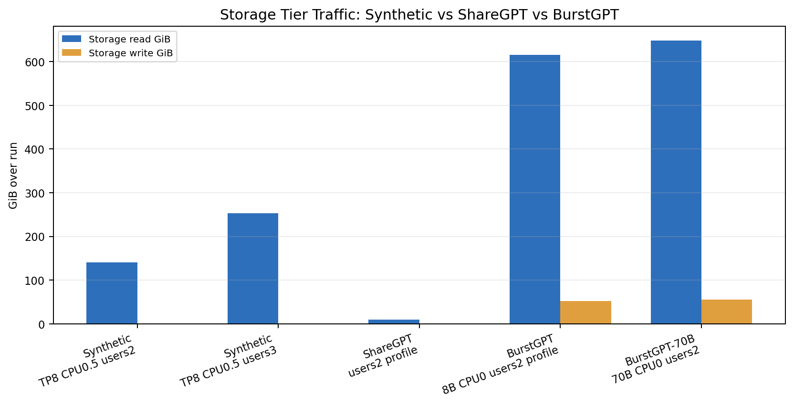
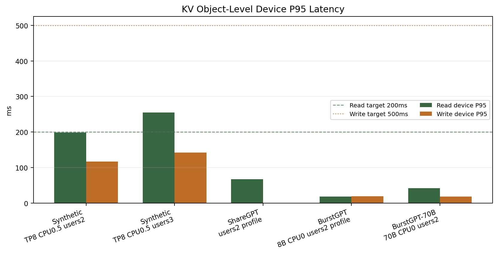
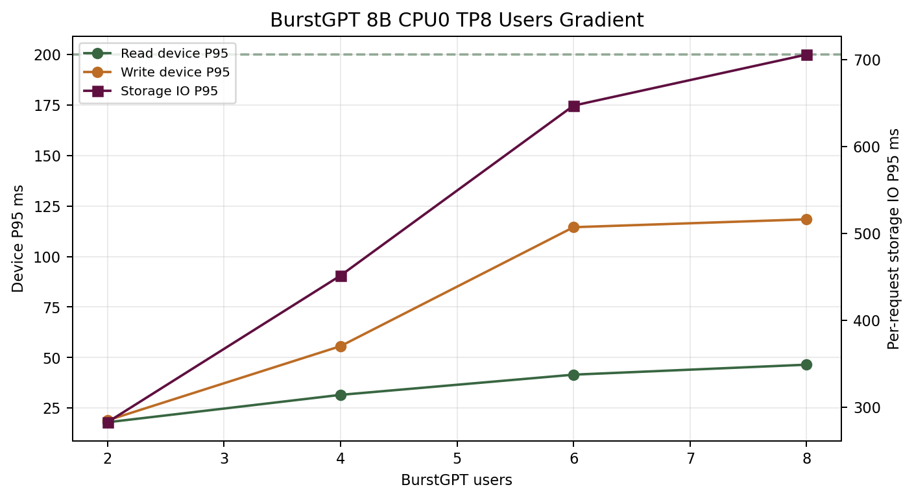
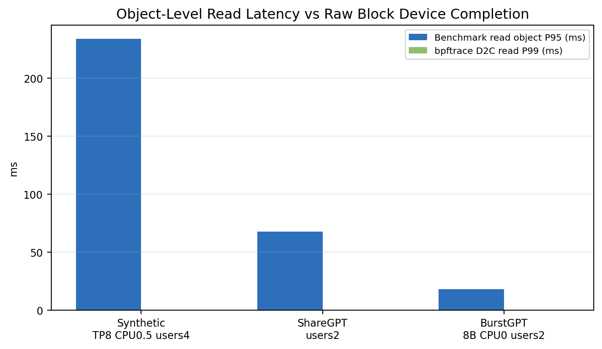
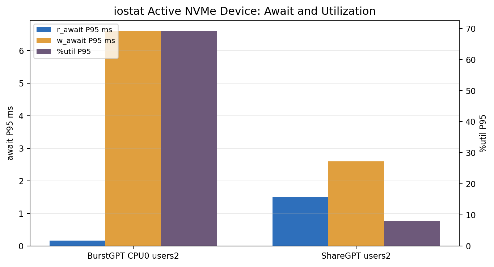

# KV Cache I/O Profiling 可视化分析报告

日期：2026-06-08

本文档面向 AI SSD 产品预研，分析 `kv_cache_benchmark` 文档提供的 KV cache 测试与 I/O profiling 方法，并把当前已完成的 Synthetic、ShareGPT、BurstGPT、70B 扩展测试结果可视化。本文不是运行手册，而是解释这些结果说明了什么、哪些指标可信、哪些指标不能过度解读。

相关背景报告：`docs/kvcache-ai-ssd-prestudy-2026-06-08.md`

## 核心结论

1. 当前最适合做 AI SSD 产品基线的是 BurstGPT + `--trace-speedup 1000` + `--cpu-mem-gb 0` + TP8。它能保留真实 API trace 的请求形态，同时把 KV cache 工作集压到 storage tier。
2. ShareGPT 是完整流程验证，不是 SSD 压力测试。它的上下文短、cache hit 高、真实 storage traffic 小，因此结果 PASS 只能说明真实聊天 workload 很轻。
3. Synthetic 长上下文 workload 适合找边界。TP1 失败严重，TP8 明显降低单个 KV object 大小，说明 tensor parallel 对 SSD 压力有决定性影响。
4. 当前 profiling 显示 SSD 原生命令延迟不是主要瓶颈。BurstGPT CPU0 profile 中 D2C read P99 约 256us，iostat `r_await` P95 约 0.16ms，但 KV object 级 read device P95 是 17.96ms，差距来自一个 KV object 被拆成大量 block I/O，以及文件系统、VFS、Python/NumPy、序列化路径。
5. 下一步产品风险不在单次 4KiB/128KiB NVMe 命令延迟，而在 object 级 tail latency、写尾延迟、长期稳态、预热/预条件化之后的行为，以及更大模型下的并发拐点。

## 文档提供的 I/O Profiling 方法

| 方法 | 对应选项或工具 | 实测含义 | 适合回答的问题 | 主要限制 |
|---|---|---|---|---|
| Benchmark JSON/XLSX | `--output`, `--xlsx-output` | KV object 级指标：每请求 storage latency、每 tier bytes、cache hit、P95/P99 | 这个 workload 对 KV cache 系统是否 PASS？失败发生在哪个 tier？ | `Device P95` 是对象级磁盘 I/O，不等于单条 NVMe 命令延迟 |
| 逻辑 I/O trace | `--io-trace-log *.csv.zst` | 记录每次 KV Read/Write、object size、tier、phase，不做真实硬件 I/O | workload 形态是什么？读写比例、对象大小、tier 分布如何？ | 延迟为 0，不可用来判断 SSD 性能 |
| Linux block/VFS tracing | `utils/storage_latency_stack.bt` + `bpftrace` | Q2D、D2C、VFS、fsync、block size、queue depth、LBA 分布 | 瓶颈在设备、调度器、文件系统还是应用路径？ | 原始输出可能超过 1GB，只应 profile 关键场景 |
| 设备级监控 | `iostat -x 1` | `r_await`、`w_await`、带宽、IOPS、`%util` | SSD 是否被打满？读写等待和利用率如何？ | 是设备聚合统计，不是单个 KV object latency |
| fio workload 提炼 | `utils/distill_fio.py` | 从 bpftrace 结果生成 read mix、block size split、热区信息 | 如何把 KV workload 转成可复现 fio 压力？ | 自动生成的 `iodepth` 可能不现实，需要人工 sweep |

## 关键术语科普

| 术语 | 解释 | 本次实验中的读法 |
|---|---|---|
| KV object | 一个请求对应的一块 KV cache 数据，包含模型层、head、序列长度相关状态 | benchmark 的 latency 是按 KV object 统计，不是按 token 或 4KiB page |
| TP / Tensor Parallel | 张量并行度。TP=8 表示 KV entry 被切成 8 份，每个 rank 只保存 1/8 | TP8 会显著降低单次读写 object size，所以 TP1 与 TP8 不可直接混为一谈 |
| Device P95 | benchmark 内 storage tier 的磁盘 I/O 部分 P95 | 对象级磁盘时间，通常远大于单条 NVMe 命令 D2C |
| Host P95 | 序列化、反序列化、Python/NumPy、文件系统路径等 host 侧开销 | Host 高说明不是只换 SSD 就能解决 |
| D2C | Dispatch to Complete，block I/O 从下发到设备到完成的时间 | 更接近单条 block command 的设备服务时间 |
| Q2D | Queue to Dispatch，block I/O 在调度队列中等待到下发的时间 | Q2D 高通常说明队列/调度竞争 |
| VFS | Linux 虚拟文件系统层，应用可见 read/write syscall 路径 | VFS 高但 D2C 低，通常说明 page cache、文件系统或应用拷贝路径占主导 |
| `r_await` / `w_await` | iostat 的设备级读/写平均等待时间 | 可判断设备侧压力，但不能替代 benchmark object latency |
| `bssplit` | fio 的 block size 分布 | 本次有效 profile 中 128KiB 占主要比例 |
| `rwmixread` | fio 读比例 | BurstGPT CPU0 profile 约 91% read，是读密集 workload |

## 总览表：当前关键测试结果

| Workload | 配置 | 状态 | Requests | Req/s | Storage I/O P95 | Read Device P95 | Write Device P95 | Storage Read | Storage Write | Cache Hit | 判断 |
|---|---:|---|---:|---:|---:|---:|---:|---:|---:|---:|---|
| Synthetic | 8B TP1 users10 | FAIL | 125 | 1.04 | 19635.46ms | 3167.48ms | 924.69ms | 334.99GiB | 13.12GiB | 72.79% | 大 object baseline，明确失败 |
| Synthetic | 8B TP8 CPU0.5 users2 | PASS | 1137 | 3.79 | 771.46ms | 198.74ms | 116.44ms | 140.78GiB | 0.20GiB | 81.39% | synthetic 稳定边界 |
| Synthetic | 8B TP8 CPU0.5 users3 | FAIL | 1051 | 3.50 | 1452.01ms | 255.07ms | 141.83ms | 253.49GiB | 0.25GiB | 73.29% | synthetic 首个失败点 |
| ShareGPT | 8B TP8 CPU0.5 users2 | PASS | 1724 | 5.74 | 937.41ms | 62.47ms | n/a | 9.79GiB | 0.00GiB | 97.74% | 完整真实聊天流程，但 SSD 压力轻 |
| ShareGPT profile | 8B TP8 CPU0.5 users2 | PASS | 1678 | 5.58 | 927.11ms | 67.56ms | n/a | 9.10GiB | 0.00GiB | 97.91% | bpftrace/iostat 验证轻压力 |
| BurstGPT profile | 8B TP8 CPU0 users2 speedup1000 | PASS | 5748 | 19.16 | 282.58ms | 17.96ms | 18.90ms | 614.97GiB | 52.48GiB | 97.75% | 当前最佳产品 baseline |
| BurstGPT | 8B TP8 CPU0 users8 speedup1000 | PASS | 7339 | 24.46 | 705.99ms | 46.48ms | 118.44ms | 781.09GiB | 67.74GiB | 97.77% | 8B 并发到 8 仍 PASS，写尾延迟上升 |
| BurstGPT 70B | TP8 CPU0 users2 speedup1000 | PASS | 2421 | 8.07 | 815.83ms | 41.85ms | 18.68ms | 648.39GiB | 55.06GiB | 97.86% | 大模型初始验证通过 |
| BurstGPT 70B | TP8 CPU0 users8 speedup1000 | PASS | 3395 | 11.32 | 1999.28ms | 115.34ms | 177.22ms | 897.83GiB | 78.22GiB | 97.79% | 70B 仍 PASS，但 object tail 已接近需要关注 |

完整 CSV 汇总表已生成到：

| 表 | 路径 |
|---|---|
| Benchmark 汇总 | `docs/assets/kvcache-io-profiling/io_profile_summary.csv` |
| fio 提炼汇总 | `docs/assets/kvcache-io-profiling/fio_distill_summary.csv` |
| iostat 汇总 | `docs/assets/kvcache-io-profiling/iostat_summary.csv` |

## 图 1：不同 workload 的 storage traffic

这张图说明 workload 形态比“是否真实数据集”更重要。ShareGPT 是真实聊天数据，但 storage read 只有约 9GiB，远小于 BurstGPT CPU0 的数百 GiB；Synthetic 和 BurstGPT CPU0 才能真正制造 SSD 压力。产品预研不能只报告 ShareGPT PASS，否则会高估 SSD 余量。

## 图 2：KV object 级 Device P95 对比

Synthetic TP1 的 read device P95 达到 3167.48ms，是明显不可接受的 baseline。切到 TP8 后，object size 下降，Synthetic users2 接近 200ms 目标，users3 超过 200ms 成为失败点。BurstGPT 与 ShareGPT 的 read device P95 明显低于目标，说明在这些 workload 下 SSD 原生读延迟有较大余量。

## 图 3：BurstGPT users 梯度

BurstGPT 8B CPU0 TP8 从 users2 到 users8 都 PASS，但趋势很重要：read device P95 从 17.96ms 上升到 46.48ms，write device P95 从 18.90ms 上升到 118.44ms，写尾延迟增长更快。对 AI SSD 产品来说，后续测试需要重点看写放大、flush、GC、SLC cache 耗尽后的 `w_await` 和 object write tail。

## 图 4：Object latency 与 D2C latency 的差距

这是当前最关键的解释图。bpftrace 的 D2C 是单条 block I/O 命令的设备完成时间，BurstGPT CPU0 中 read P99 约 256us；benchmark 的 read device P95 是 KV object 级磁盘 I/O，达到 17.96ms。二者差距不矛盾，因为一个 KV object 会拆成大量 block I/O，还会经过文件系统和应用层读写路径。

因此，产品判断不能只看 fio 单点延迟，也不能只看 benchmark object latency。正确做法是同时报告：

| 层级 | 指标 | 解释 |
|---|---|---|
| NVMe command | D2C P99/P99.9 | SSD 单条命令服务能力 |
| Device aggregate | iostat await/util | 设备是否拥塞 |
| KV object | benchmark device/total P95/P99 | 用户可感知的 KV cache object I/O tail |
| Request | end-to-end P95/P99 | 排队、I/O、生成模拟后的整体体验 |

## 图 5：iostat await 与 utilization

ShareGPT profile 的 active device `nvme1n1` 平均利用率只有 2.33%，P95 约 8%，说明它没有压住 SSD。BurstGPT CPU0 profile 的 `nvme1n1` 平均利用率约 55%，P95 约 69.2%，读 await P95 0.16ms，写 await P95 6.6ms，是更有意义的 SSD workload。这个结果支持“当前设备还有读延迟余量，但写路径需要继续观察”的判断。

## fio 提炼结果

| Profile | Total I/O | Read Mix | Read D2C P99 | Write D2C P99 | 主要 block size | 解读 |
|---|---:|---:|---:|---:|---|---|
| ShareGPT users2 profile | 171477 | 61% | 128us | 4096us | read 128KiB 62%，write 128KiB 82% | 真实聊天轻负载，写操作不少但总量小 |
| BurstGPT CPU0 users2 profile | 5856651 | 91% | 256us | 4096us | read 128KiB 92%，write 128KiB 94% | 当前最有价值的 fio replay 模板 |
| Synthetic TP8 CPU0.5 profile | 3721093 | 73% | 256us | 8192us | read/write 128KiB 99% | 压力更重，适合边界与失败分析 |

注意：自动提炼出的 `iodepth` 可能非常大，例如 524288 或 1048576。这不是建议直接拿去跑 fio。产品对比应固定一组合理队列深度，例如 `iodepth=32,64,128,256,1024`，保持 `rwmixread` 和 `bssplit` 接近真实 workload，再比较 P95/P99/P99.9。

## iostat active device 摘要

| Workload | Device | Samples | Read IOPS avg/P95 | Write IOPS avg/P95 | Read await P95 | Write await P95 | Util avg/P95 | 判断 |
|---|---|---:|---:|---:|---:|---:|---:|---|
| ShareGPT users2 profile | nvme1n1 | 271 | 388 / 1364 | 252 / 482 | 1.50ms | 2.60ms | 2.33% / 8.00% | SSD 基本空闲 |
| BurstGPT CPU0 users2 profile | nvme1n1 | 302 | 17694 / 25449 | 1709 / 2523 | 0.16ms | 6.60ms | 55.02% / 69.20% | 有效压力但未饱和 |

## 对 AI SSD 产品预研的解释

当前结果可以支持三条产品判断：

1. 如果目标场景是常规聊天类 workload，ShareGPT 说明 SSD 压力可能很轻，瓶颈更可能在调度、cache 策略、host 序列化，而不是 NAND 原生读延迟。
2. 如果目标场景是 API trace 生产负载，BurstGPT CPU0 speedup1000 更像应作为产品 baseline。它读密集、128KiB I/O 占比高、SSD utilization 有意义，并且能暴露写尾延迟增长趋势。
3. 如果目标场景包含长上下文、代码、文档或超大模型，Synthetic 和 70B BurstGPT 梯度必须继续跑。它们更容易放大 object size 和 request tail，是寻找产品边界的核心。

## 还需要补的测试

| 优先级 | 测试 | 目的 | 建议判据 |
|---|---|---|---|
| P0 | BurstGPT 70B CPU0 users 梯度 profile | 找大模型下 users=8 之后的 first FAIL 或 tail 拐点 | read device P95 < 200ms，write device P95 < 500ms，object storage P95 趋势 |
| P0 | prefill-only / decode-only | 分离写密集和读密集路径 | prefill 看 write tail，decode 看 read tail |
| P0 | fio sweep | 把 bpftrace 提炼结果变成可复现实验 | 固定 rwmixread/bssplit，扫 iodepth 32 到 1024 |
| P1 | SSD preconditioning | 排除空盘/SLC cache 偏乐观 | 预写满后重复 BurstGPT CPU0 profile |
| P1 | 长稳态 30 到 60 分钟 | 观察热、GC、wear leveling、page cache 稳态 | await/util/tail 不随时间持续恶化 |
| P1 | CPU cache sensitivity | 评估 DRAM cache 对 SSD 压力的遮蔽 | `cpu-mem-gb=0,0.5,1,2` 对比 storage bytes 和 P95 |
| P2 | DeepSeek V3 / Qwen3-32B / GPT-OSS | 覆盖不同 KV bytes/token 和模型结构 | 对比 object size 与 device P95 的关系 |

## 不应上传的文件

以下文件只保留在本地，用于追溯和复算，不进入 Git：

| 类型 | 原因 |
|---|---|
| `results/` 原始 JSON/XLSX/CSV | 可能快速膨胀，属于实验产物 |
| `datasets/` | 数据集大且可能有授权问题 |
| `bpftrace*.txt` | 原始 trace 可超过 1GB |
| `iostat*.txt` | 原始时间序列可重复生成 |
| `fio*.ini` 原始生成件 | 可由摘要和脚本再生成 |
| `uv.lock` 当前本地修改 | 主要是镜像源变化，不属于本次分析内容 |

## 生成的可视化资产

| 资产 | 路径 |
|---|---|
| Storage traffic 图 | `docs/assets/kvcache-io-profiling/storage_traffic_workload_comparison.png` |
| Device P95 对比图 | `docs/assets/kvcache-io-profiling/kv_object_device_p95_comparison.png` |
| BurstGPT users 梯度图 | `docs/assets/kvcache-io-profiling/burstgpt_users_gradient_latency.png` |
| Object vs D2C 图 | `docs/assets/kvcache-io-profiling/object_latency_vs_d2c_read.png` |
| iostat await/util 图 | `docs/assets/kvcache-io-profiling/iostat_await_utilization.png` |
| Benchmark 汇总 CSV | `docs/assets/kvcache-io-profiling/io_profile_summary.csv` |
| fio 汇总 CSV | `docs/assets/kvcache-io-profiling/fio_distill_summary.csv` |
| iostat 汇总 CSV | `docs/assets/kvcache-io-profiling/iostat_summary.csv` |
