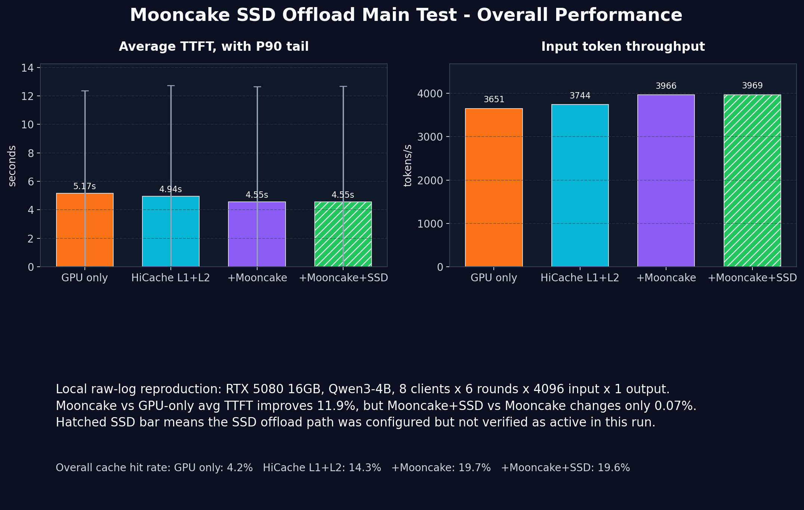
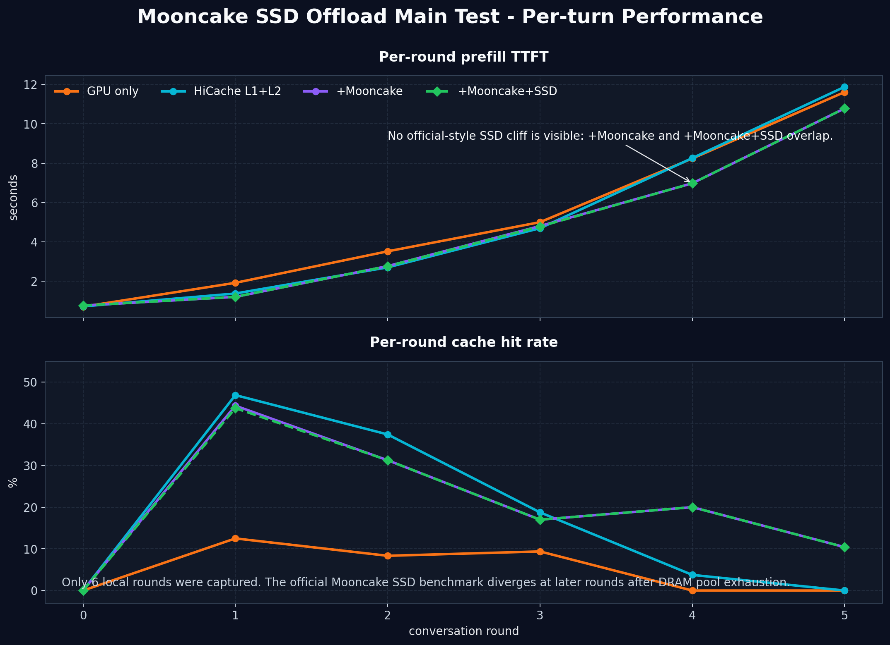

# Mooncake SSD Offload 主测报告审阅

审阅对象:

- 本地报告: `/home/ficus/llm/infer/ai_ssd_prestudy/docs/mooncake-ssd-offload-main-test-report-2026-06-26.md`
- 原始日志: `/home/ficus/mooncake_smoke_test/main_bench_20260626_123456/*/bench.log`
- 官方参考: <https://kvcache-ai.github.io/Mooncake/performance/ssd-offload-benchmark-results.html>

## 结论

这份本地报告里的核心数值是能从原始 `bench.log` JSON 复现的，数字本身不是主要问题。

主要问题是实验命名和归因: 它不能作为“SSD offload 性能报告”。更准确的说法是: 这是一次本地 RTX 5080 单卡上的 GPU only / HiCache / Mooncake 对比实验，其中 `Mooncake+SSD` 配置与 `Mooncake` 几乎重合，不能证明 SSD offload 已经生效。

## 本地数据来源

报告汇总表来自四个 `bench.log` 的第一行 JSON:

| 配置 | 原始日志 | avg TTFT | Input tput | Cache hit |
|---|---|---:|---:|---:|
| GPU only | `01_gpu_only/bench.log` | 5.166s | 3651 tok/s | 4.2% |
| HiCache L1+L2 | `02_hicache_l1_l2/bench.log` | 4.939s | 3744 tok/s | 14.3% |
| +Mooncake | `03_mooncake_only/bench.log` | 4.550s | 3966 tok/s | 19.7% |
| +Mooncake+SSD | `04_mooncake_ssd/bench.log` | 4.546s | 3969 tok/s | 19.6% |

派生数据和图表已重新生成:

- `docs/assets/mooncake-ssd-offload-review/summary.csv`
- `docs/assets/mooncake-ssd-offload-review/per_round.csv`
- `docs/assets/mooncake-ssd-offload-review/01_overall_performance_local.png`
- `docs/assets/mooncake-ssd-offload-review/02_per_round_performance_local.png`

## 报告中的问题

1. **标题和结论容易误导**

   文件名和标题是 `Mooncake SSD Offload 主测结果报告`，但报告自己也写明 `SSD offload 路径没被触发`。因此不能把这份报告解释为 SSD offload benchmark。

2. **`Mooncake+SSD` 没有独立证据**

   `+Mooncake` 和 `+Mooncake+SSD` 的 TTFT、throughput、cache hit 几乎完全一致。本地数据只能说明“SSD 配置没有带来可观测差异”，不能说明 SSD 起作用。

3. **缺少设备层 IO 证据**

   这次主测目录里没有可用的 iostat/dmon 文件，也没有 block trace、offload 目录文件增长、SSD read/write bytes、Mooncake offload hit/miss counter 等证据。没有这些，不能做 NVMe 层归因。

4. **和官方图不可直接对比**

   官方页面的关键条件是 DGX 单节点、8 x A100-SXM4-40GB、Qwen3-8B、20 clients、10 rounds、request rate 16、max parallel 4、80GB Mooncake memory pool、20GB SSD buffer、RDMA、5 块 NVMe RAID0，并且 master/client 都启用 offload。

   本地报告是 RTX 5080 16GB 单卡、Qwen3-4B、8 clients、6 rounds、request rate 8、max parallel 2、TCP localhost、8GB Mooncake pool。硬件、模型、并发、轮数、网络和 offload 启用方式都不同。

5. **本地轮数不足以复现官方关键现象**

   官方图的关键拐点在 round 7 之后: DRAM pool 用尽后，`+Mooncake` cache hit 下滑，`+Mooncake+SSD` 继续保持较高 cache hit。本地只有 round 0 到 round 5，天然看不到官方图里最关键的 cliff。

6. **压力方向不完全合适**

   本地 R5 TTFT 已经到 10s 以上，GPU 调度和长上下文 prefill 已经成为主要因素。继续增加轮数或并发前，需要同时控制 GPU 饱和、队列堆积和缓存容量压力，否则结果会混入大量调度等待。

7. **统计置信度不足**

   每个配置只有一次 run，48 个请求，且没有多次重复 run 的均值/方差。可以画图，但不适合用来做严肃性能结论。

8. **Markdown 表格有格式小问题**

   报告表头和分隔符列数不一致，部分 Markdown 渲染器会显示错位。这不是数据问题，但会影响报告可读性。

## 能不能画出官方那种图

可以画出“同结构”的本地图，包括:

- Overall Performance: avg TTFT 和 input token throughput 柱状图
- Per-turn Performance: 每轮 TTFT 和 cache hit rate 折线图

但这张图只能标注为“本地 raw-log reproduction”，不能标注为“SSD offload benchmark result”。当前图会显示 `+Mooncake` 和 `+Mooncake+SSD` 基本重合，而不是官方图中的 SSD 优势。

## 要真正达成官方图，需要补的证据

1. 使用官方式启动方式: master 和 mooncake_client 都显式启用 `enable_offload`，并确认 SGLang 使用外部 Mooncake client 或正确继承 offload 配置。
2. 跑到能触发 DRAM pool exhaustion 的规模: 至少 9 到 10 rounds，或更高 clients/request_length，或者更小 Mooncake memory pool。
3. 采集 SSD 证据: offload 目录文件增长、SSD read/write bytes、iostat、block trace、Mooncake offload counters。
4. 采集缓存证据: 每轮 cache hit、Mooncake hit/miss、SSD hit/miss、eviction count。
5. 做多次重复 run: 至少 3 次，报告均值和误差。

## 当前已生成图表

