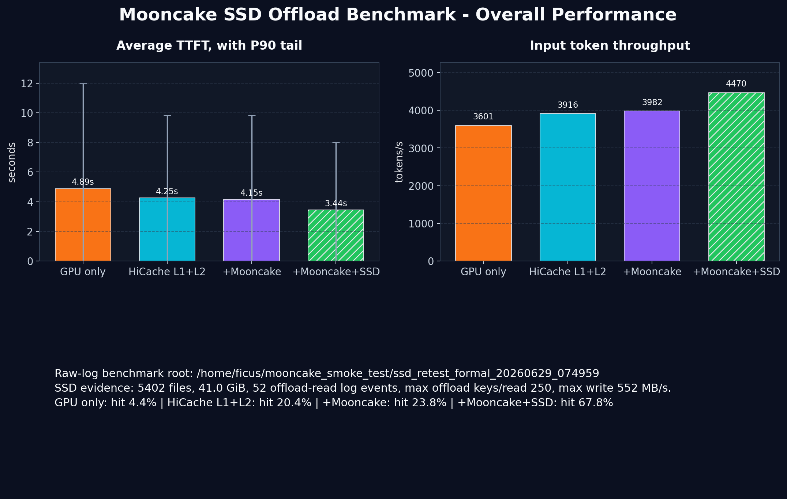
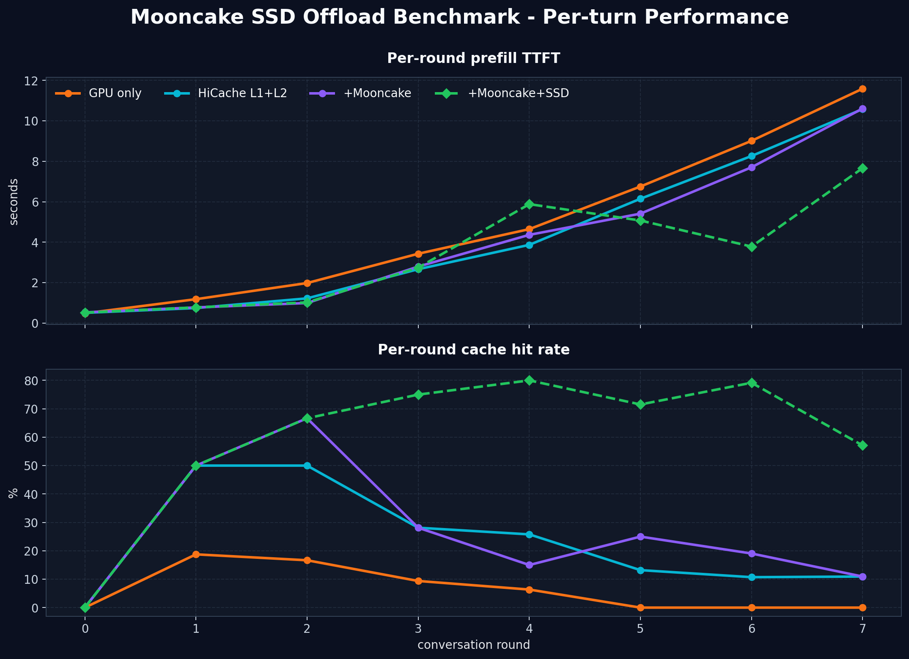
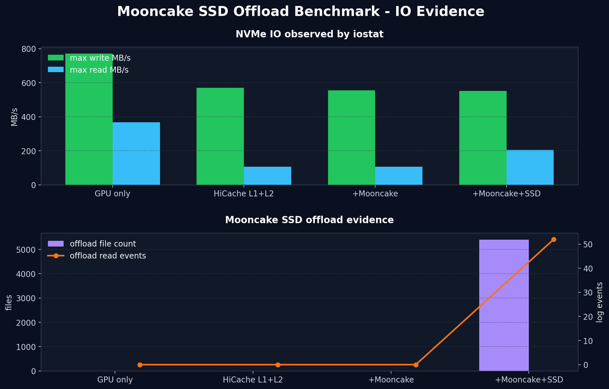

# Mooncake SSD Offload 复测与综合 I/O 分析

**日期:** 2026-06-29  
**正式 run:** `/home/ficus/mooncake_smoke_test/ssd_retest_formal_20260629_074959`  
**图表与派生数据:** `docs/assets/mooncake-ssd-offload-final-formal-20260629/`  
**测试脚本:** `scripts/run_mooncake_ssd_offload_retest.sh`  
**画图脚本:** `scripts/plot_mooncake_offload_review.py`  
**官方对照:** <https://kvcache-ai.github.io/Mooncake/performance/ssd-offload-benchmark-results.html>

## 一句话结论

这次复测已经真实触发 Mooncake SSD offload 路径，并画出了和官方页面同结构的本地图：整体性能、per-round TTFT/cache hit、NVMe I/O 证据。

但这不是完全等价官方环境的 benchmark。它是本地 RTX 5080 单卡、Qwen3-4B、TCP localhost、10GB Mooncake pool、8 clients、8 rounds 下的复测。`+Mooncake+SSD` 确实比 `+Mooncake` 有更高 cache hit、更低 TTFT、更高 input throughput，但存储层仍出现 `insufficient space` 和少量 `OBJECT_ALREADY_EXISTS`。

因此，本报告的严格结论是：

- 可以说：SSD offload path 已经被真实触发。
- 可以说：本地复测复现了官方图的核心结构和趋势。
- 可以说：本地 `+Mooncake+SSD` 在这次压力下优于 `+Mooncake`。
- 不能说：这是无异常的最终生产级吞吐数据。
- 不能说：本地百分比可以直接等同官方 DGX/A100/RDMA/RAID0 结果。
- 不能从这次 `iostat` 聚合数据推导 LBA 随机性。

## 这份报告解决什么问题

前一次主测报告的问题不是“图不好看”，而是证据链不成立。

旧报告把 `Mooncake+SSD` 放进了 SSD offload 对比，但原始日志显示 SSD path 没有启用。也就是说，旧图里名为 `Mooncake+SSD` 的曲线，本质上仍是没有 SSD offload 的 Mooncake 曲线。

这次复测要解决三个问题：

1. 先证明 SSD offload 是否真的被启用。
2. 再证明是否真的发生 SSD read/write。
3. 最后才讨论 TTFT、throughput、cache hit 的性能结果。

这个顺序很重要。没有前两步，第三步的性能图没有 SSD 归因价值。

## 证据分层

本报告把证据分成三层，避免把弱证据当强结论。

| 层级 | 证据 | 能证明什么 | 不能证明什么 |
|---|---|---|---|
| Benchmark 指标 | `bench.log`, `bench_stdout.log` | TTFT、throughput、cache hit | 不能证明 SSD 被触发 |
| Mooncake 日志 | `server.log`, `master.log` | root、enable、offload read、O_DIRECT、eviction | 不能完整给出 block LBA 分布 |
| 设备与目录证据 | `iostat.log`, `inventory.log` | NVMe 活动、offload 文件增长 | 单独不能证明 I/O 都来自 SSD offload |

最终判断必须组合三类证据。只看 `bench.log` 会重复旧报告的问题；只看 `iostat` 又会把模型加载、日志、系统背景 I/O 混进来。

## 旧主测报告的问题

旧报告位置：

```text
/home/ficus/llm/infer/ai_ssd_prestudy/docs/mooncake-ssd-offload-main-test-report-2026-06-26.md
```

旧报告的数据可以从原始 `bench.log` 复现，数字本身不是主要问题。主要问题是标题、配置命名和性能归因。

旧报告中 `Mooncake+SSD` 和 `Mooncake` 几乎完全一致：

| 配置 | avg TTFT | Input throughput | Cache hit |
|---|---:|---:|---:|
| +Mooncake | 4.550s | 3966 tok/s | 19.7% |
| +Mooncake+SSD | 4.546s | 3969 tok/s | 19.6% |

这种“几乎重合”本身已经提示 SSD 没有产生可观测作用。但更关键的是日志证据。

旧 run 的 `04_mooncake_ssd` activation 证据：

| 旧 run: `main_bench_20260626_123456/04_mooncake_ssd` | 计数 | 解释 |
|---|---:|---|
| `Storage root directory is:` | 0 | 没有成功设置 SSD root |
| `Storage root directory is not set` | 1 | 明确提示持久化目录缺失 |
| `IsEnableOffloading result: true` | 0 | file storage offload 没有启用 |
| `offload key count: [1-9]` | 0 | 没有读到 SSD/offload key |
| `read store: [1-9]` | 0 | 没有发生非零 storage read |
| `O_DIRECT mode enabled` | 0 | 没有打开 offload 文件的 direct I/O |

因此旧报告只能作为一次本地 GPU only / HiCache / Mooncake DRAM cache 对比，不能作为 SSD offload 性能报告。

## 旧报告为什么会得出错误归因

旧逻辑的问题可以拆成三点。

第一，配置名不等于执行路径。目录叫 `04_mooncake_ssd`，只说明测试脚本试图跑 SSD 配置，不说明 SGLang 内部 Mooncake client 真的开启了 SSD offload。

第二，benchmark 结果不携带 SSD 语义。`bench.log` 里的 TTFT、throughput、cache hit 是应用层结果，它不会告诉我们 cache hit 来自 GPU、host memory、Mooncake DRAM，还是 SSD。

第三，缺少 activation checks。旧报告没有用 `Storage root directory`、`IsEnableOffloading`、`offload key count`、`read store`、`O_DIRECT` 这些信号约束结论。

正确的逻辑应该是：

```text
配置已传入
  -> Mooncake 日志确认 SSD root 和 enable
  -> offload 目录出现文件增长
  -> 日志出现 offload read / read store
  -> 设备层出现相关 I/O
  -> 最后才解释 benchmark 性能差异
```

旧报告停在第一步和最后一步，中间证据缺失，所以结论不成立。

## 为什么之前没有触发 SSD 路径

从旧日志看，Mooncake 客户端没有拿到有效的 SSD offload root，也没有开启 file storage offload。

直接表现是：

- 没有 `Storage root directory is: /path`
- 出现 `Storage root directory is not set`
- 没有 `IsEnableOffloading result: true`
- 没有 offload 文件路径
- 没有 O_DIRECT 打开记录
- 没有 `read store > 0`
- `+Mooncake` 和 `+Mooncake+SSD` 的曲线几乎重合

这说明问题不是单纯“压力不够”。即使压力足够，如果运行时没有拿到 SSD root 或 offload enable，SSD 仍然不会参与。

重新测试时必须同时满足：

| 条件 | 本次做法 | 为什么需要 |
|---|---|---|
| Mooncake master 开启 offload | `mooncake_master -enable_offload=true -root_fs_dir=...` | master 需要知道可落盘的 root |
| SGLang Mooncake config 开启 SSD | `"enable_ssd_offload": true` | SGLang 内部 client 需要明确启用 SSD |
| 指定 SSD offload path | `"ssd_offload_path": "/mnt/ai_ssd0/..."` | 文件存储必须有落盘目录 |
| 传递环境变量 | `MOONCAKE_ENABLE_SSD_OFFLOAD=true` 等 | 防止内置 client 没继承 JSON 或默认值 |
| 清空 offload 目录 | 每个配置前 `rm -rf "$OFFLOAD_DIR"/*` | 避免把上一轮文件误算到下一配置 |
| 采集多源日志 | server/master/iostat/inventory | 能同时证明启用、读写和设备活动 |

## 正式复测配置

正式 run 配置来自：

```text
/home/ficus/mooncake_smoke_test/ssd_retest_formal_20260629_074959/config.env
```

完整配置如下：

| 项 | 值 | 解释 |
|---|---|---|
| `MODEL_PATH` | `/home/ficus/llm/models/Qwen/Qwen3-4B-Instruct-2507` | 本地模型路径 |
| `BENCH_SCRIPT` | `/home/ficus/llm/infer/ai_ssd_prestudy/sglang_repo/benchmark/hicache/bench_multiturn.py` | 使用 SGLang HiCache 多轮 benchmark |
| `PORT` | `8189` | SGLang HTTP 服务端口 |
| `MASTER_ADDR` | `127.0.0.1:50051` | Mooncake master 地址 |
| `OFFLOAD_DIR` | `/mnt/ai_ssd0/mooncake_ssd0/file_storage` | SSD offload 文件目录 |
| `NUM_CLIENTS` | `8` | 并发 client 数 |
| `NUM_ROUNDS` | `8` | 每个 client 的多轮对话轮数 |
| `REQUEST_LENGTH` | `3072` | 每轮新增输入长度 |
| `OUTPUT_LENGTH` | `1` | 固定 1 token，弱化 decode 干扰 |
| `MAX_PARALLEL` | `2` | benchmark 侧最大并行 |
| `REQUEST_RATE` | `8` | 请求注入速率 |
| `MOONCAKE_SEGMENT_SIZE` | `10GB` | Mooncake memory pool 大小 |
| `MOONCAKE_SEGMENT_BYTES` | `10737418240` | 同上，字节形式 |
| `OFFLOAD_BUFFER_BYTES` | `2147483648` | SSD offload local buffer，2 GiB |
| `RUN_CONFIGS` | `gpu_only,hicache_l1_l2,mooncake_only,mooncake_ssd` | 四种对比配置 |

### 为什么 request length 改成 3072

早期 4096-token 压力 run 出现了 `Input length` 错误，说明请求长度已经碰到模型或服务端可接受范围的边界。那组数据不能作为 clean 性能结论。

正式 run 使用 3072 input tokens，是为了同时满足两个目标：

- 压力足够大，能触发 Mooncake eviction 和 SSD offload。
- 不再触发 `Input length` 错误。

正式 run 结果显示四个配置的 `Input length` 错误均为 0，这比早期 4096-token run 更适合做性能对比。

### 为什么 output length 固定为 1

官方 benchmark 也固定 output length 为 1。原因是本测试关注 prefill 阶段的 KV cache 命中和复用。

如果 output 很长，decode 阶段会占用更多时间，TTFT 和端到端 latency 会混入更多 decode 调度因素。固定 1 token 可以让 TTFT 更集中反映 prefill 与 cache reuse。

### 为什么是 8 clients、8 rounds

官方是 20 clients、10 rounds、DGX A100 环境。本地是单卡 RTX 5080，无法直接使用官方压力。

8 clients、8 rounds 是一个折中：

- 能让多轮上下文逐步累积。
- 能触发 Mooncake memory pressure 和 eviction。
- 不至于像 4096-token run 那样触发请求长度错误。
- TTFT 虽然后几轮仍升高，但整体 benchmark 能完成。

## 四种配置分别代表什么

本次比较四种缓存层级。

| 配置 | 含义 | 预期行为 |
|---|---|---|
| GPU only | KV cache 主要在 GPU 内存中 | 长上下文、多轮后命中率低，TTFT 上升 |
| HiCache L1+L2 | GPU + host memory 层级缓存 | 前几轮可提高 cache hit |
| +Mooncake | HiCache 后接 Mooncake memory pool | 额外使用 Mooncake DRAM 扩展缓存 |
| +Mooncake+SSD | Mooncake memory pool 再接 SSD offload | memory pool 压力后，evicted KV 可落到 SSD 并读回 |

SSD offload 的价值不是 round 0 冷启动。它的价值出现在缓存容量不够时：原本会被丢弃的 KV cache，可以写到 SSD，后续命中时从 SSD 读回，避免完全重算。

## 本次 SSD 配置细节

正式 `mooncake_ssd/mooncake_config.json`：

```json
{
  "local_hostname": "localhost",
  "metadata_server": "P2PHANDSHAKE",
  "global_segment_size": "10GB",
  "protocol": "tcp",
  "device_name": "",
  "master_server_address": "127.0.0.1:50051",
  "master_metrics_port": 9004,
  "check_server": false,
  "standalone_storage": false,
  "enable_ssd_offload": true,
  "ssd_offload_path": "/mnt/ai_ssd0/mooncake_ssd0/file_storage"
}
```

关键字段解释：

| 字段 | 作用 |
|---|---|
| `global_segment_size` | Mooncake memory pool 的容量，本次 10GB |
| `protocol` | 本地使用 TCP，官方使用 RDMA |
| `master_server_address` | SGLang/Mooncake client 连接 master 的地址 |
| `standalone_storage` | 本次不使用 standalone storage |
| `enable_ssd_offload` | SSD offload 的核心开关 |
| `ssd_offload_path` | SSD offload 文件写入目录 |

另外，测试脚本还在 `mooncake_ssd` 配置下设置：

```bash
MOONCAKE_ENABLE_SSD_OFFLOAD=true
MOONCAKE_OFFLOAD_FILE_STORAGE_PATH=/mnt/ai_ssd0/mooncake_ssd0/file_storage
MOONCAKE_OFFLOAD_FSDIR=/mnt/ai_ssd0/mooncake_ssd0/file_storage
MOONCAKE_OFFLOAD_LOCAL_BUFFER_SIZE_BYTES=2147483648
MOONCAKE_OFFLOAD_USE_URING=1
SGLANG_HICACHE_MOONCAKE_CONFIG_PATH=$mooncake_config_path
```

这里有冗余设置，是故意的。旧 run 的问题就是配置没有完整传入运行时，所以本次同时使用 JSON 和环境变量，优先保证 activation 可被日志证明。

## 执行方式与环境

用户要求使用 `storage` 的 uv 环境。图表和派生数据生成使用：

```bash
uv run python scripts/plot_mooncake_offload_review.py \
  --bench-root /home/ficus/mooncake_smoke_test/ssd_retest_formal_20260629_074959 \
  --out-dir docs/assets/mooncake-ssd-offload-final-formal-20260629
```

服务端 benchmark 脚本 `scripts/run_mooncake_ssd_offload_retest.sh` 内部会激活：

```bash
source /home/ficus/llm/.venv/bin/activate
```

这是因为 SGLang、Mooncake、模型服务运行依赖在 `/home/ficus/llm/.venv` 里。`storage` 的 uv 环境用于报告解析和画图，服务端仍使用 LLM/SGLang 的运行环境。

## 原始产物目录结构

正式 run 每个配置都有独立目录：

```text
/home/ficus/mooncake_smoke_test/ssd_retest_formal_20260629_074959/
  config.env
  gpu_only/
  hicache_l1_l2/
  mooncake_only/
  mooncake_ssd/
```

每个配置目录中主要文件：

| 文件 | 内容 | 用途 |
|---|---|---|
| `bench.log` | benchmark JSON | 解析 overall/per-round 性能 |
| `bench_stdout.log` | benchmark stdout | JSON 失败时可 fallback |
| `server.log` | SGLang server 和 Mooncake client 日志 | activation、offload read、O_DIRECT |
| `master.log` | Mooncake master 日志 | eviction、master 状态 |
| `iostat.log` | NVMe 设备级 I/O | read/write MB/s 辅助证据 |
| `dmon.log` | GPU 监控 | 辅助判断 GPU 状态 |
| `inventory.log` | offload 目录文件数和容量 | 证明落盘文件增长 |
| `activation_checks.log` | grep 摘录 | 人读方便，不作为唯一数据源 |

注意：`activation_checks.log` 是从 raw log 摘出来的摘要。如果同时 grep `*.log`，它会把 raw log 中的事件再重复计算一遍。因此画图脚本只从 `server.log`、`master.log`、`bench.log`、`bench_stdout.log` 计数关键事件。

## SSD 路径已触发的证据

正式 run 的 `mooncake_ssd` 原始日志和 inventory 显示：

| 证据 | 值 | 说明 |
|---|---:|---|
| `Storage root directory is:` | 1 | Mooncake client 拿到了 SSD root |
| `IsEnableOffloading result: true` | 1 | file storage offload 返回 enabled |
| `offload key count: [1-9]` | 52 | batch_get 中有 key 来自 offload 层 |
| `read store: [1-9]` | 52 | 发生非零 storage read 时间 |
| `O_DIRECT mode enabled` | 1341 | offload 文件以 direct I/O 方式打开 |
| offload 文件数 | 5402 | SSD offload 目录出现大量文件 |
| offload 目录容量 | 41 GiB | 确实写入了大量数据 |
| max offload keys/read | 250 | 单次 batch_get 最多涉及 250 个 offload keys |
| iostat max write | 551.71 MB/s | 运行期间观察到 NVMe 写峰值 |
| iostat max read | 205.69 MB/s | 运行期间观察到 NVMe 读峰值 |

这些信号连起来说明：

```text
SSD root 设置成功
  -> offload 功能启用
  -> 写出了 offload 文件
  -> 后续 batch_get 读到了 offload key
  -> read store 出现非零耗时
  -> O_DIRECT 文件 I/O 大量出现
```

这已经足够证明 SSD offload path 被真实触发。

## 每个 activation 信号是什么意思

### `Storage root directory is:`

这个日志表示 Mooncake file storage 知道要把 offload 文件放到哪里。如果没有这个 root，后续持久化无法发生。

旧 run 中没有该日志，反而有 `Storage root directory is not set`。这是旧报告不能成立的最直接证据。

### `IsEnableOffloading result: true`

这个日志表示运行时判断 offloading 已启用。它比“配置文件里写了 enable”更强，因为它来自运行时实际状态。

如果配置文件写了 `enable_ssd_offload: true`，但日志没有该信号，就不能确认运行时真的启用了 SSD offload。

### `offload key count: [1-9]`

这是 read path 的核心证据。它说明一次 `batch_get_into` 中有一部分 key 不在内存里，而是在 offload 层。

值为 0 时，不能证明读了 SSD。值大于 0 时，说明请求确实触达了 offload key。

### `read store: [1-9]`

这是 storage read 耗时。非零 `read store` 表示读 storage 花了时间。

它和 `offload key count > 0` 配合使用，能证明不是只打开了 SSD 功能，而是真的走到了读 storage 路径。

### `O_DIRECT mode enabled`

该日志来自 offload 文件打开路径，表示使用 direct I/O 打开 bucket 文件。

它证明 Mooncake file storage 正在以文件 I/O 方式访问 offload 目录。它不能单独说明读还是写，但和 offload 文件增长、read store 一起构成完整证据。

### offload 文件数和容量

`inventory.log` 显示 `mooncake_ssd` 结束后 offload 目录中有 5402 个文件，占用 41 GiB。

这证明写路径发生了。旧 run 没有这类文件增长证据。

### iostat read/write

`iostat` 是设备级观察。它能证明运行期间 NVMe 有活动，但不能单独证明这些 I/O 都来自 Mooncake SSD offload。

因此本报告把 `iostat` 放在辅助证据层，而不是 activation 的唯一依据。

## 性能结果

派生数据来自：

```text
docs/assets/mooncake-ssd-offload-final-formal-20260629/summary.csv
```

总体结果：

| 配置 | Avg TTFT | P90 TTFT | P99 TTFT | Input throughput | Cache hit |
|---|---:|---:|---:|---:|---:|
| GPU only | 4.887s | 11.967s | 12.462s | 3600.5 tok/s | 4.35% |
| HiCache L1+L2 | 4.253s | 9.838s | 12.662s | 3915.9 tok/s | 20.36% |
| +Mooncake | 4.151s | 9.836s | 12.707s | 3981.8 tok/s | 23.84% |
| +Mooncake+SSD | 3.436s | 8.007s | 9.181s | 4469.9 tok/s | 67.76% |

相对提升：

| 对比 | Avg TTFT | Input throughput |
|---|---:|---:|
| `+Mooncake+SSD` vs GPU only | 降低 29.7% | 提升 24.1% |
| `+Mooncake+SSD` vs `+Mooncake` | 降低 17.2% | 提升 12.3% |



## 每个性能指标是什么意思

### Avg TTFT

TTFT 是 Time To First Token。这里主要反映 prefill 阶段完成到首 token 返回的时间。

Avg TTFT 是所有请求的平均值。它容易受后几轮长上下文和排队影响，但适合看整体趋势。

### P90 / P99 TTFT

P90 和 P99 是尾延迟指标。P90 表示 90% 请求的 TTFT 不超过该值；P99 表示 99% 请求不超过该值。

在多轮长上下文测试中，尾延迟很重要，因为后几轮请求通常更长，也更容易排队。

### Input token throughput

Input throughput 是输入 token 的处理吞吐。由于 output length 固定为 1，它主要反映 prefill 侧效率。

SSD offload 提高 cache hit 后，可以减少重复 prefill 计算，所以 input throughput 可能上升。

### Cache hit

Cache hit 是 benchmark 报告的缓存命中率。它表示有多少输入上下文可以复用已有 KV cache。

需要注意：`bench.log` 的 cache hit 本身不告诉我们命中来自哪一层。因此必须结合 Mooncake 日志判断是否涉及 SSD offload。

## Per-round 形态

派生数据来自：

```text
docs/assets/mooncake-ssd-offload-final-formal-20260629/per_round.csv
```

每轮结果：

| Config | R0 | R1 | R2 | R3 | R4 | R5 | R6 | R7 |
|---|---:|---:|---:|---:|---:|---:|---:|---:|
| GPU only cache hit | 0.00% | 18.75% | 16.66% | 9.37% | 6.35% | 0.00% | 0.00% | 0.00% |
| HiCache L1+L2 cache hit | 0.00% | 49.99% | 49.99% | 28.12% | 25.77% | 13.19% | 10.71% | 10.93% |
| +Mooncake cache hit | 0.00% | 49.99% | 66.65% | 28.12% | 15.00% | 24.99% | 19.04% | 10.93% |
| +Mooncake+SSD cache hit | 0.00% | 49.99% | 66.65% | 74.98% | 79.98% | 71.51% | 79.14% | 57.08% |

`+Mooncake+SSD` 的 per-round TTFT：

| Round | Cache hit | Avg TTFT |
|---:|---:|---:|
| 0 | 0.00% | 0.522s |
| 1 | 49.99% | 0.781s |
| 2 | 66.65% | 1.026s |
| 3 | 74.98% | 2.743s |
| 4 | 79.98% | 5.884s |
| 5 | 71.51% | 5.076s |
| 6 | 79.14% | 3.787s |
| 7 | 57.08% | 7.667s |



## 如何解读 per-round 曲线

Round 0 是冷启动，所有配置 cache hit 都是 0。这是预期行为，因为没有前文 KV cache 可复用。

Round 1 和 Round 2 中，HiCache、Mooncake、Mooncake+SSD 都开始出现较高 cache hit。此时 SSD 的优势还不一定明显，因为 Mooncake memory pool 仍能容纳较多缓存。

Round 3 之后，`+Mooncake+SSD` 和 `+Mooncake` 开始明显分化。`+Mooncake+SSD` 维持更高 hit rate，而 `+Mooncake` 的 hit rate 明显下滑。

这和官方页面的核心机制一致：当 DRAM pool 压力上来后，普通 Mooncake 需要 evict；SSD offload 则可以把被 evict 的 KV cache 保留下来。

但本地曲线不是官方曲线的等比例缩小。原因是本地硬件、模型、并发、transport、pool size 和 storage warning 都不同。

## I/O 证据



I/O 派生数据：

| 配置 | offload files | offload GiB | offload read events | read store events | O_DIRECT events | max write MB/s | max read MB/s |
|---|---:|---:|---:|---:|---:|---:|---:|
| GPU only | 0 | 0.0 | 0 | 0 | 0 | 770.82 | 367.29 |
| HiCache L1+L2 | 0 | 0.0 | 0 | 0 | 0 | 570.07 | 107.23 |
| +Mooncake | 0 | 0.0 | 0 | 0 | 0 | 554.86 | 106.73 |
| +Mooncake+SSD | 5402 | 41.0 | 52 | 52 | 1341 | 551.71 | 205.69 |

这里最容易误解的是 `iostat`。

GPU only 也有较高 max write/read MB/s，这并不表示 GPU only 走了 SSD offload。它只是说明 NVMe 设备有 I/O，可能来自模型加载、日志、系统背景、文件系统等。

判断 SSD offload 的关键不是 `iostat` 单项，而是：

```text
offload files > 0
AND offload GiB > 0
AND O_DIRECT events > 0
AND offload read events > 0
AND read store events > 0
AND storage root / enable 日志存在
```

只有 `mooncake_ssd` 同时满足这些条件。

## 读 I/O 和写 I/O 分别怎么证明

### 写 I/O 证据

写路径的主要证据是：

- offload 目录出现 5402 个文件。
- offload 目录容量达到 41 GiB。
- `O_DIRECT mode enabled` 大量出现。
- `iostat` 观察到写带宽。
- `Write page to storage` 相关日志出现。

其中最强的是 offload 目录容量增长，因为它直接证明有数据落盘。

### 读 I/O 证据

读路径的主要证据是：

- `offload key count: [1-9]` 出现 52 次。
- `read store: [1-9]` 出现 52 次。
- 单次 batch_get 的 max offload keys/read 达到 250。
- `iostat` 观察到读带宽。

其中最强的是 `offload key count > 0` 和 `read store > 0` 同时出现，因为它说明读请求确实触达了 offload 层，并产生 storage read 耗时。

## 异常与限制

正式 run 比 4096-token 的早期 run 干净很多。

四个配置均为：

| 错误 | 计数 |
|---|---:|
| `Input length` | 0 |
| `BUFFER_OVERFLOW` | 0 |
| `INVALID_KEY` | 0 |

这说明正式 run 没有再触发请求长度错误，也没有出现 buffer overflow 或 invalid key。

但 `mooncake_ssd` 仍有存储层 warning/error：

| 事件 | 计数 | 解释 |
|---|---:|---|
| `OBJECT_ALREADY_EXISTS` | 3 | 写入时遇到重复对象 key |
| `insufficient space` | 86 | Mooncake storage layer 报空间不足 |
| `Write page to storage` | 43 | 写 page 到 storage 相关失败/警告上下文 |
| `EVICT-TRIGGER` | 10475 | master 触发 eviction |
| `EVICT-DONE` | 10475 | eviction 完成 |

这些 warning/error 不会推翻“SSD path 已触发”的结论，但会限制性能结论的强度。

更严谨的说法是：

```text
SSD offload 功能已触发；
本地压力下曲线显示收益；
但 storage layer 仍存在压力相关异常；
所以这不是 clean production benchmark。
```

## 为什么有 `insufficient space` 还说 SSD path 成功

这是两个不同问题。

`Storage root directory is`、`IsEnableOffloading result: true`、`offload key count > 0`、`read store > 0`、O_DIRECT、offload 文件增长，证明路径被触发。

`insufficient space` 说明路径触发后，Mooncake storage layer 在压力下出现容量或分配相关 warning/error。

前者回答“有没有走 SSD”，后者回答“走 SSD 时是否健康”。本次答案是：

- 有没有走 SSD：有。
- 是否完全健康：否。

## 和官方 benchmark 的差异

官方页面的环境和参数大致是：

| 项 | 官方 | 本地复测 |
|---|---|---|
| GPU | 8 x A100-SXM4-40GB | RTX 5080 16GB 单卡 |
| 模型 | Qwen3-8B | Qwen3-4B-Instruct-2507 |
| Clients | 20 | 8 |
| Rounds | 10 | 8 |
| Request length | 4096 | 3072 |
| Output length | 1 | 1 |
| Request rate | 16 | 8 |
| Max parallel | 4 | 2 |
| Mooncake pool | 80GB | 10GB |
| SSD buffer | 20GB | 2GB |
| Network | RDMA | TCP localhost |
| SSD | 5 x Samsung NVMe RAID0 | `/mnt/ai_ssd0` 本地 offload 目录 |
| 理论 SSD 顺序读 | 约 27 GB/s | 未按同方式标定 |

因此，官方的百分比不能直接迁移到本地。

官方图里最重要的现象是：前几轮 `+Mooncake` 和 `+Mooncake+SSD` 接近，memory pool 不够后，`+Mooncake` hit rate 出现 cliff，而 `+Mooncake+SSD` 继续保持较高 hit rate。

本地复测也出现了 `+Mooncake+SSD` 相比 `+Mooncake` 的明显优势，但曲线受单卡调度、TCP、较小 pool、storage warning 影响更大。

## 和上次测试的本质区别

| 维度 | 上次主测 | 本次复测 |
|---|---|---|
| SSD root | 未成功设置 | 已设置 |
| SSD enable | 未证明 | `IsEnableOffloading result: true` |
| SSD write | 无 offload 文件证据 | 5402 文件，41 GiB |
| SSD read | `offload key count` 为 0 | 52 次 offload read |
| O_DIRECT | 0 | 1341 |
| 请求错误 | 未作为核心门禁 | `Input length` 明确为 0 |
| 目录污染 | 有潜在遗留风险 | 每个配置前清空 offload 目录 |
| I/O 监控 | 缺少系统化证据 | iostat + inventory + logs |
| 结论 | 错把未触发 SSD 的 run 当 SSD 报告 | 先证明路径，再解释性能 |

这不是“同一批数据换个解释”，而是测试链路、证据采集和结论门禁都变了。

## 和 LBA 分析的关系

本报告不是 LBA 随机性报告。

这次复测没有采集 `block:block_rq_issue` per-I/O trace，因此不能从这份报告推导真实 LBA delta、顺序比例、随机读跨度。

如果要分析真实 LBA 规律，应使用 block trace 报告：

```text
docs/kv-cache-nvme-offload-real-io-analysis-2026-06-29.md
```

那份报告的数据来自 Linux block 层 per-I/O event stream，字段包含：

```text
timestamp_ns,dev,sector,bytes,rwbs,comm,pid
```

其中 `LBA = sector * 512`。这类数据才适合分析真实 LBA spatial pattern。

本报告里的 `iostat` 只能说明设备级 read/write 带宽峰值，不能提供 LBA 序列。

## 图表说明

本次生成三张图。

第一张 `01_overall_performance_local.png` 展示总体性能。左侧是 Avg TTFT，并用 P90 做尾延迟参考；右侧是 input token throughput；底部列出 cache hit 和 SSD 证据摘要。

第二张 `02_per_round_performance_local.png` 展示每轮 TTFT 和 cache hit。它用于观察多轮上下文累积后，不同缓存层级是否出现分化。

第三张 `03_io_evidence_local.png` 展示 NVMe I/O 和 Mooncake offload 证据。它不是单纯设备性能图，而是用来回答“SSD 路径有没有参与”。

生成命令：

```bash
uv run python scripts/plot_mooncake_offload_review.py \
  --bench-root /home/ficus/mooncake_smoke_test/ssd_retest_formal_20260629_074959 \
  --out-dir docs/assets/mooncake-ssd-offload-final-formal-20260629
```

## 派生 CSV 字段说明

`summary.csv` 中关键字段含义：

| 字段 | 含义 |
|---|---|
| `avg_ttft_s` | 所有请求平均 TTFT |
| `p90_ttft_s` | TTFT 90 分位 |
| `p99_ttft_s` | TTFT 99 分位 |
| `input_token_throughput_tok_s` | 输入 token 吞吐 |
| `cache_hit_rate_pct` | benchmark 报告的总体 cache hit |
| `offload_file_count` | offload 目录文件数 |
| `offload_du_gb` | offload 目录容量 |
| `offload_read_events` | `offload key count > 0` 事件数 |
| `read_store_events` | `read store > 0` 事件数 |
| `max_offload_key_count` | 单次 batch_get 最大 offload key 数 |
| `storage_root_set_count` | SSD root 设置日志计数 |
| `ssd_enabled_count` | offloading enabled 日志计数 |
| `o_direct_events` | O_DIRECT 文件打开事件数 |
| `evict_trigger_events` | eviction 触发次数 |
| `max_write_mb_s` | iostat 观察到的最大写 MB/s |
| `max_read_mb_s` | iostat 观察到的最大读 MB/s |
| `input_length_errors` | 请求长度错误 |
| `buffer_overflow_errors` | buffer overflow 错误 |
| `invalid_key_errors` | invalid key 错误 |
| `duplicate_key_errors` | duplicate/object exists 错误 |
| `insufficient_space_errors` | insufficient space 错误 |
| `write_page_failures` | 写 page 到 storage 相关失败/警告 |

`per_round.csv` 中字段含义：

| 字段 | 含义 |
|---|---|
| `config` | 配置名 |
| `round` | 多轮对话轮次 |
| `avg_ttft_s` | 该轮平均 TTFT |
| `cache_hit_rate_pct` | 该轮 cache hit |
| `request_count` | 该轮请求数，本次每轮 8 |

## 可复现实验命令

正式 run 已完成。若要重新跑同类实验，可以用：

```bash
OUT_ROOT=/home/ficus/mooncake_smoke_test/ssd_retest_formal_$(date +%Y%m%d_%H%M%S) \
NUM_CLIENTS=8 \
NUM_ROUNDS=8 \
REQUEST_LENGTH=3072 \
OUTPUT_LENGTH=1 \
MAX_PARALLEL=2 \
REQUEST_RATE=8 \
MOONCAKE_SEGMENT_SIZE=10GB \
MOONCAKE_SEGMENT_BYTES=10737418240 \
OFFLOAD_BUFFER_BYTES=2147483648 \
RUN_CONFIGS=gpu_only,hicache_l1_l2,mooncake_only,mooncake_ssd \
bash scripts/run_mooncake_ssd_offload_retest.sh
```

跑完后重新画图：

```bash
uv run python scripts/plot_mooncake_offload_review.py \
  --bench-root /path/to/new/run \
  --out-dir docs/assets/mooncake-ssd-offload-new-run
```

## 如何判断下一次 run 是否有效

下一次 run 至少要满足这些门禁：

| 门禁 | 合格条件 |
|---|---|
| benchmark 完成 | 四个配置都有 `bench.log` |
| 请求合法 | `Input length` 为 0 |
| SSD root | `mooncake_ssd` 有 `Storage root directory is:` |
| SSD enable | `mooncake_ssd` 有 `IsEnableOffloading result: true` |
| SSD write | `offload_file_count > 0` 且 `offload_du_gb > 0` |
| SSD read | `offload_read_events > 0` 且 `read_store_events > 0` |
| direct I/O | `o_direct_events > 0` |
| 非 SSD 配置不污染 | GPU/HiCache/Mooncake-only 的 offload files 为 0 |
| 异常可控 | `insufficient_space`、duplicate-key 不应大量出现 |

如果这些门禁不满足，就不能写成 SSD offload 性能结论。

## 对当前结果的最终判断

当前复测达成了两个目标。

第一，纠正旧报告错误。旧报告的 `Mooncake+SSD` 没有 SSD path 证据，不再作为 SSD 性能结论使用。

第二，产出新的本地图。当前三张图可以对标官方页面的图表结构，并且有 SSD root、enable、offload read、O_DIRECT、目录增长、iostat 的组合证据。

当前结果仍有一个限制：`mooncake_ssd` 存在 storage warning/error。因此它适合用于“路径验证 + 本地趋势复现 + 报告图表”，还不适合作为最终生产级 benchmark。

## 下一步建议

要把这份结果升级为更硬的 benchmark，需要三步。

1. 每个配置重复至少 3 次，报告均值、方差和误差条。
2. 调整 Mooncake/offload buffer/pool 参数，先消除或显著降低 `insufficient space` 和 duplicate-key。
3. 对 `mooncake_ssd` 增加 `block:block_rq_issue` per-I/O trace，单独分析真实读写 LBA 分布。

如果目标是和官方图尽量接近，还需要继续拉近环境：

- 增加 clients 和 rounds。
- 使用更接近官方的 request length 4096，但必须确认不再触发 `Input length`。
- 使用更大的 Mooncake memory pool 和 SSD buffer。
- 尽量使用更接近官方的高速 NVMe/RAID 或明确记录本地 SSD 差异。
- 如果条件允许，使用 RDMA 而不是 TCP localhost。
