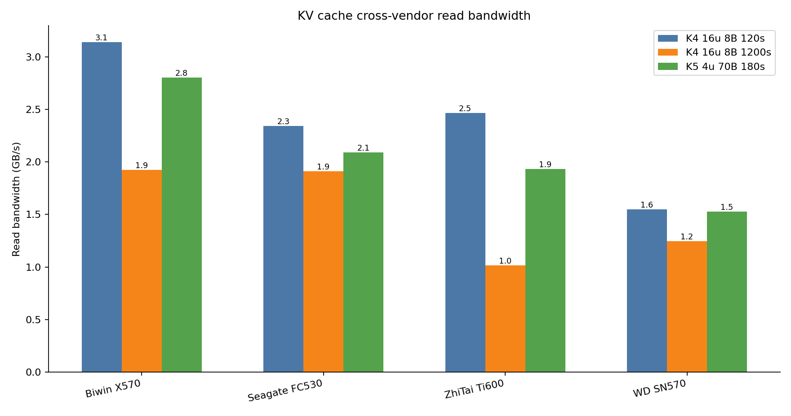
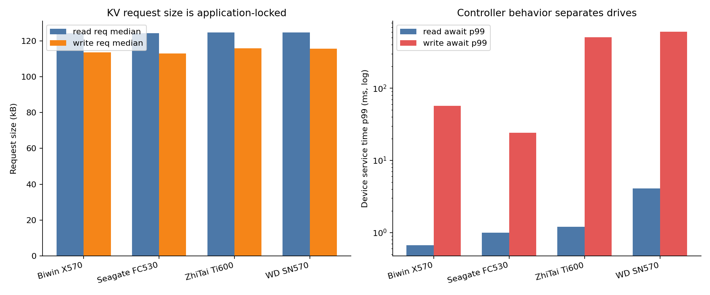
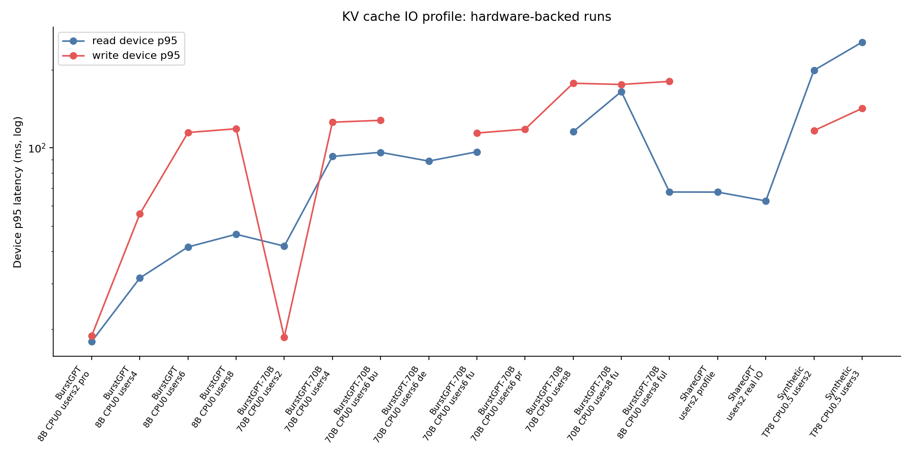
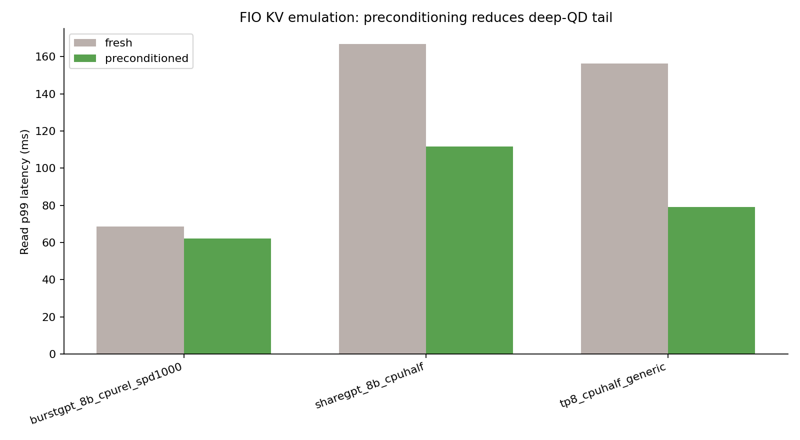

# 测试历史总表与 IO 重新分析

**生成日期:** 2026-06-24

## 产物

- 总表 CSV: `results/history-summary/test_history_master.csv`
- IO 明细 CSV: `results/history-summary/io_analysis_summary.csv`
- KV profile 去重 CSV: `results/history-summary/io_profile_runs.csv`
- Excel 工作簿: `results/history-summary/test_history_master.xlsx`

## 总览

- 总表共收录 **192** 行历史结果，覆盖 KV cache、FIO KV 仿真、SSD 跨盘表征、checkpoint、训练/object-store Markdown 报告摘要。
- 结构化 KV cache 结果 **101** 行；FIO KV 仿真 **21** 行；SSD 表征 **36** 行。
- K4 16-user 1200s 长稳态中，按 KV summary 的应用层 storage read bandwidth 最高的是 **Biwin X570**（1.92262 GB/s）。
- 设备侧写入 p99 最好的是 **Seagate FC530**（w_await p99=24.1 ms）。

## 重画图

## IO 重新总结

KV cache offload 的块设备行为不是顺序流式读写，而是 **约 115-125 kB 的稀疏大块随机 IO**。判断依据是 `%rrqm` 中位数为 0，读请求大小在四块盘上几乎一致，说明请求形状由 KV entry 大小决定，而不是由 SSD 决定。

真正拉开差距的是设备如何处理随机写和深队列：Seagate FC530 的写 p99 明显低，队列深度也更浅；Biwin X570 峰值读带宽强，但 GC cliff 来得早；ZhiTai Ti600 和 WD SN570 在长稳态中队列堆积和写尾延迟更明显。

下面的 `*_mb_s` 来自 `iostat -dx -m`，单位是 MB/s；KV summary 表中的 `read_bw_gbps/write_bw_gbps` 来自 benchmark summary，口径是应用层 storage bandwidth。

### K4 GC-drift IO 指标

| disk | cliff_min | read_req_median_kb | write_req_median_kb | rrqm_median_pct | r_await_p99_ms | w_await_p99_ms | aqu_p99 |
| --- | --- | --- | --- | --- | --- | --- | --- |
| Biwin X570 | 2.91667 | 124.4 | 113.68 | 0 | 0.67 | 57.23 | 107.98 |
| Seagate FC530 | 8.05 | 124.41 | 113.05 | 0 | 1 | 24.1 | 58.03 |
| ZhiTai Ti600 | 5.61667 | 124.69 | 115.94 | 0 | 1.2 | 511.24 | 328.03 |
| WD SN570 | 7.81667 | 124.82 | 115.67 | 0 | 4.09 | 604.8 | 286.92 |

### 代表性 KV cache 长稳态

| vendor | scenario | model | users | duration_s | read_bw_gbps | write_bw_gbps | read_dev_p99_ms | write_dev_p99_ms | status |
| --- | --- | --- | --- | --- | --- | --- | --- | --- | --- |
| Biwin X570 | K4-GC-DRIFT | llama3.1-8b | 16 | 1205 | 1.92262 | 0.171115 | 132.754 | 155.673 | PASS |
| Seagate FC530 | K4-GC-DRIFT | llama3.1-8b | 16 | 1204 | 1.91243 | 0.169824 | 185.164 | 111.421 | PASS |
| WD SN570 | K4-GC-DRIFT | llama3.1-8b | 16 | 1209 | 1.24749 | 0.123422 | 406.978 | 451.711 | FAIL |
| ZhiTai Ti600 | K4-GC-DRIFT | llama3.1-8b | 16 | 1206 | 1.01469 | 0.0988969 | 242.843 | 697.98 | PASS |

### FIO QD=1024 preconditioning 对比

| family | scenario | read_mix_pct | read_bw_gbps | write_bw_gbps | read_dev_p99_ms | write_dev_p99_ms |
| --- | --- | --- | --- | --- | --- | --- |
| fresh | sharegpt_8b_cpuhalf | 61 | 0.994727 | 0.770215 | 166.724 | 379.585 |
| fresh | burstgpt_8b_cpurel_spd1000 | 91 | 2.39336 | 0.24043 | 68.6817 | 476.054 |
| fresh | tp8_cpuhalf_generic | 73 | 1.55947 | 0.579688 | 156.238 | 480.248 |
| preconditioned | sharegpt_8b_cpuhalf | 61 | 1.14404 | 0.887793 | 111.673 | 221.25 |
| preconditioned | burstgpt_8b_cpurel_spd1000 | 91 | 2.48691 | 0.248145 | 62.1281 | 337.641 |
| preconditioned | tp8_cpuhalf_generic | 73 | 1.74668 | 0.646875 | 79.1675 | 196.084 |

## 结合真实 LMCache / SGLang HiCache 预研的补充结论

参考 `/home/ficus/llm/infer/ai_ssd_prestudy` 中的 `AI_SSD_BOSS_REPORT.md`、`REPORT.md`、`REPORT_LMCACHE.md`、`reports/ai-ssd-real-offloading-investigation-report-2026-06-17.md` 和 `docs/p5-hicache-write-policy.md`，这里的 KV cache 模拟测试应被定位为 **storage microbenchmark / trace replay**，而不是完整替代真实 LMCache 或 SGLang HiCache 端到端测试。

### 1. 模拟测试回答的是“盘能不能扛住 KV-like IO”

本仓库的 `kv-cache.py` / FIO / iostat 数据把复杂 serving 系统拆开，重点压测 SSD 面对 KV-cache-like large-block random IO 时的能力：读写带宽、p95/p99、队列深度、GC cliff、preconditioning 效果。它适合做盘型筛选和控制器行为分析。

但真实 LMCache / HiCache 端到端还包含 prefix lookup、GPU/CPU/L3 分层命中、prefetch、write-through/write-back、eviction、文件系统、page cache、pin_memory L2、推理 scheduler 等因素。真实用户感知的 TTFT/ITL 不等于裸盘 IO 数字。

### 2. LMCache 证明“缓存机制有价值”，但不直接给盘型排名

`REPORT_LMCACHE.md` 中 7000-token prompt 的早期 LMCache 测试显示：cold TTFT 约 0.779s，warm TTFT 约 0.034-0.035s，加速约 22-23x；单请求约 0.95GB KV chunk 落盘。这说明 KV cache offload / external prefix cache 方向成立。

同时该报告也说明：LMCache 默认有 local CPU tier，warm 请求可能优先命中 CPU L1，而不是每次都从 SSD reload。因此 LMCache 单 prompt cold/warm 测试更适合证明缓存机制收益，不适合直接作为 AI SSD 盘型排名。要比较盘，必须强制 L2 miss / cold-from-device，并用 iostat/bpftrace 验证目标盘真有读写。

### 3. HiCache 证明“盘差只在 L3 reload 暴露”

`REPORT.md` 和 Boss 报告的核心结论是：常规 cold/warm 或 L2 host DRAM 命中时，4 盘 TTFT spread 只有毫秒级；只有多 prompt 填满 L2、回放早期 prompt 触发 L2 miss / L3 reload 时，盘差才明显。

Phase7 v3 中，20 prompts × 7K tokens 后 replay p0 的 L3 reload 结果约为：BIWIN 1.66s，Seagate 2.43s，ZhiTai 2.55s，WDC 2.64s，spread 约 980ms / 1.59x。这个结论比单轮 cold/warm 更接近 AI SSD 选型问题：**真正关键的是 L3 reload latency 和稳定性，而不是普通缓存命中路径。**

### 4. 真实框架会强烈改变 SSD 可见 IO

HiCache 预研发现几个会改变结论的工程因素：

- `drop_caches` 清 OS page cache，但不清 SGLang pin_memory 自管 L2；所以只看 drop_caches 后 warm TTFT 可能仍是 L2 hit。
- `write_through`、`write_back`、`write_through_selective` 改变 prefill 是否被写盘阻塞，也改变 OOM 风险。
- `write_back` 平均冷启动 TTFT 低约 31ms / 2.2%，但 WDC/ZhiTai 这类慢盘在 20 prompt async flush 下出现 OOM。
- `write_through_selective` 虽然少写盘，但在 NTFS 上可能因为碎片化读取更慢，WDC 上 replay 比 write_through 慢约 22%。
- 文件系统和挂载路径很关键；ext4、NTFS、系统盘 page cache、mount 误配都会掩盖或扭曲盘差。

因此，模拟测试里的“Seagate 写尾延迟最好 / Biwin 短 burst 强 / ZhiTai 和 WD 长稳态风险大”应该作为底层盘能力判断；真实部署时还要叠加 framework policy 和 cache hierarchy 的行为。

### 5. 推荐的证据链

后续做 AI SSD 结论时，建议把三类测试串起来，而不是互相替代：

| 层级 | 工具 | 回答的问题 | 不能回答的问题 |
| --- | --- | --- | --- |
| SSD 微基准 | fio / direct IO | 盘的顺序、随机、precondition、SLC/GC 上限 | 真实 KV cache 命中和调度 |
| KV-like trace replay | `kv-cache.py` + iostat/bpftrace | 盘面对 KV-like 大块随机 IO 的 p99、GC cliff、跨盘差异 | LMCache/HiCache 的真实 TTFT 收益 |
| 真实系统 | LMCache / SGLang HiCache | cache 命中、L2 miss、L3 reload、write policy 对 TTFT 的影响 | 单独隔离 SSD 控制器能力较难 |

最小闭环应同时满足：1) multiprompt 或容量压力触发 L2 miss；2) iostat 目标盘 `rMB/s/wMB/s` 明确非零；3) 记录 TTFT/ITL 与 block IO p95/p99；4) 分离 page cache hit 与 cold-from-device；5) 至少跑 20-30 分钟长稳态观察 GC cliff。

## 结合生产 KVCache 架构的修正

阿里云 Tair KVCache 的两篇生产环境文章把这个问题进一步拉到分布式系统层面：

- [3FS 工程化落地 KVCache](https://developer.aliyun.com/article/1695651)：生产 L3 KVCache 不是单机 SSD 目录，而是面向长上下文、多轮对话/RAG、高并发低延迟 SLA 的共享存储底座。文章给出的典型特征是单次推理 KVCache 可达 GB 到数十 GB，读写比通常大于 10:1，写多为顺序追加，读多为随机跳转/检索，端到端 P99 目标可到 50ms 甚至 10ms 级，并要求节点级带宽能力。
- [Tair KVCache-HiSim](https://developer.aliyun.com/article/1704428)：生产优化不能只靠真实集群压测，需要能建模请求生命周期、调度、prefill/decode、L3→L2 预取、L2→L1 加载、缓存命中/驱逐和 SLO 约束的仿真器。文章强调 KVCache 已从“显存内缓存”升级为可存储、可共享、可调度的系统级状态管理。

更完整的文章解读见 [阿里云 Tair KVCache 两篇文章解读](aliyun-tair-kvcache-articles-interpretation-2026-06-24-zh.md)。

这对本预研有三点修正。

### 1. AI SSD 不是孤立硬件，而是 L3 KVCache 底座的一层

本预研中的本地 SSD 测试仍然必要，因为它揭示了单盘控制器在 KV-like large-block random IO 下的 p99、GC cliff 和写尾延迟。但生产环境更关心的是 **L3 层整体服务能力**：容量池化、跨节点读写、故障切换、负载均衡、租户隔离、监控运维和成本。阿里云 3FS 方案中的 RDMA、USRBIO、CRAQ 读任一副本、GDR 零拷贝、Kubernetes Operator 等能力，说明最终产品形态更像“KVCache storage appliance / service”，不是单块消费级 NVMe。

### 2. 我们的 block IO 结论和生产特征一致，但粒度要扩展

阿里云文章明确生产 KVCache 是读多写少，读多为随机，写多为追加；这和我们在 `kv-cache.py` / iostat 中看到的 **约 115-125 kB 大块随机读写、读写比约 9-12:1、%rrqm≈0** 是一致的。差别在于生产系统还会把这个模式叠加到分布式文件、RDMA 网络、元数据服务、复制协议和调度策略上。因此后续报告不应只写“SSD 随机读写性能”，而应写成：**AI SSD 需要在 KVCache L3 服务中稳定提供随机读尾延迟、追加写吸收能力和长稳态 GC 可控性。**

### 3. 选型指标要从“盘排名”升级为“SLO 下的容量-延迟-成本前沿”

HiSim 文章强调在 SLO 约束下搜索时延、吞吐、成本的 Pareto frontier。对应到本预研，单盘排名只能回答局部问题；更完整的选型应给出在目标 TTFT/TPOT/P99 下，GPU HBM、Host DRAM、local SSD、remote KVCache/3FS 各层容量和带宽如何配置。也就是说，AI SSD 报告的下一版应从“哪块盘最快”升级为“在特定业务 workload 和 SLO 下，哪种分层配置最省钱且足够快”。

### 对现有结论的更新

| 原结论 | 生产 KVCache 修正后 |
| --- | --- |
| 看 SSD 顺序/随机性能 | 继续看，但要把读多写少、随机读取、追加写和长稳态 GC 纳入同一模型 |
| 看 LMCache/HiCache 端到端 TTFT | 继续看，但必须记录 L3→L2 预取是否隐藏 IO，以及调度策略是否等待 cache ready |
| 看单盘 4 盘排名 | 扩展为本地 SSD、远程 3FS/RDMA、CPU DRAM、GPU HBM 的层级配置比较 |
| 用 fio/kv-cache.py 做复现 | 作为组件级校验；还需要 HiSim 类仿真，把真实 workload trace、SLO、驱逐/TTL/预取策略放进去 |
| AI SSD 是高性能硬盘 | 更准确地说，AI SSD 是生产 KVCache L3 的硬件组件，需要和文件系统、RDMA/GDR、调度和运维体系一起定义 |

### 下一步建议

1. **增加 production trace 维度**：采集或构造多轮对话/RAG/agent workload，包含 prefix 复用率、上下文长度、并发、TTL、eviction 分布。
2. **补 L3 service 模型**：在本地 SSD 之外，加入 remote KVCache / 3FS-like 参数：网络 RTT、RDMA 带宽、复制因子、metadata 开销、GDR/zero-copy 开关。
3. **把指标改成 SLO-driven**：用 TTFT p95/p99、TPOT p95/p99、cache hit rate、L3 reload p99、$/1M tokens，而不是单独的 GB/s 排名。
4. **保留组件级长稳态**：继续跑 20-30 分钟以上 GC cliff、preconditioning、write-back 压力，因为生产 L3 的尾延迟最终仍会落到 SSD 控制器和 NAND 稳态能力上。
5. **验证预取是否真的隐藏 IO**：对比 `best_effort / wait_complete / timeout` 等策略下，L3→L2 预取窗口、队列等待和实际 TTFT/TPOT 的关系。

## 结论

1. **AI SSD 选择不能只看顺序带宽。** KV cache 的关键指标是随机大块读写下的 p99/p999、队列深度和 GC cliff 后的稳态带宽。
2. **短 burst 与长稳态结论不同。** Biwin X570 的短时读带宽很强；长会话/持续 eviction 更看重 Seagate FC530 的写尾延迟和 cliff 延后能力。
3. **preconditioning 后深队列尾延迟改善明显。** QD=1024 下多个 workload 的读/写 p99 都下降，说明 fresh-device 数据会高估实际部署风险或低估稳态差异，具体取决于测试目标。
4. **训练/object-store 历史结果仍需保留但不应混入块设备 IO 结论。** 那些结果更多反映 s3dlio、loopback/s3-ultra、DLIO 参数和 co-located 资源竞争；本次总表把来源分开，便于后续按类别过滤。

## 来源说明

本报告优先使用 JSON/CSV 结构化结果；Markdown 历史报告仅抽取明确表格项作为补充，不从自由文本中推断新数值。
