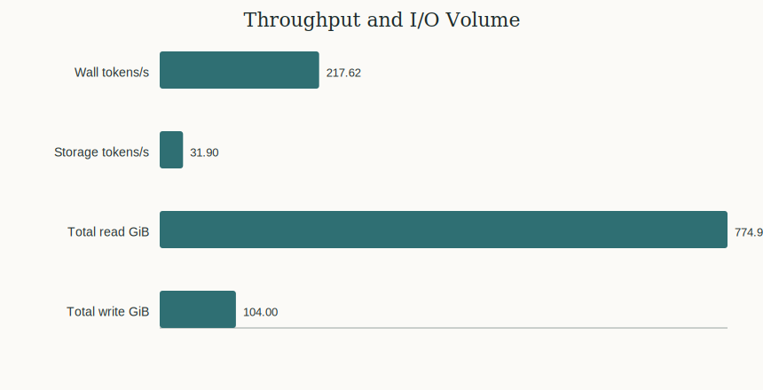
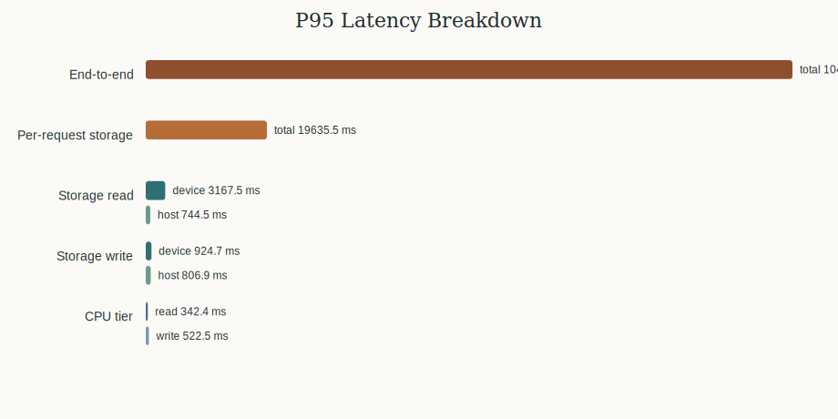
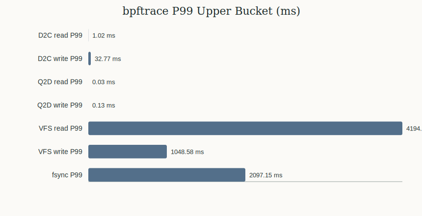
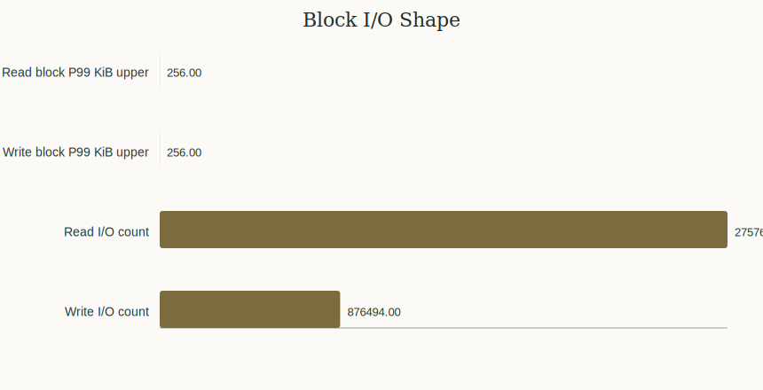
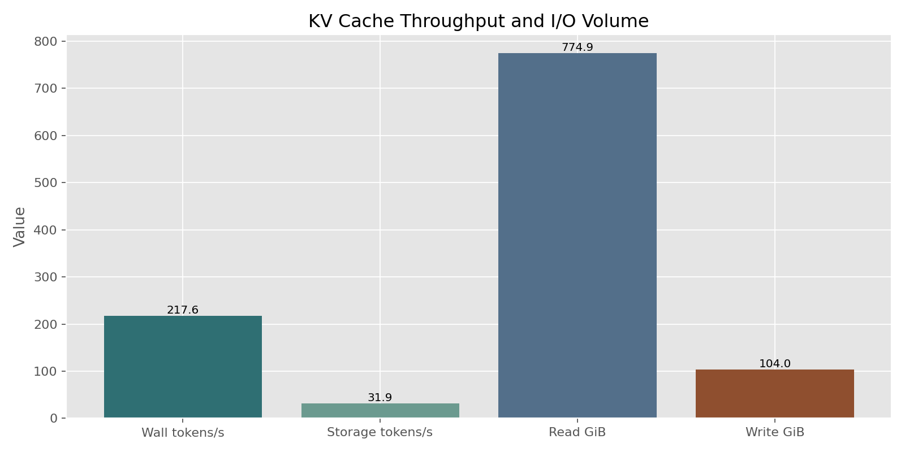
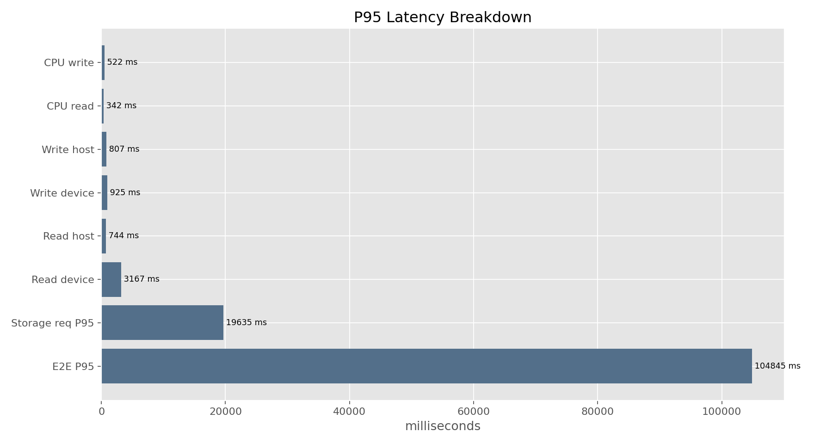
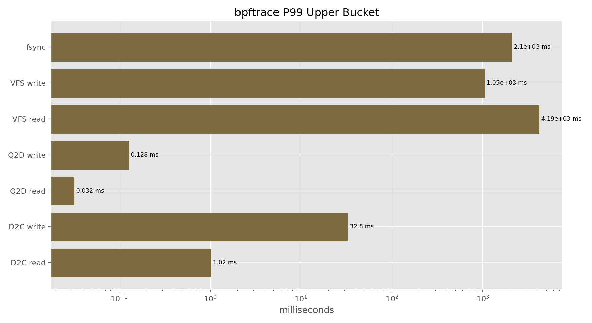
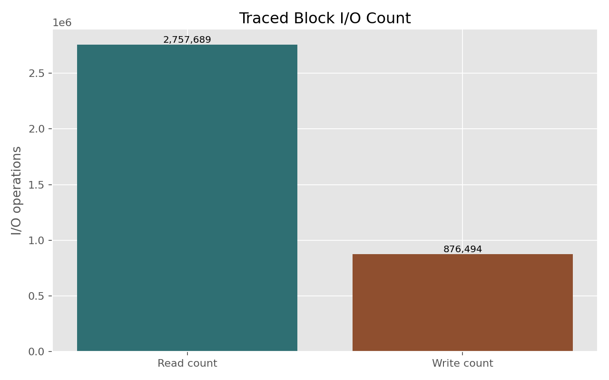

# KV Cache AI SSD Baseline Report

Generated: 2026-06-07 15:19:19

## Test Command

```bash
cd /home/ficus/llm/storage/kv_cache_benchmark

python3 kv-cache.py \
  --config config.yaml \
  --model llama3.1-8b \
  --num-users 10 \
  --duration 120 \
  --gpu-mem-gb 0 \
  --cpu-mem-gb 2 \
  --max-concurrent-allocs 4 \
  --generation-mode none \
  --cache-dir /home/ficus/llm/storage/results/kvcache-profile/kv-cache-dir \
  --seed 42 \
  --output /home/ficus/llm/storage/results/kvcache-profile/test_8b_10users_profiled.json \
  --xlsx-output /home/ficus/llm/storage/results/kvcache-profile/test_8b_10users_profiled.xlsx
```

A standalone bpftrace session was run in parallel with:

```bash
sudo ./utils/storage_latency_stack.sh python3 --fio
```

## Test Configuration

| Field | Value |
|---|---:|
| Model | Llama 3.1 8B |
| Users | 10 |
| Duration | 120 s |
| GPU cache tier | 0 GiB |
| CPU cache tier | 2 GiB |
| Max concurrent allocations | 4 |
| Generation mode | none, pure storage I/O |
| Seed | 42 |
| Cache directory | `/home/ficus/llm/storage/results/kvcache-profile/kv-cache-dir` |
| Result JSON | `/home/ficus/llm/storage/results/kvcache-profile/test_8b_10users_profiled.json` |
| bpftrace output | `/home/ficus/llm/storage/results/kvcache-profile/bpftrace_8b_10users.txt` |
| fio workload | `/home/ficus/llm/storage/kv_cache_benchmark/fio_traced_20260607_150153.ini` |

## Command Output Summary

The benchmark reported the memory safety check as OK:

```text
Formula: peak = (workers x 2 x mean_entry_bytes) + baseline
       = (10 x 2 x 1000MiB) + 2.5GiB
       = 22.0GiB
Available RAM: 26.0GiB
Safe concurrent readers: ~12
Status: OK
```

KV cache block sizing from the command output:

| Block Metric | Value |
|---|---:|
| KV bytes/token | 131,072 bytes, 128.0 KiB |
| Entries in cache | 126 |
| Block size min | 80.6 MiB |
| Block size mean | 845.2 MiB |
| Block size P95 | 1822.1 MiB |
| Block size max | 2048.8 MiB |

Storage assessment from the command output: **FAIL**, criteria passed 1/4.

| Criterion | Actual | Target | Pass |
|---|---:|---:|---|
| Storage Tier Write Device P95 < 500ms | 924.691 ms | 500 ms | no |
| Storage Tier Read Device P95 < 200ms | 3167.484 ms | 200 ms | no |
| CPU RAM P95 < 150ms | 373.995 ms | 150 ms | no |
| Cache Hit Rate > 30% | 0.728 ratio | 0.3 ratio | yes |

## Benchmark Results

| Metric | Value |
|---|---:|
| Requests completed | 125 |
| Total tokens generated | 26114 |
| Wall-clock throughput | 217.62 tokens/s |
| Storage I/O throughput | 31.90 tokens/s |
| Requests/sec | 1.04 |
| End-to-end P50 | 33324.03 ms |
| End-to-end P95 | 104845.21 ms |
| End-to-end P99 | 112363.54 ms |
| Per-request storage P50 | 3125.27 ms |
| Per-request storage P95 | 19635.46 ms |
| Per-request storage P99 | 29052.64 ms |
| Cache hit rate | 72.8% |
| Total read | 774.94 GiB |
| Total write | 104.00 GiB |
| Read/write ratio | 7.45:1 |
| GPU entries | 0 |
| CPU entries | 3 |
| Storage entries | 123 |





## Tier Latency Breakdown

| Tier / Operation | P95 Total | P95 Device | P95 Host / Serialization |
|---|---:|---:|---:|
| Storage read | 3936.28 ms | 3167.48 ms | 744.48 ms |
| Storage write | 1709.60 ms | 924.69 ms | 806.93 ms |
| CPU read | 342.40 ms | n/a | n/a |
| CPU write | 522.49 ms | n/a | n/a |

## bpftrace Results

The bpftrace run produced a 1.18 GiB trace file and generated a fio workload file. Key extracted histograms:

| Histogram | Samples | P50 | P95 | P99 | Meaning |
|---|---:|---:|---:|---:|---|
| `d2c_read_us` | 236,510 | 128-256 us | 512-1,024 us | 512-1,024 us | Device service time for read commands |
| `d2c_write_us` | 85,334 | 4,096-8,192 us | 16,384-32,768 us | 16,384-32,768 us | Device service time for write commands |
| `q2d_read_us` | 168 | 4-8 us | 16-32 us | 16-32 us | Block queue wait before read dispatch |
| `q2d_write_us` | 17,430 | 8-16 us | 32-64 us | 64-128 us | Block queue wait before write dispatch |
| `vfs_read_us` | 3,621 | 32-64 us | 1,048,576-2,097,152 us | 2,097,152-4,194,304 us | Application-visible read syscall latency |
| `vfs_write_us` | 264 | 64-128 us | 524,288-1,048,576 us | 524,288-1,048,576 us | Application-visible write syscall latency |
| `fsync_us` | 123 | 262,144-524,288 us | 524,288-1,048,576 us | 1,048,576-2,097,152 us | Durable flush latency |
| `write_to_fsync_us` | 123 | 64-128 us | 4,096-8,192 us | 8,192-16,384 us | Gap between write return and fsync entry |
| `fadvise_to_read_us` | 435 | 64-128 us | 4,096-8,192 us | 8,192-16,384 us | Gap from cache-drop hint to read |
| `bssplit_read_kb` | 2,757,689 | 128-256 KiB | 128-256 KiB | 128-256 KiB | Read block size distribution |
| `bssplit_write_kb` | 876,494 | 128-256 KiB | 128-256 KiB | 128-256 KiB | Write block size distribution |
| `qd_read` | 2,757,217 | 1,048,576-2,097,152 | 2,097,152-4,194,304 | 2,097,152-4,194,304 | In-flight read queue depth at dispatch |
| `qd_write` | 876,488 | 262,144-524,288 | 524,288-1,048,576 | 524,288-1,048,576 | In-flight write queue depth at dispatch |






## fio Workload Distilled From bpftrace

```ini
# Storage Latency Stack; Distilled fio Workload
# Generated: 2026-06-07 15:01:53
# Source process: python3
# Total traced I/Os: 3,634,183 (2,757,689 reads, 876,494 writes)
#
# Device latency (D2C):
#   D2C Read: P50=128 us, P99=256 us (224767 samples)
#   D2C Write: P50=4096 us, P99=16384 us (81359 samples)
# LBA spatial distribution:
#   Read hot zone: 570-940GiB (96% of I/O)
#   Write hot zone: 570-950GiB (97% of I/O)
#
# Usage:
#   fio <this_file> --filename=/dev/nvmeXn1
#   fio <this_file> --filename=/mnt/nvme/fio_test --size=100G

[python3_workload]
ioengine=libaio
direct=1
time_based
runtime=300
rw=randrw
rwmixread=76
bssplit=2k/1:4k/1:8k/1:16k/1:32k/1:64k/1:128k/100,4k/2:8k/1:16k/1:32k/1:64k/1:128k/96
iodepth=1048576
iodepth_batch_submit=1048576
iodepth_batch_complete_min=1
size=100%
thinktime=64
thinktime_blocks=1048576
# thinktime_iotime=1s  # uncomment for fio 3.28+
refill_buffers=1
norandommap=1
randrepeat=0
numjobs=1
group_reporting
percentile_list=50:95:99:99.9:99.99
```

Important note: the generated fio file has `iodepth=1048576`. This is a mechanical distillation from the observed in-flight histogram and is not a realistic product-test iodepth. For AI SSD comparison, use the generated `bssplit` and read/write mix, but run a controlled iodepth sweep such as 64, 128, and 256.

## Vocabulary

- `VFS read/write`: Application-visible Linux virtual filesystem syscall latency. It includes page cache, filesystem work, kernel copying, and any underlying block I/O.
- `Q2D`: Queue-to-dispatch. Time from entering the block layer queue to being dispatched to the device driver. High Q2D points to scheduler or queue contention.
- `D2C`: Dispatch-to-complete. Time from device dispatch to completion. This is closest to SSD/controller command service time.
- `fsync`: Time to force buffered writes to durable storage. High fsync means persistence/flush is expensive.
- `write_to_fsync`: Time between a write returning and fsync being entered. High values indicate application, CPU, lock, GIL, or serialization overhead before the flush.
- `fadvise_to_read`: Time between the benchmark issuing a page-cache drop hint and the following read. Used here to avoid measuring only page-cache hits.
- `bssplit`: Block size distribution seen by the kernel. Here, reads and writes are dominated by 128-256 KiB I/O, meaning large KV blocks are split into many block commands.
- `QD` or queue depth: Number of in-flight I/O operations at dispatch. Extremely high values in trace-derived output should be treated as a workload-shape signal, not a direct fio setting.
- `LBA heatmap`: Logical block address distribution. It shows where on the drive the I/O lands and whether access is clustered or spread out.

## Analysis Conclusion

This run is a storage-only KV cache stress test, not an end-to-end inference test. The GPU tier is disabled and the CPU tier is capped at 2 GiB, so the benchmark intentionally pushes most cache entries into the storage tier.

The benchmark-level result fails the current storage health assessment. The biggest user-visible issue is tail latency: end-to-end P95 is 104.8s, while per-request storage P95 is 19.6s. The difference indicates significant queue wait once 10 users are active on this PC.

At the block layer, individual read commands are not slow: D2C read P99 is in the 512-1,024 us bucket. Write commands are slower: D2C write P99 is in the 16,384-32,768 us bucket. Scheduler delay is low, with Q2D read/write P99 in microsecond-scale buckets.

The seconds-level benchmark read latency is therefore not caused by slow individual NVMe read commands. It comes from reading very large KV objects, with block I/O dominated by 128-256 KiB commands, plus VFS and NumPy load/copy overhead. The write path has two bottlenecks: SSD write/flush behavior and host-side serialization. `fsync` reaches the 1,048,576-2,097,152 us P99 bucket, which is material for AI SSD write-tail evaluation.

For AI SSD product pre-research, this workload is useful as a stress baseline. The next tests should split prefill-only writes from decode-only reads, add a user-concurrency sweep, and repeat the key cases after SSD preconditioning.


## PNG Charts








